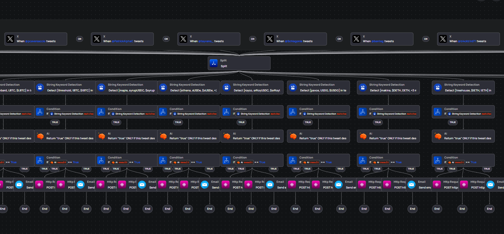

# Become a Guardian

Guardians are the whitelisted addresses that submit and curate hack alerts on thatsRekt. There are two ways to participate: with your own automated monitoring pipeline, or simply by curating posts that others submit.

Both paths start the same way: get whitelisted. Fill in the application form at [thatsrekt.com/apply](https://thatsrekt.com/apply) with who you are, your detection focus, and the address you want whitelisted. The governance multisig reviews each application, and once approved, submits your address to the onchain whitelist through a 3-day timelock (long enough for integrators to react if a hostile operator is queued, short enough that real-world onboarding doesn't stall). When the timelock expires your address is live and you can start posting and confirming.

---

## Path A: With automated monitoring

Set up a pipeline that watches security feeds and posts alerts to the registry automatically, without you having to do anything once it's running.

The fastest way to get there is the **example-otomato** workflow in this repo. It wires together:

- X account monitoring (your choice of security feeds)
- Per-protocol AI classification
- Automatic relay webhook call on a positive hit
- Email (or Telegram / Slack / any HTTPS endpoint) alerts to your team



> _What the pipeline looks like inside [builder.otomato.xyz](https://builder.otomato.xyz/) after a single `npm run create`. Each column is one protocol branch; hits automatically fire the relay and your chosen alert channels._

### What you need

| Requirement     | Notes                                                                                                                                     |
| --------------- | ----------------------------------------------------------------------------------------------------------------------------------------- |
| Otomato account | Sign up at [app.otomato.xyz](https://app.otomato.xyz). API key from **Settings → API Keys**.                                              |
| A hosted relay  | Deploy the `relay/` service (Railway, fly.io, etc.) with your whitelisted EOA's private key. See [`relay/README.md`](../relay/README.md). |
| Node 20+        | To run the setup script once.                                                                                                             |

### Quick start

```bash
cd example-otomato
npm install
cp .env.example .env          # fill in OTOMATO_API_KEY + relay URL + token + chain
# edit tracking.json          # your protocols, X accounts, alert emails
npm run create                # creates + activates the workflow on Otomato
npm run check                 # verify it's live
```

Full walkthrough, including `tracking.json` customisation (protocols,
keywords, monitored X accounts, alert emails) and what to expect from
the output, is in [`example-otomato/README.md`](../example-otomato/README.md).

### Adding more alert channels

After the workflow is created, open it in [builder.otomato.xyz](https://builder.otomato.xyz/)
and add action nodes for Telegram, Slack, Discord, PagerDuty, or any
HTTPS webhook. You can describe what you want to your LLM and paste the
result into the builder; Otomato supports all standard HTTP action
shapes. Reference: [docs.otomato.xyz](https://docs.otomato.xyz/otomato-docs/).

---

## Path B: Without automated monitoring

You don't need to run a detection pipeline to be a useful guardian.
Confirming and disconfirming posts that other guardians submit is
equally important: it's what builds the net score that integrators
read onchain.

### How to confirm or disconfirm a post

1. Visit [thatsrekt.com](https://thatsrekt.com) and connect the wallet
   address that has been whitelisted.
2. Find the post you want to vote on in the feed.
3. Hit **↑** to confirm (you agree the attack is real / accurate) or
   **↓** to disconfirm (you believe it's wrong or a false positive).


> _Clicking ↑ sends a `confirm(postId, Up)` transaction to the thatsRekt
> contract on the post's chain. Rabby (or any wallet) will show a
> confirmation prompt; the contract address is always
> `0xBfaEEE9662b4c037De24e5Caa65815350d57b89A`._

Each confirmation or disconfirmation is a signed onchain transaction.
Your address is recorded publicly in the `confirmationLog`. Switching
direction (↑ after a ↓, or vice versa) replaces your previous vote.
You can also withdraw it entirely with `unconfirm`.

### What your vote does

- **↑ confirm** → adds `+1` to the `attackerScore` of every address
  listed as an attacker in that post.
- **↓ disconfirm** → adds `−1` to the same scores.
- The net score across all active posts and all guardians is what
  integrators (wallets, bridges, lending markets) read onchain.

A single well-timed confirmation from a trusted guardian can cross the
threshold that triggers a real-time protection in another protocol.

### If you also want to post directly

Once whitelisted you can submit a post from the site using the
**[REPORT]** button (desktop), or call `post(...)` on the contract
directly from any Solidity-compatible tooling. The full write interface
is documented in [thatsrekt.com/docs](https://thatsrekt.com/docs) under
**whitelisted write functions**.
