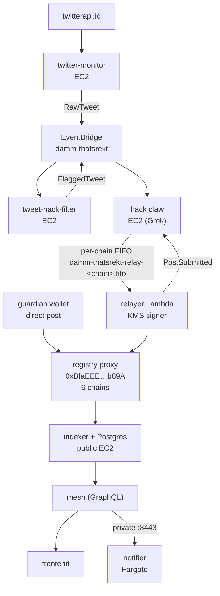
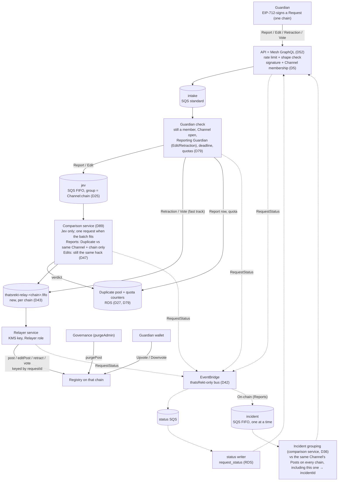
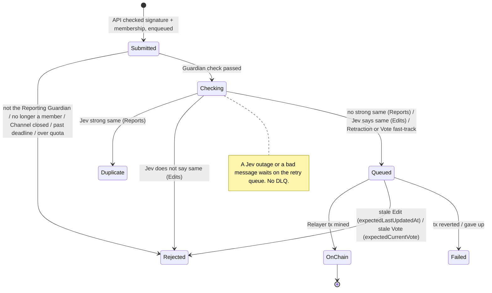

# thatsRekt — Guardian Report Intake Redesign

**Status:** Design in progress (D1–D94; no open questions in §7). Revised after Jerry's review of PR #287 (2026-10-06/07). Implementation not started.  
**Started:** 2026-09-30  
**Glossary:** [`../CONTEXT.md`](../CONTEXT.md) — terms in **bold** are defined there.  
**Builds on:** [`REWRITE-NOTES-2026-09-30.md`](./REWRITE-NOTES-2026-09-30.md). Where this file disagrees, this file wins (see §6).

---

## 1. Ground rules for the rewrite

| Rule | Decision |
|---|---|
| Rewrite scope | Heavy rewrite/refactor is acceptable across the whole stack: contracts, cloud, API, frontend. |
| Contract | Upgrading the registry contract is on the table. |
| Downtime | Avoid if possible; not a hard constraint. |
| Transport | Built on AWS SQS, like today's relay path. |
| API | The Mesh GraphQL gateway (D52). Dumb: serves data, accepts **Requests**, enqueues them. A structural shape check, edge rate limiting (D29), and a signature + **Channel** membership check before enqueueing (D5); no content validation. Writes are whitelisted, reads are public. |
| In scope | Centralizing two things: relaying to the chain and **Duplicate** checks (no hack verification stage, D46). The API is the only entry point. Decoupling the Twitter detector from the thatsRekt stack (D40). |
| Out of scope | The Twitter detector itself (twitter-monitor, tweet-hack-filter, its claw path): Bauti runs it on DAMM's behalf and refactors it in a separate planning session (D11). |

---

## 2. Current production (baseline)

Also running, not on this path: donations indexer (6 scheduled Fargate tasks), guardian-apply bot (hourly), notifier state in S3. The RDS cutover code is on `thatsrekt-cloud` main: damm-cloud #317 landed as thatsrekt-cloud#12 (`e44e9d5`) and #318 as thatsrekt-cloud#13 (`0a0473d`), onto `thatsrekt-db` (`aws_db_instance.thatsrekt`, `terraform/rds.tf:165`); the damm-cloud issues are still open.

Today's contract identity model (`contracts/src/ThatsRekt.sol`): `post()` is `onlyWhitelisted` and stores `poster = msg.sender`; `amend*`, `addAttackers`, `addVictims`, `retract` require `poster == msg.sender`; `confirm`/`unconfirm` are `onlyWhitelisted`; `confirm` rejects `poster == msg.sender` (`PosterCannotConfirm`).

---

## 3. Target intake flow

| Request | Signed contents (D33) | Path |
|---|---|---|
| New **Report** | chain, **Channel**, title, note, attackers, victims, `attackedAt`, `deadline` | `intake` (Guardian check, quota) → `jev` (**Duplicate**, same **Channel** + chain only, D89; pool row written on accept) → `relay-<chain>`; once **On-chain**, `incident` (grouping, off the relay path) |
| **Edit** | chain, **Post** id, changed fields, `expectedLastUpdatedAt`, `deadline` | `intake` (Guardian check, quota) → `jev` (still the same hack by Jev, D47; no **Duplicate** check) → `relay-<chain>` (stale check before sending) |
| **Retraction** | chain, **Post** id, `deadline` | `intake` → `relay-<chain>` (fast track, no comparison) |
| **Vote** (relayed) | chain, **Post** id, direction (up/down/clear), `expectedCurrentVote`, `deadline` | `intake` (Guardian check, **Vote** quota) → `relay-<chain>` (fast track, no comparison, D6) |
| **Purge** | — | Not part of intake. Governance (`purgeAdmin`) calls `purgePost` directly. |

- A terminal outcome enqueues nothing further.
- The comparison service never calls the **Relayer service** directly; `jev` only enqueues.
- A hack on N chains = N **Reports**, each relayed to its own chain once it is not a **Duplicate** in its **Channel** there; the `incident` stage then gives the ones in the same **Channel** a shared **Incident** id off-chain. The **Registry** has no multi-chain concept.
- **Request** id = EIP-712 digest; it is the idempotency key on every queue and the on-chain `requestId` (D32, D35).

### Request status

Status is tracked per **Request** (Report, Edit, Retraction, or Vote), not per **Post**.

| Outcome | Meaning for the **Guardian** |
|---|---|
| **Rejected** | You may not make this **Request** (not the **Reporting Guardian**, no longer a member, **Channel** closed), it expired, you are over a quota (D79), it is stale (the **Post** or your **Vote** changed since you signed — re-sign against the current state), or (for an **Edit**) Jev did not confirm it is the same hack — submit a new **Report** or re-sign a narrower **Edit** (D47, D89). A bad signature or non-**Guardian** signer is refused at submit by the API (D5) and never becomes a **Request**. |
| **Duplicate** | Already reported in this **Channel** on this chain; final (D27). Upvote the original, or comment on it with your extra details (D75). |
| **On-chain** | Done; chain, **Post** id, tx hash. |
| **Failed** | A DAMM-side error: a malformed message, or the **Relayer** could not get it on-chain. A model outage is never **Failed**; the **Request** waits in **Checking** (D89). |

---

## 4. Decision log

| # | Question | Decision | Why / rejected alternatives |
|---|---|---|---|
| D1 | Who writes **Posts** on-chain? | A new on-chain **Relayer** role, held by the DAMM **Relayer service** via a KMS key. The contract allows more than one **Relayer**. **Guardians** no longer write **Posts**. | Matches REWRITE-NOTES goal 4 (Guardians without on-chain txs). |
| D2 | What can a **Relayer** do? | Only a **Relayer** can create, **Edit**, or **Retract** a **Post**. It can also relay a **Guardian**'s signed **Vote** (D6). Its sole job is acting on behalf of **Guardians**. | Replaces today's `onlyWhitelisted` + `poster == msg.sender` gates. |
| D3 | Is the **Guardian** recorded on the **Post**? | Yes — every **Post** names the **Guardian** who submitted it (**Reporting Guardian**). | Keeps attribution now that `msg.sender` is always a **Relayer**. |
| D4 | Does the **Request signature** go on-chain? | Yes. The **Registry** verifies the **Guardian**'s EIP-712 signature on every **Relayer** write (D55). The **Relayer** cannot write anything a **Guardian** did not sign. | Reversed by Bauti (2026-10-05); the first answer (off-chain check only, the contract trusting the **Relayer** about the **Reporting Guardian** — ADR 0001) let a **Relayer** key or pipeline bug create, **Edit**, or **Retract** **Posts** under any **Guardian**'s name. ADR 0001 is superseded by ADR 0003. |
| D5 | Where is a bad signature / non-Guardian rejected? | In the API. `submitRequest` recovers the signer and checks membership of the **Request**'s **Channel** on its chain before enqueueing; a bad signature or a non-**Guardian** gets an immediate error, and nothing is queued or stored. Membership is read live from the indexer's **Channel** tables: a lookup keyed by (chain, **Channel**, **Guardian**), built from `GuardianAdded`/`GuardianRemoved` (D80). The only cache is the existing negative one (`failedWhitelistMap`, 60 s `FAILED_WHITELIST_WINDOW_MS`, `mesh/src/comments.ts`). Indexer lag fails safe: a just-added **Guardian** is refused until indexed; a just-removed one can still pass the API until the indexer catches up, and a **Request** already queued still relays. The **Registry** rejects the write if they are not a member at execution. The API also refuses a signer on the ops denylist, a table in the thatsRekt database, read on every submit. `intake` and the **Relayer** do not re-read that table (Bauti, 2026-10-09). The `intake` Guardian check stays for everything else (deadline, **Reporting Guardian**/**Edit** rights, quotas, membership re-check), and the **Registry** stays the authority (D55). Reads stay public (D31). | Revised in review (Jerry, 2026-10-06; Bauti, 2026-10-07): write endpoints are whitelisted, read endpoints are public. The first answer (the API accepts any well-shaped payload; rejection only later, in `intake`) let unauthenticated traffic fill the queue and the public `request_status` store, so anyone could make a "Report" naming any address readable on the API for a day (D29, D31). Rejected: a cached **Guardian** set (a second copy to keep fresh; the indexer tables already are the copy); an on-chain read per submit (RPC latency and cost on every submit); SIWE sessions (auth state in the API, double signing). |
| D6 | How do **Guardians** Upvote/Downvote? | Either directly from their own wallet (`confirm`/`unconfirm`), as today, or by signing an EIP-712 **Vote** (`guardian, postId, direction, expectedCurrentVote, deadline`) that a **Relayer** sends via `vote(Vote, signature)`. `direction` is up, down, or clear; clear replaces `unconfirm`. The **Registry** runs the D55 checks (signature, membership of the **Post**'s open **Channel**, deadline), the D7 self-vote rule, and a stale check: unless the **Guardian**'s current **Vote** on the **Post** equals `expectedCurrentVote`, it reverts `StaleVote`, which the **Relayer service** maps to **Rejected** (stale). A relayed **Vote** skips `jev` (fast track, like a **Retraction**) and has its own quota (D79). ADR 0006. | Revised in review (Jerry, 2026-10-06; Bauti, 2026-10-07): the D55 signature machinery exists anyway. Relaying completes REWRITE-NOTES goal 4 (**Guardians** without on-chain txs), lets bot **Guardians** corroborate without holding gas on 6 chains, and gives a **Duplicate**'s "**Upvote** the original" a gasless path (D27). `expectedCurrentVote` stops a delayed relayed **Vote** from overwriting a later wallet **Vote** (the D50 pattern). Kept: wallet votes, and the **Guardian** set stays on-chain. Rejected: wallet-only (the first answer); relayed-only (breaks today's integrators and wallet **Guardians**). ABI change, so it is decided before scheduling (D41). |
| D7 | Self-vote rule | A **Guardian** cannot vote on a **Post** they are the **Reporting Guardian** of, whether from the wallet (`confirm`) or relayed (`vote`, D6). `PosterCannotConfirm` moves from `poster` to `reportingGuardian`. | Carried over from today's rule; `poster` would always be the **Relayer**, making the old check meaningless. |
| D8 | Can one address be both? | No. The contract enforces that an address is either a **Guardian** or a **Relayer**, never both at once. | Keeps the roles separate: the role that writes cannot also vote or be credited. |
| D9 | Multi-chain hacks | The **Guardian** submits one **Report** per chain. Each is validated independently and relayed to its own chain. | Rejected: one **Report** fanned out to chosen chains; posting every **Report** to all 6 chains. |
| D10 | Scope of the **Duplicate** check | Only against already-accepted live **Posts** and comparison-passed **Reports** in the same **Channel** on the same chain as the new **Report** (D66). A mainnet `main` **Report** is compared only with mainnet `main` history. | Follows from D9: sibling **Reports** on other chains must not be flagged as **Duplicates**. Narrowed to the **Channel** by Bauti (2026-10-05): the same hack in two **Channels** is two **Posts** (D62). |
| D11 | Twitter-detected hacks | Out of scope. The Twitter detector is not part of the thatsRekt stack; Bauti runs it on DAMM's behalf, and it gets its own full refactor in a separate planning session. | This design only centralizes relay and **Duplicate** checks (D46). Known coupling, left to that session: today's detector writes straight to `relay-<chain>.fifo` and relies on the old relayer's `post(…, expectedPostId)`, so that path stops working when the upgrade lands; cutover does not wait for it (D87). |
| D12 | Who decides a **Report** is accepted? | Two layers. The off-chain pipeline decides what gets relayed (API and Guardian checks → **Duplicate** check, D5, D46, D89). The **Registry** independently enforces authorship: a valid signature from the named **Guardian**, who must still be a member of the **Channel** on that chain when the tx executes (D55, D60). | Reversed with D4. A **Guardian** removed from the **Channel** between the Guardian check and the mined tx now reverts (`NotWhitelisted`); the **Relayer service** maps that to **Rejected** (not a **Guardian**). Still off-chain only: the **Duplicate** check and the **Edit** same-hack check (D47) — a **Relayer** could relay a **Guardian**-signed **Request** the pipeline ruled out, but only that **Guardian**'s own signed content. |
| D13 | Which **Guardian** set does the Guardian check use? | The member list of the **Request**'s **Channel** on the **Request**'s own chain (D60, D66). Membership stays per chain, exactly as today; there is no chain-wide **Guardian** list any more. | Rejected: one canonical chain's roster for all chains. Amended by D60 (whitelisting is per **Channel**). |
| D14 | Cross-chain awareness | Each chain's **Registry** is fully isolated and knows nothing of the others. No cross-chain state or ids on-chain. | Any cross-chain grouping must be off-chain. |
| D15 | Edit path | An **Edit** names the chain and **Post** id it changes. It goes Guardian check (signer is the **Post**'s **Reporting Guardian** and still a member of the **Post**'s **Channel**, D64) → same-hack check by Jev (D47, D89) → **Relayer service** sends `editPost`. **No** **Duplicate** check (reconfirmed). | Rejected: a **Duplicate** check on **Edits** — the **Post** is already live and identified by id. Originally the claw validated **Edits** (D34); superseded by D46/D47. |
| D16 | **Retraction** path | A **Retraction** names the chain and **Post** id. Once the Guardian check passes, it is fast-tracked onto the queue for the **Relayer service**, which calls `retract`. No claw, no comparison. | Taking back a claim only removes data; nothing to verify. |
| D17 | Guardian delete vs governance moderation | A **Guardian**'s delete is a **Retraction** (`retract`, via the **Relayer**). **Purge** (`purgePost`) stays with governance (`purgeAdmin`); a **Relayer** can never purge. "Delete" is retired as a term. | Rejected: giving the **Relayer** `purgePost`; merging both into one `delete`. Keeps "reporter took it back" separate from "governance removed abuse", which indexers/frontends already read as two flags, and stops a compromised **Relayer** key from hiding any **Post** entirely. |
| D18 | Who may **Edit**/**Retract** a **Post**? | Only its **Reporting Guardian**, submitting a signed request to the API, only while still a member of the **Post**'s **Channel** on that chain (D64), and only while that **Channel** is open (D65). The **Relayer service** relays it on-chain. | Rejected: letting **Retractions** survive Guardian removal (today's `retract` has no whitelist check); letting any **Guardian** change any **Post**. Removing a **Guardian** from a **Channel** freezes their **Posts** in it; only a governance **Purge** can take one down. Closes the stolen-key → mass-retract scenario. Rejected in review (Jerry, 2026-10-06; Bauti, 2026-10-07): letting a **Duplicate**'s **Guardian** **Edit** the original, either as any **Channel** member (loosens D55 (3) for every **Edit**) or with a co-signature from the **Reporting Guardian** (a second signing flow). That **Guardian** **Upvotes** the original or comments on it with extra details (D75); a wrong **Post** is **Purged**. |
| D19 | **Request** status model | Status is per **Request**. In-flight: `Submitted`, `Checking`, `Queued`. Terminal outcomes: **Rejected**, **Duplicate**, **On-chain**, **Failed** (see §3, Request status). **Not verified** was retired by D46. | `Checking` stays coarse — the **Guardian** gains nothing from knowing which consumer holds it. **Failed** is separate from **Rejected** so a **Relayer** outage never reads as the **Guardian**'s fault. |
| D20 | Channels | **Superseded by D57.** Not part of this redesign; the concept was dropped. | Reversed by Bauti (2026-10-05). |
| D21 | Who governs the **Relayer** set? | **Superseded by D67.** Governance, exactly as for **Guardians**: added by `whitelistAdmin` (3-day TimelockController, multisig proposer), removed instantly by `whitelistRemover` (multisig kill switch). No separate relayer admin plane. | Rejected: a dedicated `relayerAdmin`/`relayerRemover` plane; owner-only (no instant kill switch). The D8 exclusivity check applies on every add. Correction (checked 2026-10-05): `whitelistRemover` and `purgeRemover` are both `0xda1b…7f45` on all 6 chains — an EOA (no code), one of the 5 owners of the 2-of-5 governance Safe `0x59E4…0679`, not the Safe itself, so one key can remove any **Guardian** or revoke `purgeAdmin` today. `whitelistAdmin` is TimelockController `0xB83A…8D4f` (`getMinDelay()` = 259200, 3 days) with the Safe as proposer. |
| D22 | Claw content sanity | **Superseded by D46.** Whenever the claw verifies a new **Report** or an **Edit**, it checks that the title and note make sense and are not gibberish. Random titles end as **Not verified**. | The **Registry** only enforces title length (1–200 bytes); content quality has to be judged off-chain. |
| D23 | How the new model ships | **Superseded by D71 except the address:** the in-place UUPS upgrade of the existing proxies on each chain (same addresses) stands; the storage approach below (reuse the `poster` slot, append to v1 storage) does not — v2 stores the **Reporting Guardian** in its own **Post** struct in a fresh namespace. As first written: the existing `poster` storage slot is reused to mean **Reporting Guardian**: `post()` writes the passed-in **Guardian** there. A new `PostRelayed` event records which **Relayer** sent the tx. | Rejected: a new `reportingGuardian` struct field (dual attribution + legacy fallback — later adopted by D71, where v2 drops the v1 struct entirely, so there is no dual attribution); fresh Registries (address change for integrators, aggregates reset). Legacy **Posts** are already correct: today's `poster` is whoever reported it (mainnet: 47 by `0xFe6B…FFdb`, 12 by `0xE039…4374`, checked via `getPost` 1–59); the indexer carries it as their **Reporting Guardian** (D77). |
| D24 | Today's relayer key `0xFe6B…FFdb` | Stays a **Guardian** and keeps its legacy **Posts**. A brand-new KMS key becomes the **Relayer**, installed by the upgrade itself (D39). Anything that reports with `0xFe6B` afterwards goes through the API like any other **Guardian** (how the separate DAMM detector uses it is outside this design, D11). | Rejected: turning `0xFe6B` into the **Relayer** (it would have to leave the **Guardian** set per D8, freezing its legacy **Posts** under D18). `0xFe6B` is already whitelisted on all 6 chains (checked `isWhitelisted` on 1, 8453, 42161, 10, 56, 137), so no **Guardian** change is needed. |
| D25 | Queue topology | One queue per stage: API → `intake` (standard; Guardian check, quotas) → `jev` (FIFO, `MessageGroupId = channelId:chainId`: one **Request** at a time per **Channel** and chain, in arrival order, parallel across them; comparison service, D89: **Duplicate** for **Reports**, same hack for **Edits**) → new per-chain `thatsrekt-relay-<chain>.fifo` (**Relayer service**, D43). **Retractions** and relayed **Votes** skip `jev`. Off the relay path, an `incident` FIFO queue (one message group, so one **Post** at a time) receives every **Report**'s **On-chain** event for grouping (D36). `jev` has no redrive policy. A failure is not re-sent to the same FIFO: the dedup id is the **Request** id, and a repeat inside 5 minutes is dropped. It moves to a separate retry queue, and the line keeps moving. A later **Report** can land first. A dead-letter queue does not pull a **Request** out. **Edits** stay in the `channelId:chainId` group (D89). The **Request** id is the idempotency key on every stage and the `MessageDeduplicationId` on the `jev` and relay queues (replacing `action_id`). | Rejected: one shared queue with a `stage` field (one retry policy for fast and slow stages; backlogs hide each other); per-chain FIFO for every stage (a slow comparison run stalls the whole chain). Only the relay stage needs per-chain ordering (nonces); the `incident` stage needs global serial order (D36). Revised in review (Jerry, 2026-10-06; Bauti, 2026-10-07): `jev` is FIFO per (**Channel**, chain) so two concurrent **Reports** of the same hack cannot each miss the other in the D27 pool (the 2026-05-11 INK Finance race); the D49 parallel calls keep each run around a second, so a group is not stalled for long. |
| D26 | Status store | The API and every stage emit `RequestStatus{request_id, state, …}` events to a thatsRekt-only EventBridge bus (D42). One rule routes them to a `status` SQS queue; a single status writer upserts a `request_status` table in thatsRekt RDS. The API only reads that table. States only move forward; a terminal outcome is never overwritten (handles out-of-order and redelivered events). `request_status` is for display only: the **Duplicate** pool (D27) and the quotas (D79) are written synchronously elsewhere and never read from it. | Rejected: each stage writing RDS directly (five writers, forward-only rule duplicated); DynamoDB (a second datastore beside RDS). Same pattern as the relayer's lifecycle events (`lifecycle_v21.go`) and `PostSubmitted` → SQS → bookkeeping, on a bus the detector does not use. The RDS exists: `aws_db_instance.thatsrekt` (`thatsrekt-db`, `thatsrekt-cloud/terraform/rds.tf`), landed by thatsrekt-cloud#12/#13 (damm-cloud issues #317/#318). |
| D27 | **Duplicate** pool and disposition | The comparison service (D89) compares a **Report** against already-accepted things in its **Channel** on its chain: live **Posts** that are not retracted, not purged, and not at 2+ downvotes (`disconfirmations >= 2`), and **Reports** the comparison stage has already passed that are not yet on-chain. An unchecked **Report** is never a candidate. A match against a legacy **Post** is not a **Duplicate**: the **Report** still posts, and `incident` links them (D36). The pool row is written when the comparison stage accepts the **Report**, before enqueue to relay. `intake` does not insert a candidate row. Oldest match wins: a **Report** can only be a **Duplicate** of something older. A **Duplicate** is final and ends with a pointer to the original **Post** id (or **Request** id if still in flight); the **Guardian** is told to **Upvote** it or comment on it with extra details (D75). "Same hack" is Jev's judgment only (D48, D89), guided by the claw's proven signals: same attacker, same victim, or same protocol + day; there is no code overlap gate. | Rejected: comparing on-chain **Posts** only (concurrent **Reports** both pass — the 2026-05-11 INK Finance 5-alert incident, where verified/in-flight siblings were invisible to `dedup_lookup`); auto-merging into the original (would be an **Edit** by someone other than its **Reporting Guardian**, breaking D18). Revised in review (Jerry, 2026-10-06; Bauti, 2026-10-07): the pool is written synchronously. Rejected in review: reading the pool from `request_status` (written asynchronously, D26, so a burst misses itself); provisional **Duplicates** re-queued when the original fails (more states for a rare case; revisit if it happens in production); letting the **Duplicate**'s **Guardian** **Edit** the original (D18). Accepted risk: an orphaned **Duplicate** — its original in flight ends **Rejected** or **Failed** and the hack is not on-chain; the SDK polls that **Request** and tells the **Guardian**; a bot may re-sign and resubmit. The server does not re-queue it. There is no also-reported-by panel. |
| D28 | How a **Guardian** learns the outcome | Pull only. The frontend polls status by **Request** id after submitting, and a "My Requests" view lists every **Request** signed by the connected **Guardian** address with its outcome and pointer: **Duplicate** → original, **On-chain** → **Post** + tx, **Rejected** → which check failed (including "describes a different hack" for **Edits**). | Rejected: Telegram or email push (needs a **Guardian** ↔ contact mapping; push can later be added as another bus subscriber without changing this design). **Rejected** must name the failed check so the **Guardian** can act on it. |
| D29 | Spam on the intake | nginx `limit_req` per IP on the submit endpoint, a body-size cap, strict structural schema validation, and the D5 signature + membership check in the API. Non-**Guardian** submissions are refused at the API and never stored (D5). | Rejected: SIWE sessions (auth state in the API, double signing). Today there is no WAF/API Gateway/CloudFront in `thatsrekt-cloud/terraform` and no `limit_req` in `local-stack/nginx.conf`. Revised in review (Jerry, 2026-10-06; Bauti, 2026-10-07): API-side signer recovery + live membership adopted as D5; the 1-day deletion of non-**Guardian** `Rejected` rows (Bauti, 2026-10-05) is dropped, since such rows are no longer stored. |
| D30 | What the **Request signature** covers | An EIP-712 typed-data signature over the **full** **Request** payload (D33 types). The domain carries the target chain id and the proxy address. The **Registry** recomputes the digest from the calldata and verifies it (D55), so every field the **Relayer** writes on-chain provably comes from the signed payload. | Guarantees the **Guardian** authored and approves the exact contents; no stage (the comparison service, **Relayer service**) can add or alter a signed field without the write reverting. Chain id in the domain matters because the proxy address is identical on all 6 chains, so `verifyingContract` alone cannot stop cross-chain replay. |
| D31 | Who can read a **Guardian**'s **Requests** | Public by address. Anyone can list any address's **Requests** and their contents and outcomes; no read signature. | Rejected: signed reads; capability-only access by **Request** id. Accepted risk: **Duplicate** and **Rejected** **Requests** naming attacker/victim addresses are publicly readable through the API even though they never reach the **Registry**. |
| D32 | Replay protection | **Request** id = the EIP-712 digest, so resubmitting the same signature is the same **Request** (SQS dedup + forward-only status make it a no-op). Every payload carries a signed `deadline`, defaulting to 7 days after signing. It is checked twice: by the Guardian check at intake (early **Rejected**) and by the **Registry** on every **Relayer** write, which reverts `RequestExpired(deadline)` once `block.timestamp > deadline` (D55); the **Relayer service** maps that revert to **Rejected** (expired). Every **Edit** carries `expectedLastUpdatedAt` (the **Post**'s `lastUpdatedAt` when signed); the contract refuses it if the **Post** has changed since (D50), and the **Relayer service** pre-checks with `getPost` to skip a doomed tx; either way the outcome is **Rejected** (stale). | Decided by Bauti (2026-10-05): on-chain, so a **Relayer** cannot hold a signed **Request** and land it much later. Rejected: intake-only checking (the first answer — nothing could ever expire in a backlog, but a **Relayer** could land a signed **Request** at any time); the earlier ~24 h default (a slow comparison run, a model outage (D89), or the D37 3-day **Relayer** rotation would expire valid **Requests**); per-**Guardian** nonces (one stuck **Request** blocks every later one; needs a nonce store); deadline only (replays inside the window still roll **Edits** back). Needed because D31 makes every signed payload public. `lastUpdatedAt` is already stored and returned by `getPost`; the per-chain relay FIFO (D25) serializes **Edits**. |
| D33 | What a **Guardian** signs | Four fixed EIP-712 types (the chain comes from the domain, D30): **Report** `guardian, channelId, title, note, attackers[], victims[], attackedAt, deadline`; **Edit** `guardian, postId, expectedLastUpdatedAt, newTitle, newNote, addAttackers[], addVictims[], removeAttackers[], removeVictims[], deadline` (empty value = unchanged, matching `editPost`, D51; removals D94); **Retraction** `guardian, postId, deadline`; **Vote** `guardian, postId, direction, expectedCurrentVote, deadline` (D6). `guardian` is the signer's own address (needed for ERC-1271, D55). `channelId` is `keccak256(name)` (D58); **Edit**, **Retraction** and **Vote** carry no channel, because a **Post**'s **Channel** is fixed (D64). No `protocol` field (D92). No separate evidence field: a **Guardian** who has exploit tx hashes puts them in the note, which is emitted on-chain in `PostCreated`/`PostNoteAmended`. Evidence is optional; no stage may depend on it. The **Relayer service** adds nothing but the signature itself; the **Request** id is computed by the contract (D35). | Rejected: a "changed fields only" **Edit** type (the contract needs one fixed struct to hash); a required `txHashes[]` field (with no Verifier after D46 nothing checks it, and **Guardians** cannot be assumed to have one when reporting); an optional `txHashes[]` field (an extra signed field stored only off-chain, while the note already reaches the chain); evidence in a new on-chain field/event (keeps the upgrade minimal); a `sources[]` URL list; a `channelIds[]` array (D57). |
| D34 | What the claw checks on an **Edit** | **Superseded by D46/D47** (no claw; Jev keeps check (3)). The edited **Post** as a whole against the current one: (1) D22 sanity on the new title and note; (2) new attackers/victims are backed by the **Edit**'s `txHashes`; (3) the edited **Post** still describes the same hack. | Rejected: checking the change in isolation (**Votes** cast for one hack would silently count toward another). |
| D35 | Replace `expectedPostId` | Every **Relayer** write is keyed by its **Request** id, which the contract computes as the EIP-712 digest of the signed struct (D55) — never a caller argument: `post(Report, signature)`, `editPost(Edit, signature)` (D51), `retract(Retraction, signature)`, `vote(Vote, signature)` (D6). A `postIdOfRequest[bytes32 → uint256]` mapping in the v2 namespace (D71) makes each **Request** id usable once; reuse reverts `RequestAlreadyRelayed(postId)`, which the **Relayer service** treats as **On-chain**. `expectedPostId`, `peekNextPostId`, and `PostIdMismatch` are removed. Attribution: the **Post** stores the **Reporting Guardian** (D71), `PostCreated` carries it, and the **Edit** events' `amender` is the **Post**'s **Reporting Guardian** — never the **Relayer**; a relayed **Vote**'s events name the signing **Guardian**. `PostRelayed(postId, relayer, requestId, channelId)` records which **Relayer** sent each write (D70). | Rejected: just deleting it (exactly-once would rest on the relayer's 24 h `PostCreated(poster = signer)` log scan in `internal/idempotency`, which D23 breaks); keeping it (peek-then-post race, `PostIdMismatch` retries in `classifier.go`). Keying by the digest, not the signature bytes, means a malleated signature is still the same **Request**. Its original purpose — committing to a stable URL before mining — has no user once **Guardians** get a **Request** id and D28 status. Cost: one extra SSTORE per write. |
| D36 | Cross-chain grouping | Pipeline-assigned **Incident** id, assigned after relay and never gating it: a **Report** is relayed as soon as it passes the Guardian check and is not a **Duplicate** in its **Channel** on its own chain (D10). Its **On-chain** status event feeds the `incident` stage (D25), which sends the new **Post** and every live **Post** of the same **Channel** on every chain, including this one, including legacy **Posts** shown as `main` (D66). Not retracted, not purged. A **Post** with 2+ downvotes is still a grouping candidate to the comparison service (D89), all candidates in parallel (D49). A strong `same` from Jev makes it inherit the `incidentId` of the oldest matching **Post**; otherwise a new one is minted. An **Incident** only groups one **Channel**'s **Posts** across chains: a hack reported in `ABC` on 1, 8453 and 42161 is one **Incident**; the same hack in `main` is another. The stage processes one **Post** at a time, so two siblings landing together cannot each mint an id. **Edits** do not regroup (D47 keeps them on the same hack). The stage stores `(chain, postId) → incidentId` in thatsRekt RDS; Mesh exposes it on `UnifiedPost` (D52) and the frontend groups by it. Nothing multi-chain exists on-chain. | Decided by Bauti (2026-10-05): grouping is for API consumers only and must not delay relay, and an **Incident** lives inside one **Channel**. Rejected: grouping across **Channels**; grouping inside the `jev` stage before relay (comparisons across all 6 chains added to every **Report**'s latency, for a result that never changes the outcome); comparing in-flight **Reports** (only needed when grouping ran before relay); keeping the June-spec heuristic `poster + normalizeTitle + attackedAt window` (misses siblings filed by different **Guardians**); no grouping. Revised in review (Jerry, 2026-10-06; Bauti, 2026-10-07): grouping uses the same comparison service and any-model rule as the **Duplicate** check. Rejected in review: requiring every model to agree (a wrong grouping only affects display, so the looser rule costs little and misses fewer siblings). Fills the `incidentId` seam the June spec left open. A wrong grouping only affects display, never on-chain state. |
| D37 | **Relayer** key compromise | No standby key. Governance removes the compromised **Relayer** instantly (`relayerRemover`, a Safe, D67); relay is paused (event-source mapping disabled so messages wait in the FIFO instead of hitting the DLQ); a new KMS key is added through `relayerAdder` (the 3-day TimelockController, D67); relay resumes. Keys are per chain (D83), so all of this happens on the affected chain only. | Rejected: a pre-registered standby **Relayer** key; two active keys (one compromise exposes both). With D55 a leaked key cannot forge **Posts**, **Edits**, or **Retractions**; it can only withhold, delay, or reorder **Guardian**-signed **Requests** within their deadline, or relay ones the pipeline ruled out. Accepted risk: up to a 3-day posting blackout on affected chains. **Requests** signed with the default 7-day `deadline` (D32) outlive the 3-day rotation and the relay FIFO retains messages 14 days; a **Request** whose deadline passes during the blackout ends **Rejected** (expired) and is re-signed. |
| D38 | **Incident** ids for legacy **Posts** | One-off, idempotent backfill before the frontend switches to `incidentId`: feed every existing **Post** on all 6 chains, oldest first, through the `incident` stage (D36), each inheriting an earlier match's id or getting a new one. Off-chain only: it reads legacy **Posts** from the indexer and writes `(chain, postId) → incidentId` rows to thatsRekt RDS. Nothing is sent on-chain, and legacy **Posts** are never re-posted to v2 (D71). The June-spec heuristic is then deleted from the frontend. When it runs: D82. | Rejected: leaving legacy **Posts** ungrouped; keeping the heuristic as a fallback (two grouping systems forever); a separate backfill grouping script (two implementations of D36). Scale: 93 **Posts** (`postCount()`: 1→59, 8453→5, 42161→7, 10→4, 56→16, 137→2). |
| D39 | Installing the first **Relayer** | The upgrade is `upgradeToAndCall(newImpl, initializeV2(initialRelayer, roles, mainGuardians))`, where `roles` carries all eight role addresses (`relayerAdder`, `relayerRemover`, `purgeAdmin`, `purgeRemover`, and the four **Channel** roles). `initializeV2` is a `reinitializer(2)` that adds that chain's own KMS **Relayer** (D83) with the D8 exclusivity check, sets every role in the v2 namespace — v2 reads no v1 role slot, so an unset role is a dead path (D59, D67, D68, D71) — creates `main` with today's **Guardians** (D61), and starts v2 **Post** ids after the v1 `postCount` (D72). Every later **Relayer** add follows D67. | Rejected: upgrading, then adding through the 3-day `relayerAdder` path (`post()` is **Relayer**-only from the upgrade, so nobody could post on any chain for 3 days); hardcoding the **Relayer** in the implementation (contradicts D67, awkward rotation). The add is still governed — more strictly: the proxy `owner()` is the TimelockController `0xf6F8…2aB6` with `getMinDelay()` = 604800 (7 days) on all 6 chains, and the **Relayer** address is visible in the queued calldata. A fork test runs the queued calldata and checks every role getter against its intended holder. |
| D40 | Twitter detector boundary | The thatsRekt stack shares nothing with the Twitter detector: no EventBridge bus, queues, IAM grants, service instances, or DB tables. The detector's only possible interface is the public API, as an ordinary **Guardian** client. Cutting today's couplings is part of this redesign. | Today they share the `damm-thatsrekt` bus: `RawTweet` (twitter-monitor) → tweet-hack-filter → `FlaggedTweet` → hack-monitor-claw → `VerifiedHack`/`PostUpdate` → relayer, and the relayer's `PostSubmitted` → claw bookkeeping queue (`damm-thatsrekt-v2-notifier.tf`, `hack-monitor-claw.tf:637–648`, `tweet-hack-filter.tf:462–471`). Without decoupling, D26's `RequestStatus` events and the new **Relayer service** would land on a bus the detector also drives. |
| D41 | Cutover and the governance timelock | Keep the in-place upgrade and its 7-day owner timelock. Schedule the 6 upgrades only once the whole off-chain stack is built, shipped dark, and rehearsed on a fork against the deployed implementation — the operations become executable by anyone 7 days later, and that ready moment is the start of the downtime window (§8). Accepted: a planned downtime window of a couple of hours, and the 7-day wait after the build finishes. | Decided by Bauti (2026-10-05). The ready moment is not ours to choose: `EXECUTOR_ROLE` is held by `address(0)` on all 6 TimelockControllers (`hasRole(EXECUTOR_ROLE, 0x0)` = `true` on 1, 8453, 42161, 10, 56, 137, checked 2026-10-05), so anyone can execute a ready operation, and it never expires. Executed before the off-chain stack is live, the upgrade makes `post` **Relayer**-only with nothing relaying — no **Posts** on any chain. Rejected: scheduling right after audit so the delay overlaps the build (anyone could execute before the stack is ready); scheduling right after audit with a longer delay aimed at the planned window (a slipping build forces cancel-and-reschedule before the ready moment, each costing at least 7 more days, and a missed cancel is an outage); an implementation that stays inert until a "relay enabled" switch (a second governed on-chain step with its own delay); fresh deployment to skip the timelock (reverses D23: new address for integrators reading `attackerScore`/`isVictim`, 93 **Posts**, all **Votes** and **Guardian** sets to migrate or lose). No fast path exists: `_authorizeUpgrade` is `onlyOwner`; owner is TimelockController `0xf6F8…2aB6`, `getMinDelay()` = 7 days on all 6 chains, and changing the delay is itself a 7-day operation. Risk: a bug found after scheduling means the Safe cancels before the ready moment and reschedules (+7 days) — audit and rehearse before scheduling. |
| D42 | Shared infrastructure with the detector | thatsRekt builds its own: a new thatsRekt-only EventBridge bus carries D26's `RequestStatus` events. The detector keeps hack-monitor-claw, the `damm-thatsrekt` bus, and tweet-hack-filter untouched until its own refactor. (The planned thatsRekt **Verifier** service with from-scratch prompts is superseded by D46.) | Rejected: thatsRekt taking over hack-monitor-claw and the bus (forces the detector refactor before cutover); a shared claw library (couples both release cycles). The claw's tweet input and `prod_agent_chain_post_bookkeeping` are detector concerns. |
| D43 | Relay queues | New per-chain `thatsrekt-relay-<chain>.fifo` queues, each with its own DLQ and thatsRekt-only IAM; only `intake` (**Retractions** and relayed **Votes**) and the `jev` stage may send. The old `damm-thatsrekt-relay-<chain>.fifo` queues, their `damm-thatsrekt` bus rule, and the old relayer Lambda are deleted after cutover. | Rejected: reusing and purging the old queues (a missed purge or leftover grant lets an unsigned, old-format detector message reach the **Relayer service**). Enforces D40 in infrastructure rather than in a cutover checklist. |
| D44 | Verifier tooling | **Superseded by D46.** The Verifier would have had every read tool: X/Twitter search, Foundry (`cast`, local `anvil` forks), chain RPC, Alchemy, web search/fetch. | — |
| D45 | How much the Verifier confirms | **Light check superseded by D46**; the principle stands: truth is signalled after posting by **Guardians**' **Upvotes**/**Downvotes**, and DAMM's detector, as a **Guardian**, is one of those voters. No outside confirmation is sought before relaying. | Rejected: requiring external confirmation (post-mortems, security-firm alerts) before relaying — slower in the first minutes after a hack, and duplicates the job **Votes** already do. |
| D46 | Remove the Verifier | No hack-verification stage. A **Report** is accepted once the Guardian check passes and the comparison service (D89) finds no **Duplicate**, and is relayed within seconds. Truth is decided after posting by **Votes** (D45), with **Purge** and **Guardian** removal (D18) against abuse. No evidence checks at intake. **Not verified** is retired. | Rejected: the D42/D44/D45 Verifier — minutes of latency per hack alert, LLM cost, and the largest prompt-injection surface (broad tool access); code-only tx-hash checks (evidence is optional, D33, so they could not gate acceptance). Accepted risk: a careless or compromised **Guardian**'s **Report** goes on-chain unchecked; `isVictim` and `attackerAppearances` move as soon as the **Post** exists, while `attackerScore` moves only with **Votes** (`ThatsRekt.sol` :798–807, :1069–1079). |
| D47 | Keeping **Edits** on the same hack | The comparison service (D89) checks every **Edit**: Jev compares the edited **Post** with the current one and decides whether it still describes the same hack. The **Edit** goes through only if Jev says `same`; anything else ends **Rejected** ("describes a different hack — submit a new **Report**"). Still no **Duplicate** check on **Edits** (D15). | Keeps the protection D34 (3) gave D15: without it, a **Post** that already has **Votes** could be edited into a different hack and those **Votes** would count toward the new attackers. One model is the whole check (D89, Bauti 2026-10-09). Accepted: a fooled Jev can approve a pivot. The threshold is the guard. The old every-model rule existed because a false accept moves the **Post**'s **Votes** onto a different hack. Rejected: restricting what an **Edit** may change (e.g. fixed title); accepting the risk. The models have no tools, so this adds little injection surface. |
| D48 | Prompt injection in the models | Code bounds every model verdict. (1) Per-model typed output validated in code: a verdict (`same` / `different` / `unsure`), a probability, and a pointer that must be a supplied candidate id; anything else is malformed, and output still malformed after retries counts as "not this candidate". (2) No code overlap gate: "same hack" is the models' judgment (D27); time, addresses and tx hashes are signals in the prompt, not code checks. (3) How the N models' verdicts combine is D89: a **Report** is a **Duplicate** on a strong `same` from Jev; an **Edit** goes through only if Jev says `same`; an **Incident** joins on a strong `same` from Jev. Cutover runs Jev only (D89). (4) Untrusted text (titles and notes of the **Request** and of every candidate) reaches every model only as quoted JSON data fields, never as instructions. (5) The comparison service has no tools, no keys beyond the model APIs', and no egress beyond the model APIs. (6) A CI injection suite covers planted-**Post** suppression and **Edit** pivots, run against every model. | Rejected: a screening model (B — a second injectable model, more latency, blocks nothing the code bounds miss); a quarantined dual model (C — double cost for the same bound); rejecting a **Report** on any `unsure` (with one call per candidate, D49, rejections would grow with every **Post**); a separate "Unchecked" outcome. Revised in review (Jerry, 2026-10-06; Bauti, 2026-10-07): the code overlap gate (a shared address, a shared tx hash, or `attackedAt` within ±24 h; Jerry proposed ±48 h) is dropped — **Guardians** of different kinds don't share those fields, so a strict match would both miss real duplicates and reject real ones; failing open on a model outage is rejected (D89). Accepted risk: one fooled model can end a real hack as a final **Duplicate** (D27), pointing at an older planted **Post** in the same **Channel** + chain; (1) catches malformed output, not a wrong verdict. |
| D49 | Comparison call shape | One Jev request per **Report** when the batch fits; otherwise one candidate per call. For a **Report**'s **Duplicate** check (`jev` stage), code builds the D27 pool (same **Channel** + chain) and sends every candidate to Jev, batched when the batch fits Jev's context, otherwise one call per candidate under a concurrency cap. The oldest candidate with a strong `same` from Jev wins; if none gets one, the **Report** is posted. **Incident** grouping (`incident` stage, after relay) uses the same shape over the D36 pool (the same **Channel**'s live **Posts** on every chain, including this one (D36)). An **Edit** is already one comparison (current vs edited **Post**). Every call is a fresh context holding exactly two records. Scale: one Jev request when the batch fits, otherwise one call per candidate. One prompt spec for every model — inputs, the meaning of "same hack", the output schema, and worked same/different/unsure examples — reviewed before implementation and versioned with its fixtures. | Revised in review (Jerry, 2026-10-06; Bauti, 2026-10-07): parallel instead of oldest-first serial calls. Rejected: a code pre-filter on candidates (the D48 overlap gate under another name); a cap on the pool (the oldest match could fall outside it); all candidates in one context (the pool grows with every **Post** and will not fit a 32k context). Accepted cost: pool size × N model calls per **Report**, plus the same for grouping off the relay path. Batching is the default when the batch fits (Bauti, 2026-10-09). A malformed answer on question k is not that candidate; it cannot point at a different **Post**. |
| D50 | Where stale **Edits** are refused | On-chain. `editPost` (D51) takes the signed `expectedLastUpdatedAt` and reverts `StalePost(postId, lastUpdatedAt)` unless it equals the **Post**'s stored `lastUpdatedAt`. The **Relayer service** maps that revert to **Rejected** (stale); its pre-send `getPost` comparison (D32) stays only to skip a doomed tx. | Rejected: an off-chain-only check (D32 as first written — a pipeline bug or compromised **Relayer** could apply an **Edit** on top of a newer version, rolling the **Post** back). `lastUpdatedAt` already exists and is bumped only by `post` and today's four **Edit** functions (`ThatsRekt.sol` :708, :1003, :1026, :1083, :1123); **Votes** and `retract` do not touch it, so a **Vote** never makes an **Edit** stale. Limitation: second granularity — two changes in the same block share a timestamp; the per-chain relay FIFO (D25) makes that unreachable for **Relayer** writes. |
| D51 | How an **Edit** reaches the chain | One function, one tx: `editPost(Edit edit, bytes signature)`, where `Edit` is the signed D33 struct (`guardian, postId, expectedLastUpdatedAt, newTitle, newNote, addAttackers, addVictims, removeAttackers, removeVictims, deadline`). Empty values mean "unchanged"; an **Edit** with nothing to change reverts. It runs the D55 signature checks and the D50 stale check once, consumes the **Request** id once (D35), applies every change with today's per-field rules (title 1–200 bytes, attackers + victims ≤ 100, zero/duplicate addresses rejected, new attackers inherit the **Post**'s net **Votes**) plus the D94 removal rules, bumps `lastUpdatedAt` once, and emits the existing per-field events (`PostTitleAmended`, `PostNoteAmended`, `AttackersAdded`, `VictimsAdded`), the new `AttackersRemoved`/`VictimsRemoved` (D94), plus `PostRelayed`. `amendTitle`, `amendNote`, `addAttackers`, `addVictims` are removed as entry points. | Rejected: keeping four calls per **Edit** (the second call of a multi-field **Edit** hits both `StalePost` and `RequestAlreadyRelayed`); one change per signed **Edit** (up to four signatures, each waiting for the previous to land); multicall (needs the stale check and **Request** id special-cased inside a batch). Indexers keep consuming the same events, plus the two removal events. |
| D52 | What the API is | The existing Mesh GraphQL gateway (`mesh/`) — no new service. A `requests` module beside `comments`/`guardian`/`donations`: `submitRequest(kind, payload, signature)` mutation (shape check, signature + membership check (D5), enqueue to `intake`, return the **Request** id); `request(id)` and `requests(signer, limit)` queries over `request_status` (public by address, D31), plus both remaining quotas (D79, D88); on `UnifiedPost`: `incidentId` (D36), the corroboration count (D91) and the protocol (D92). nginx `limit_req` sits on the Mesh route (D29). Integrators keep one GraphQL endpoint for **Posts**, **Requests**, and outcomes. | Rejected: a separate REST intake service with Mesh stitching only reads (two public surfaces; submissions bypass GraphQL). Mesh already runs signed-payload mutations and off-chain tables (`submitComment`, `guardian_applications` via `metaPool`, `server.ts` :758–777), so this is its existing pattern. Accepted: intake and read traffic share one process. |
| D53 | TypeScript framework | Effect-TS (v4) only where code is already TypeScript, plus new TypeScript services. Rewritten in Effect, and live in production before the upgrade is scheduled (D78): Mesh (D52) and the `indexer`. New, written in Effect: the `intake`, `jev`, and `incident` consumers, the comparison service (D89), the status writer, and the Guardian SDK (D90). Go services stay Go — no language rewrites: the **Relayer service** is the existing Go relayer (`damm-thatsrekt-relayer`), extended in Go for the new relay queues (D43), the signed-struct calldata (D55), the revert → outcome mapping (D32, D35, D50, `StaleVote` D6), and `RequestStatus` events (D26), and deployed as six new Lambda functions on the new queues, one per chain, each with its own execution role (D83); the `notifier` stays Go (D56). `guardian-apply-bot` (TypeScript; hourly Fargate task that forwards `guardian_applications` rows to a private Telegram channel) is kept unchanged through cutover; its Effect rewrite is a follow-up after cutover (§8). Domain types (**Request** payloads, `RequestStatus`, model verdicts) are `effect/Schema`, shared across the TypeScript services; errors are tagged; dependencies (SQS, RDS, RPC, model APIs, Alchemy) are Layers with test Layers. The Go **Relayer service** consumes the same JSON shapes; a shared fixture set (one example per D33 type and per `RequestStatus` state) is decoded by both the Schemas and the Go structs in CI so the two cannot drift. GraphQL transport stays `graphql-yoga` + `@graphql-tools/stitch`: Effect v4 ships no GraphQL server (no GraphQL module in `Effect-TS/effect-smol` packages at `3a1128c`; its HTTP stack is `unstable/httpapi`, REST/OpenAPI). Resolvers are Effect programs run on a `ManagedRuntime` of the app Layer. Written with the `effect-ts` skill. | Decided by Bauti (2026-10-05): Effect rewrites only for services already in TypeScript. Rejected: rewriting the Go relayer in TS + Effect (D53 as first written — a language rewrite of the KMS-signing path on the cutover's critical path); rewriting the Go `notifier` (D56); keeping today's plain-TS style in the TypeScript services; rewriting `guardian-apply-bot` before cutover (off the new path — adds risk, moves nothing forward). Accepted: the **Request**/status boundary is declared twice (Schema + Go struct), held together by the shared CI fixtures. Revised in review (Jerry, 2026-10-06; Bauti, 2026-10-07): Effect v4 is stable (npm `effect` 4.0.1); pin the exact version (DAMM fixed-versions rule). |
| D54 | Donations | The donations indexer is replaced by live reads from Alchemy's Transfers API (`alchemy_getAssetTransfers`, incoming transfers to the donation recipient, native + the existing ERC20 allowlist) on all 6 chains, called server-side from Mesh's `donations` resolver. The Alchemy key stays server-side (Secrets Manager; Bauti supplies it). The frontend `/donate` timeline keeps working on the same `donations` query. Removed: `donations-indexer/` (six scheduled Fargate tasks, `thatsrekt-donations-indexer.tf`, its ECR repo, `build-donations-indexer.yml`, its Portal alarms and secrets) and Mesh's `donationsDb.ts`. The `thatsrekt_donations` database and its `donation` table are left in place, marked deprecated — never dropped. Stopping the live scheduled tasks is a production change made only with explicit approval. Independent of cutover (§8 item 6). | Decided by Bauti (2026-10-05): cheaper than six indexers plus a database. Rejected: rewriting the indexer in Effect (D53). Alchemy lists the Transfers API for BNB Smart Chain as well as Ethereum, Base, Arbitrum, Optimism, Polygon (alchemy.com/docs/bnb-smart-chain/bnb-smart-chain-api-overview); confirm per chain with the key. Accepted: donation data depends on Alchemy availability; the ERC20 allowlist (anti-spam) moves into the resolver. The **Donations Indexer** and **Indexer Family** terms leave `CONTEXT.md` in the same change that removes the indexer. Revised in review (Jerry, 2026-10-06): it shares nothing with the intake path, so it ships on its own schedule. |
| D55 | On-chain signature verification | Every **Relayer** write carries the **Guardian**'s signed struct (D33) and signature. The **Registry** (OZ `EIP712Upgradeable`, domain name `thatsRekt`, version `2`, chain id, proxy address) hashes the struct; that digest is the **Request** id (D32, D35). It then requires: (1) `SignatureChecker.isValidSignatureNow(guardian, digest, signature)` — ECDSA for EOAs, ERC-1271 for contract wallets — else `InvalidSignature`; (2) `guardian` is a member, at execution, of the **Channel** on this chain — the signed `channelId` for a **Report**, the **Post**'s **Channel** for an **Edit**/**Retraction**/**Vote** (D60, D64) — else `NotWhitelisted`, and that **Channel** exists and is open, else `ChannelNotFound`/`ChannelIsClosed` (D65); (3) for an **Edit**/**Retraction**, `guardian` is the **Post**'s **Reporting Guardian**, else `NotPoster` (D18); for a **Vote**, `guardian` is not the **Post**'s **Reporting Guardian**, else `PosterCannotConfirm` (D7), and the **Guardian**'s current **Vote** equals `expectedCurrentVote`, else `StaleVote` (D6); (4) `block.timestamp ≤ deadline`, else `RequestExpired(deadline)` (D32). Only then does it apply the write, storing `guardian` as the **Reporting Guardian** (for a **Report**) or the voter (for a **Vote**). The off-chain API and Guardian checks (D5) stay as early filters that give fast errors and **Rejected** statuses and skip doomed txs; the contract is the authority. | Decided by Bauti (2026-10-05): the **Relayer** must not be able to speak for a **Guardian** — off-chain verification alone would let it. Supersedes ADR 0001 (ADR 0003). Rejected: off-chain-only verification (D4 as first written); ECDSA-only (a **Channel** member can be a Safe or other contract wallet). `guardian` is inside the signed struct so an ERC-1271 signature valid for one wallet cannot be credited to another with the same owners. Accepted: extra gas per write (hashing title, note, arrays, plus one signature check); the typed-data schema becomes part of the contract ABI, so changing it is a 7-day upgrade. Storage: `EIP712Upgradeable` (OZ 5.6) keeps its state in an ERC-7201 namespace, so `__gap` and existing slots are untouched. |
| D56 | Forwarding new **Posts** to Telegram | The existing Go `notifier` (`notifier/`, Fargate singleton, `thatsrekt-notifier.tf`) stays the public channel forwarder, in Go, with no Effect rewrite. It keeps today's behaviour: poll Mesh's `posts` feed over the private route every 10 s; publish a new **Post**; edit the message in place when `actionCount`/`lastUpdatedAt` change (**Edits**); strike it through when per-chain `postById` shows a **Retraction**; state in S3. One message per **Post** (a hack on N chains is N messages, as today). Its only input is Mesh; the one notifier change is the `main`-only filter on its `posts` query (D69). Otherwise Mesh must keep the `posts`/`postById` fields it reads, with `poster` filled from the **Reporting Guardian** for both schema versions (D77). Verify during the build: if the indexer bumps `actionCount` once per event, one `editPost` (D51, several events) raises "rev N" by more than one — fix in the indexer if so, not in the notifier. Covered by the cutover smoke test (§8). | Decided by Bauti (2026-10-05): keep it, keep it Go. Rejected: an Effect rewrite (D53 covers TypeScript services only; a rewrite adds cutover risk and changes nothing a channel reader sees); an event-driven rebuild off the thatsRekt bus; one message per **Incident** (grouping is asynchronous, D36, so it would delay or rewrite alerts). It shares no bus, queue, or IAM with the detector (D40); `damm-thatsrekt-v2-notifier.tf` is the claw's bookkeeping queue, not this bot. |
| D57 | Channels | On-chain **Channels**. Each chain's **Registry** stores its **Channels**, and every **Post** belongs to exactly one, fixed when the **Post** is created. A **Report** names one **Channel** (signed `channelId`, D33); posting a hack to two **Channels** takes two **Reports**, as D9 does for chains. Each chain starts with `main`, the public hack feed (D61). | Decided by Bauti (2026-10-05); supersedes D20 and answers REWRITE-NOTES' open "channel array" question. Rejected: a `channelIds[]` array per **Report** (one signature fanning out to several **Posts**, **Duplicate** scopes, and **Request** ids); off-chain-only channels. |
| D58 | **Channel** identity | `channelId = keccak256(bytes(name))`. The name is set at creation and never changes: 1–32 bytes of `[a-z0-9-]`, unique per chain (`ChannelExists`, `InvalidChannelName`). The same name gives the same id on every chain, so `main` is one id on all 6. **Channels** are still created per chain (D14). | Decided by Bauti (2026-10-05). Rejected: a per-chain counter (the same **Channel** gets different ids on different chains, so **Incident** grouping (D66) and the frontend would need a name ↔ id map per chain). Lowercase-only stops `Main` and `main` from coexisting. Accepted: no renames. |
| D59 | Who manages **Channels** | Governance only. A **Channel** has no admin; **Guardians** never create or manage one. Four actions, each callable only by its own role address: `createChannel` (`channelCreator`), `addGuardian` (`guardianAdder`), `removeGuardian` (`guardianRemover`), `closeChannel` (`channelCloser`). Planned holders: a Safe for create, remove, and close (instant), and a 1-day TimelockController for add (proposer: a Safe); possibly a different Safe per action. All four are set by `initializeV2` (D39) and can be changed only by the owner (the 7-day TimelockController `0xf6F8…2aB6`); no role can transfer itself, and none can revoke another. | Decided by Bauti (2026-10-05). Rejected: **Guardians** creating and administering **Channels**, with governance able to take one over (Bauti's first draft); a single `channelAdmin` slot; the 3-day `whitelistAdmin` for adds; an instant revoke of `guardianAdder` by `guardianRemover` (`guardianRemover` already undoes any add instantly, and the Safe can cancel queued adds); today's self-transfer path (`setWhitelistAdmin` callable by its own holder). Accepted: the contract checks only the caller, so the 1-day add delay lives in the role holder — a holder set without a timelock makes adds instant; check the holders at deploy and on every owner change. |
| D60 | What makes a **Guardian** | Whitelisting is always per **Channel**: an address is a **Guardian** of a **Channel** on a chain once `guardianAdder` adds it there. There is no chain-wide **Guardian** list. "A **Guardian**" in this plan means a member of at least one **Channel** on that chain; every check (Guardian check, D55, **Votes**, **Edits**, **Retractions**) uses the member list of the **Channel** in question. D8 applies across **Channels**: a member of any **Channel** cannot be a **Relayer**, and the other way round. The contract therefore keeps, per address, a count of the **Channels** it belongs to, and exposes `isGuardianOf(channelId, account)` and `isGuardian(account)` (count > 0). Every off-chain reader of `isWhitelisted` moves to these getters and the new **Channel** events (D61). | Decided by Bauti (2026-10-05). Rejected: a governance-managed chain-wide list from which **Channels** pick members (first answer in the same session, replaced); self-serve membership run by **Channel** admins (DAMM's **Relayer** pays gas for every **Post**, so outsiders added by an admin could spend it). The per-address count is what makes the D8 check one storage read instead of a loop over **Channels**. |
| D61 | Moving today's state into `main` | **Amended by D71.** `initializeV2` creates `main` on each chain and adds that chain's current **Guardians** to it from a list passed in the calldata (rebuilt from `WhitelistUpdated` events). Legacy **Posts** are not tagged on-chain: v2 never reads them (D71), and the API presents them as `main`. | Decided by Bauti (2026-10-05). Rejected: reusing `isWhitelisted` as `main`'s member list (special-cases `main` in storage and code forever); tagging the 93 legacy **Posts** with `main` in `initializeV2` (first version of this decision, dropped with D71). Accepted: a larger per-chain `initializeV2` call. The list sits in the queued calldata, so signers check it against the events during the 7-day delay; a missed address is re-added through `guardianAdder` (1 day). |
| D62 | Scores across **Channels** | Every **Channel** feeds the same per-chain `attackerScore`, `attackerAppearances`, and `isVictim`; the getters integrators read are unchanged. | Decided by Bauti (2026-10-05). Rejected: per-**Channel** scores (new storage and getters; every score write keyed by **Channel**). Governance decides which **Channels** exist (D59), so each is an approved hack feed. Accepted: the same hack in two **Channels** is two **Posts** (D10), so `attackerAppearances` counts its attackers twice and its **Votes** split; `isVictim` (a flag) is unaffected. Changing this later is a 7-day upgrade. |
| D63 | Who may **Vote** | Only members of the **Post**'s **Channel** can **Upvote**/**Downvote** it, from the wallet (`confirm`/`unconfirm`) or as a relayed **Vote** (`vote`, D6). The self-vote rule stays (D7). **Votes** already cast stay when the voter is removed from the **Channel**; a removed voter cannot change them, as today. | Decided by Bauti (2026-10-05). Rejected: any **Guardian** of any **Channel** voting everywhere (a 1-day add to a small **Channel** would quietly grant **Votes** on `main`). |
| D64 | **Edits** and **Retractions** with **Channels** | A **Post**'s **Channel** never changes: the **Edit** type has no channel field. To move a **Post**, its **Reporting Guardian** retracts it and reports it again in the other **Channel**. An **Edit** or **Retraction** needs the **Reporting Guardian** to still be a member of the **Post**'s **Channel** on that chain, checked by `intake` (D5) and by the **Registry** (D55). | Decided by Bauti (2026-10-05). Rejected: moving a **Post** between **Channels** (changes its **Duplicate** scope and needs regrouping, which D36 never does after relay); accepting **Edits** from a member of any **Channel** (breaks D60). |
| D65 | Closing a **Channel** | `closeChannel` is one-way and freezes the **Channel**: `post`, `editPost`, `retract`, `confirm`, `unconfirm`, and `vote` on it revert `ChannelIsClosed`, and so does adding a member. Its **Posts**, **Votes**, and score contributions stay. Members stay until `guardianRemover` removes them. Governance **Purge** still works on its **Posts** (D17). No reopen: restarting means a new name (the old one still reverts `ChannelExists`). **Requests** in flight when a **Channel** closes revert on-chain, and the **Relayer service** maps that to **Rejected**. | Decided by Bauti (2026-10-05): full freeze. Rejected: blocking only new **Posts**; a reopen action (a fifth role). Accepted: mistakes in a closed **Channel** can no longer be fixed or retracted by **Guardians** — only **Purged**. |
| D66 | Off-chain checks per **Channel** | Every off-chain check is scoped to (**Channel**, chain). The API and Guardian checks test membership of the **Request**'s **Channel** (the signed `channelId` for a **Report**, the **Post**'s **Channel** for an **Edit**/**Retraction**/relayed **Vote**) and that it is open. The **Duplicate** pool (D10, D27) is already-accepted live **Posts** and comparison-passed **Reports** of the same **Channel** on the same chain. **Incident** grouping (D36) compares a new **Post** with live **Posts** of the same **Channel** on every chain, including this one. | Decided by Bauti (2026-10-05). Rejected: **Duplicate** checks per chain across all **Channels**; grouping **Incidents** across **Channels**. |
| D67 | Who governs the **Relayer** set | Two **Relayer** roles replace `whitelistAdmin`/`whitelistRemover`. `relayerAdder` takes over `whitelistAdmin`'s holder, TimelockController `0xB83A…8D4f` (3 days, Safe `0x59E4…0679` as proposer); it adds **Relayers** only. `relayerRemover` removes **Relayers** only and is set by `initializeV2` to a Safe, replacing the single-key EOA `0xda1b…7f45` that holds `whitelistRemover`. Both are changeable only by the owner (the 7-day TimelockController), like the D59 **Channel** roles: `setWhitelistAdmin`'s self-transfer path and the remover's instant revoke of the adder are gone. All eight role addresses (these two, `purgeAdmin`/`purgeRemover` (D68), and the four **Channel** roles) live in the v2 namespace and are set by `initializeV2` (D39, D71). The D8 check runs on every **Relayer** add. | Decided by Bauti (2026-10-05); supersedes D21. Rejected: keeping the old roles with today's semantics beside new **Channel** roles (two governance styles in one contract, and a single key that can remove any **Relayer**); owner-only **Relayer** adds with `guardianRemover` removing (a D37 rotation becomes a 7-day blackout instead of 3). Accepted: integrators reading `whitelistAdmin()`/`whitelistRemover()` must switch to the new getter names (v2 is not backwards compatible, D71). |
| D68 | Who holds `purgeRemover` | `initializeV2` sets `purgeRemover` in the v2 namespace to a Safe on all 6 chains (today the single-key EOA `0xda1b…7f45` holds it), and sets `purgeAdmin` to its current holder, the purge TimelockController `0xd8Db…98a8` (D71). Its power is unchanged: instantly revoke `purgeAdmin`; the owner re-installs one through the 7-day path. After the upgrade no kill switch (`relayerRemover`, `guardianRemover`, `purgeRemover`) is held by a single key. The purge TimelockController itself is untouched: the EOA still proposes purges (1-day delay) and Safe `0x59E4…0679` still cancels them. The stale NatSpec (`ThatsRekt.sol:47–51`, `:588–594`: "EOA cancels", "`whitelistRemover` is the Safe") is not carried into the new implementation. | Decided by Bauti (2026-10-05). Rejected: keeping the cold-wallet EOA as the contract's design intended (one leaked key turns purge off for at least 7 days); also moving the purge proposer to the Safe (a separate 1-day operation on the purge TimelockController, outside the upgrade). Accepted: an emergency purge shut-off needs 2-of-5 signatures instead of one key. Residual risk: the EOA can still queue a `purgePost` of any v2 **Post** on any chain; the only checks are the 1-day delay and the Safe cancelling in time. Moving the proposer to the Safe later closes it without an upgrade. |
| D69 | Which **Channels** reach Telegram | The `notifier` forwards `main` on every chain (all 6 today, and any chain added later) to today's public Telegram channel, and nothing else. `main` has the same `channelId` on every chain (D58), so the notifier keeps its one unified cross-chain `posts` query and adds a single `channelId = main` filter (needs the Mesh **Channel** filter, §7). Every other **Channel** is tracked by its own community: DAMM runs no feed for it, and anyone can follow it from the public API (`posts` filtered by `channelId`) or straight from on-chain events. | Decided by Bauti (2026-10-05). Rejected: every **Channel** into the one Telegram channel, tagged by name (noise from niche **Channels**; the same hack posted in two **Channels** shows twice); a config map from **Channel** to Telegram chat run by DAMM (new config and **Channel**-keyed state, and DAMM operating feeds for communities that can run their own). Consequence: the public API's `channelId` filter and the on-chain events must be enough for an outside tracker to follow one **Channel** without DAMM's help (§7). |
| D70 | **Channel** on post events | Every event about a **Post** carries `bytes32 indexed channelId`: `PostCreated`, `PostTitleAmended`, `PostNoteAmended`, `AttackersAdded`, `VictimsAdded`, `AttackersRemoved`, `VictimsRemoved` (D94), `PostRemoved` (**Retraction**), `PostPurged`, `Confirmed` (**Votes**), and `PostRelayed`. An outside tracker follows one **Channel** with a single topic filter on the proxy, with no join by `postId`. Event signatures change, so every consumer moves to the new ABI at the upgrade. | Decided by Bauti (2026-10-05): "very important" for community-tracked **Channels** (D69); breaking event signatures is fine. Rejected: tagging only the new `PostRelayed` and joining the rest by `postId` (keeps old signatures but every tracker needs state); tagging `PostCreated` only. Each event already has at most two indexed fields, so a third fits. Cost: one more log topic per event (375 gas). |
| D71 | Shape of the contract upgrade | Same proxy, new implementation that keeps nothing from v1 except the scores. v2 keeps all its state in one ERC-7201 namespace: **Channels**, **Posts** (a clean struct with a `reportingGuardian` field and `channelId`), **Votes**, roles, the **Relayer** set, `postIdOfRequest`, the post feed. The only v1 storage it touches is the four score mappings, declared at their existing slots and kept live: `attackerScore` (slot 10), `attackerAppearances` (11), `isVictim` (12), `_victimActivePosts` (13) (`forge inspect ThatsRekt storageLayout`). Every other v1 slot (0–9, 14–18, `__gap` at 19) is never read or written again, apart from the one-time read of `postCount` in `initializeV2` (D72). OZ 5.6 already keeps `Ownable`/`Ownable2Step`/`Initializable` state in their own namespaces, so the owner (7-day TimelockController) and `reinitializer(2)` carry over untouched. Legacy **Posts** are frozen on-chain history: no **Votes**, **Edits**, **Retractions**, or **Purges** through v2, and no v2 getter returns them. The API (Mesh) stitches old and new: the indexer reads both event formats from the proxy into one model, legacy **Posts** shown as `main`, and every object carries its schema version (D77). v2 is not backwards compatible (ABI, events, getters). | Decided by Bauti (2026-10-05). Priorities, in order: (1) keep the **Registry** address; (2) no tech debt from v1 — v2 need not be backwards compatible; (3) the API stitches old and new. Rejected: carrying the v1 layout forward and appending (D23 and ADR 0002 as first written — the v1 struct, dead `isWhitelisted`, `__gap` arithmetic, and a legacy-tagging loop stay forever); a clean slate that also resets the scores (on-chain readers of `attackerScore`/`isVictim` lose the 93 legacy **Posts**' history); copying the scores into the new namespace from `initializeV2` calldata (needless — the values are already live in the proxy — and wrong, since legacy **Posts** can still be voted on during the 7-day delay, so a snapshot taken at scheduling time is stale at execution). Scores stay consistent: legacy contributions are fixed because legacy **Posts** are frozen, and `_victimActivePosts` is only ever changed again by v2 **Posts**. Accepted debt: four mappings pinned at fixed slots, documented in code and held by a Foundry storage-layout test. Consequence: a legacy **Post**'s score contributions can never be undone through v2 — a wrongly flagged attacker or victim stays flagged for on-chain readers, who do not see any API-side hiding; hence the pre-upgrade audit (D73). Supersedes ADR 0002's storage approach (ADR 0004). |
| D72 | **Post** ids after the upgrade | v2 continues each chain's numbering: `initializeV2` reads the v1 `postCount` (slot 5) once, at execution, and the first v2 **Post** gets that value + 1. On each chain legacy and v2 ids never collide, so `chain-id` links, the API's stitched feed, and the `notifier`'s stored ids need no prefix. | Decided by Bauti (2026-10-05). Rejected: passing the start id in `initializeV2` calldata (stale if **Posts** land during the 7-day delay, so ids would collide); restarting at 1 with an API-side `v1-`/`v2-` prefix (every link, client, and the `notifier`'s S3 state must learn it). Accepted: one read of a v1 slot, in the initializer only; no runtime code reads v1 **Post** storage. |
| D73 | Correcting legacy **Posts** | Before the upgrade executes, governance audits the legacy **Posts** on all 6 chains and purges any bad one through v1's `purgePost`, which reverses its score contributions. After the upgrade, legacy **Posts** and their scores are final. v2 has no legacy correction path. This audit is a gate on executing the upgrade (§8 step 4.6). | Decided by Bauti (2026-10-05). Rejected: a governance-only v2 function to adjust `attackerScore`/`attackerAppearances`/`isVictim` (a new power to set any address's score, broader than purging a **Post**, and v1-specific code kept in v2 forever, against D71's priority 2); an API-side hide list (fixes what Mesh shows, not what integrators read on-chain). Timing: a purge goes through the purge TimelockController `0xd8Db…98a8` (1-day `minDelay`, open executor), so it has to be proposed at least 1 day before the upgrade's ready moment and executed before it. Legacy **Posts** stay votable and editable in v1 until execution, so a bad change in the last day cannot be purged in time: the Safe then cancels and reschedules the upgrade (+7 days) or accepts it. |
| D74 | How the API and frontend expose **Channels** | The indexer records the four **Channel** events (`ChannelCreated`, `GuardianAdded`, `GuardianRemoved`, `ChannelClosed`) and stores every legacy **Post** with `channelId = main` (D71). Mesh adds `UnifiedPost.channel { id, name }`; a `channelId` filter on `posts`, which works across chains because a name has one id on every chain (D58); `channels(chainId)` with members and closed state; and `guardianChannels(account, chainId)`. The frontend homepage feed shows `main` only, with a **Channel** switcher; every other **Channel** has its own opt-in page at `/c/<name>`. The **Report** form's **Channel** picker lists only the open **Channels** the **Guardian** belongs to on the chosen chain. | Decided by Bauti (2026-10-05). Rejected: every **Channel** on the homepage, each **Post** tagged (the same hack in `main` and another **Channel** shows twice, and the public feed is only as good as its weakest **Channel**); API filter only, with no **Channel** pages (**Guardians** of other **Channels** still need the picker, and their communities would each build their own views). The homepage matches what the `notifier` sends to Telegram (D69). |
| D75 | Who may comment on a **Post** | Only members of the **Post**'s **Channel**: Mesh `submitComment` checks `isGuardianOf(post.channelId, signer)` on the **Post**'s chain (D60), replacing today's `isWhitelisted` gate (`mesh/src/comments.ts:487`, `:722`, `:852`). Legacy **Posts** are `main` (D71, D74), so `main` members keep commenting on them; comments are off-chain, so the on-chain freeze does not stop them. | Decided by Bauti (2026-10-05). Same rule as **Votes** (D63), so one membership check covers both. Rejected: any **Guardian** on that chain (a 1-day add to a small **Channel** would grant comments on `main`, the loophole D63 closed for **Votes**); **Channel** members plus every `main` **Guardian** (a `main` special case for comments only). |
| D76 | Which **Channel** a **Guardian** application targets | The `/apply` form, `guardian_applications`, and `guardian-apply-bot` stay unchanged. The **Channel** (and the wallet and chains, as today) is settled in governance's off-platform follow-up before the `guardianAdder` add (D59, D60). | Decided by Bauti (2026-10-05). Rejected: an optional **Channel** field defaulting to `main` (a new column and a bot change, against D53's "unchanged through cutover"; and `channels(chainId)` is per chain and v2-only, so the select has no data before cutover); per-**Channel** apply pages plus a "request a new **Channel**" form (a self-serve funnel for a governance-only, rare action, D59). Accepted: governance asks every applicant which **Channel** they mean. |
| D77 | Indexing old and new history, and schema versions | One indexer reads every log from the proxy, block 0 to now, and routes by `topic0`: every **Post** event changes signature in v2 (D70), so both formats coexist without an upgrade-block cut-off. An event that keeps its signature and meaning in v2 (e.g. `PurgeAdminTransferred`) has one handler; its `schemaVersion` comes from whether its block is before or after the proxy's `Upgraded` event to the v2 implementation. v1 handlers write legacy **Posts** and their **Votes** into the same model as v2, with `channelId = main` and the **Reporting Guardian** taken from v1 `poster`; v2 handlers write v2 data. v1 `WhitelistUpdated` is kept as history only: current **Channel** membership comes from v2 events alone, starting with the `GuardianAdded` events `initializeV2` emits for `main` (D61), so an address left out of that list is not shown as a member. A re-index from block 0 rebuilds everything idempotently. Every **Registry**-derived API object (`UnifiedPost`, **Votes**, post activity entries, **Channel** and member entries) carries `schemaVersion: Int!`: the **Registry** schema it was written under — `1` for legacy (v1), `2` for v2. Fields a version cannot have are `null` for it (e.g. `requestId`, `relayer` on `1`). A future **Registry** upgrade that changes the shape bumps the number. Legacy reads never touch the chain: the indexer's vote-count reconciler (`indexer/src/reconcile.ts`, an `eth_call` to `getPost` at the latest block after each `Confirmed`) runs for v2 **Posts** only, with the v2 ABI — legacy counts are final as of their last v1 event — and v2 getters revert `PostNotFound` for any id that is not a v2 **Post**, so no reader can mistake a legacy id for an empty **Post**. The frontend reads legacy **Posts** and a viewer's legacy **Votes** (today `useUserVote` calls `confirmationOf` on-chain) from Mesh only, and shows them without **Vote**, **Edit**, or **Retraction** controls. | Decided by Bauti (2026-10-05), including the explicit schema version for API consumers. Rejected: freezing a v1 snapshot and joining it with new v2 tables in Mesh (the snapshot cannot be rebuilt by re-indexing, and every query joins two models); a one-off static export of legacy **Posts** (a hand-made artifact with no rebuild path); a `legacy: Boolean` flag instead of a version (does not extend to a later upgrade); versioning the GraphQL endpoint (one feed mixes both versions). Accepted: the v1 ABI and handlers stay in the indexer — off-chain only — and are ported in its Effect rewrite (D53). Risk closed by the getter rule: during a re-index after the upgrade, a v1 `Confirmed` handler calling `getPost` would hit v2 code; a v2 getter returning a zeroed struct would make the reconciler overwrite legacy counts with 0. |
| D78 | When the indexer and Mesh are rewritten | Before the upgrade is scheduled, and live in production on v1 data first. The Effect indexer and Mesh (D53) are built with both v1 and v2 handlers (D77) and replace today's in production while the chain still runs v1, so they serve only `schemaVersion` 1 until cutover. Indexer: the new one re-indexes from block 0 into new tables beside the running one; its legacy **Posts**, **Votes**, per-address scores, and whitelist history must match today's indexer row for row (only the new fields — `channelId`, `schemaVersion`, the **Reporting Guardian** name — may differ) before it takes over. Mesh: the new one keeps every field the frontend and `notifier` query today, adding the D74/D77 fields, and is checked against those queries before nginx moves to it. Mesh switches each chain from v1 to v2 behaviour on its own: until the indexer has seen that chain's `Upgraded` event to the v2 implementation, the comment gate stays today's `isWhitelisted`; after it, D75's `isGuardianOf` — the 6 upgrades land in one window but not in one block. The v2 handlers are proved in the fork rehearsal (§8 step 4.5). Once each swap holds, the old plain-TS indexer and Mesh code are deleted; the old indexer tables are left in place, marked deprecated, never dropped. Scheduling the upgrade (§8 step 4.6) requires both swaps done. The downtime window then changes only the contract, the relay mappings, and the frontend's switch to signed **Requests**. | Decided by Bauti (2026-10-05). Rejected: rewriting both and switching them on in the downtime window (the riskiest day carries the whole new read path, with no live comparison against today's output); patching v2 support into the current plain-TS code and rewriting after cutover (v2 handlers written twice, and the new design lives in old-style code meanwhile). The indexer needs a rework anyway (two formats, `schemaVersion`, **Channels**, a re-index from block 0), so a rewrite costs about the same as a patch, and the side-by-side run turns it into a checked migration. Accepted: both rewrites sit before the 7-day timer, so the ready moment moves later. Kept in review (Jerry, 2026-10-06; Bauti, 2026-10-07): Effect v4 is now stable (D53), so building on it before cutover carries no beta risk. |
| D79 | Limiting the gas one **Guardian** can make DAMM spend | `intake` enforces two rolling quotas per (**Guardian**, chain), right after the Guardian check, each an atomic per-(**Guardian**, chain) counter in RDS that `intake` checks and increments in one statement (`UPDATE … RETURNING`) before enqueueing — never counted from `request_status`, which is written asynchronously (D26), so a burst would all see the old count. (1) **Reports** plus **Edits**: at most 20 in any 24 h, including **Requests** that later end **Duplicate** (each still costs model calls). (2) Relayed **Votes** (D6, including clear): a gas budget per rolling 24 h, reserved atomically from the **Post**'s attacker count, so voting during a busy incident never uses up a **Guardian**'s reporting allowance and a 100-attacker flip is not priced like a one-attacker **Vote**. The budget number is config and is not picked yet. Over a quota, the **Request** ends **Rejected** ("rate limited"), with no model call and no gas. **Retractions** are exempt: each **Post** can be retracted only once, so they are already bounded, and a **Guardian** cleaning up must never be blocked. Both limits live in `intake` config (per chain, so mainnet can be tighter), changed by a deploy, not an upgrade. The **Relayer service** publishes each tx's cost (`gasUsed × effectiveGasPrice`) as a per-chain CloudWatch metric; an hourly-spend alarm per chain pages ops, who pause the chain's relay mapping (D37) and ask governance to remove the **Guardian** (`guardianRemover`, D18, D59). | Decided by Bauti (2026-10-05); starting value 20 per day per chain, first picked by the agent and confirmed by Bauti in D88 — tune on real traffic. Revised in review (Jerry, 2026-10-06; Bauti, 2026-10-07): atomic counters, so a stolen key cannot burst past the limit; a second quota for relayed **Votes**, whose 100/day is an agent default to tune on real traffic. Rejected: no quota, alarm only (a burst is relayed before anyone acts, and on mainnet that is the whole cost); an on-chain quota in the **Registry** (a 7-day upgrade to change, and the **Relayer** is already the only sender, so the off-chain pipeline already decides what is relayed); counting **Retractions**; one shared quota for **Reports**, **Edits** and **Votes** (voting would eat the reporting allowance). Accepted: a genuine burst (one **Guardian** reporting a large multi-chain hack and then editing it) may hit 20 on one chain; that **Guardian** re-submits after the window or another **Guardian** posts. D29's per-IP limit stays in front for non-**Guardian** junk. |
| D80 | **Channel**, **Relayer**, and role events | **Channel**: `ChannelCreated(bytes32 indexed channelId, string name)` (the id is a hash, so the name must be in the log), `GuardianAdded(bytes32 indexed channelId, address indexed guardian)`, `GuardianRemoved(bytes32 indexed channelId, address indexed guardian)`, `ChannelClosed(bytes32 indexed channelId)`. **Relayer** set: `RelayerAdded(address indexed relayer)`, `RelayerRemoved(address indexed relayer)`. Roles: one named event per role, each `(address indexed previous, address indexed next)` — `RelayerAdderTransferred`, `RelayerRemoverTransferred`, `PurgeAdminTransferred`, `PurgeRemoverTransferred`, `ChannelCreatorTransferred`, `GuardianAdderTransferred`, `GuardianRemoverTransferred`, `ChannelCloserTransferred`. `PurgeAdminTransferred` and `PurgeRemoverTransferred` keep their v1 signatures (`ThatsRekt.sol:246–247`), so D77's version-by-block rule applies to them; `purgeRemover`'s revoke of `purgeAdmin` emits `PurgeAdminTransferred(old, address(0))`, as today. `initializeV2` emits every one of these for the state it sets: the eight role events with `previous = address(0)` (the v2 namespace starts empty, D71), `RelayerAdded` for the first **Relayer** (D39), `ChannelCreated` for `main`, and one `GuardianAdded` per address in `mainGuardians` (D61) — so the indexer rebuilds all v2 state from events alone (D77). No event carries the caller: each action has exactly one role holder, and the role events record who held it when. | Decided by Bauti (2026-10-05): named per-role events, readable in an explorer without an ABI. Rejected: one generic `RoleSet(bytes32 indexed role, previous, next)` with `bytes32` role constants (one indexer handler and one auditor filter, but opaque in explorers, and it would have changed the two purge events' signatures). Accepted: eight role events and eight indexer handlers kept in step with eight setters; a new role in a later upgrade adds a new event. |
| D81 | Editing from the frontend | The frontend gets an **Edit** form at cutover, on the **Post** detail page next to `RetractPostButton`. It is shown only to the **Post**'s **Reporting Guardian**, only on a v2 **Post** whose **Channel** is open and of which the viewer is still a member (D64, D65). Fields: new title, new note, attackers to add, victims to add, and attackers and victims to remove, picked from the **Post**'s current lists (empty = unchanged, D51, D94). It signs an **Edit** carrying the `lastUpdatedAt` it loaded as `expectedLastUpdatedAt` (D50), submits through `submitRequest`, and polls `request(id)` like a **Report**, reusing the same signing and polling code. **Rejected** (stale) or **Rejected** (different hack, D47) shows the reason and reloads the **Post**. | Decided by Bauti (2026-10-05). Today no frontend code edits: `amendTitle`/`amendNote`/`addAttackers`/`addVictims` appear only in `Docs.tsx` and a comment in `lib/queries.ts`, so a **Guardian** fixes a typo through a block explorer. Rejected: **Edits** through the API only at cutover, with the form as a follow-up (human **Guardians** could fix a **Post** only by retracting and reporting again, which loses its **Votes**). Accepted: one more form and hook in the cutover scope. |
| D82 | When the legacy **Incident** backfill runs | Once, in the downtime window, after all 6 upgrades execute and before the relay mappings are enabled. Only then is the set of legacy **Posts** final. The backfill enqueues every legacy **Post**, oldest first across chains, into the `incident` stage's queue, which processes one **Post** at a time (D36). Relay is then enabled at once: the **On-chain** events of the first v2 **Posts** queue behind the backfill, so every legacy **Post** has its `incidentId` before any v2 **Post** is compared with it. The backfill does not lengthen the downtime, only the delay before the first v2 **Posts** are grouped. The trigger stays D36's **On-chain** status event; there is no indexer trigger. Rehearsed on the fork (§8 step 4.5), with its groups compared against what the June heuristic shows today. The frontend keeps the heuristic until the backfill drains, then switches to `incidentId`, and the heuristic is deleted. | Decided by Bauti (2026-10-05). Rejected: an indexer-triggered `incident` stage live on v1 before cutover (a second trigger path for v2 **Posts**, and the comparison service plus the `incident` stage in production early); running the backfill after relay is enabled without queue ordering (a v2 **Post** compared with an ungrouped legacy **Post** would mint a new id instead of inheriting one). Cost: about 93 × (same-**Channel** **Posts** on other chains) × N model calls, run once; grouping of the first v2 **Posts** waits until the backfill drains. |
| D83 | **Relayer** keys per chain | One KMS key per chain, so 6 **Relayer** addresses. The **Relayer service** runs as six Lambda functions from the same code, one per chain: each is triggered only by its chain's relay queue (D43) and has its own execution role, which may sign only with that chain's key (a Lambda has exactly one execution role, so a single function would hold all six keys and void the isolation). `initializeV2` installs each chain's own `initialRelayer` (D39); its calldata already differs per chain (`mainGuardians`). Each address is funded with that chain's native gas token, as one shared address would be. Funding uses the existing `damm-top-up-monitor`, which today watches the thatsRekt KMS-EOA on all 6 chains as role `thatsrekt_relayer` (`damm-top-up-monitor/docs/runbooks/seed-static-wallets.md:225–230`): each new address is registered on its own chain with the same per-chain bands. The old key (D24) stays a **Guardian** and still pays gas for its own wallet txs (**Votes**, D6, D45), so its rows stay, relabelled from `thatsrekt_relayer` to a **Guardian** role, until it sends no more txs. A leaked key, or a bad IAM change, reaches one chain, and the D37 rotation (up to 3 days without posting) blacks out that chain only. | Decided by Bauti (2026-10-05). Rejected: one key and one **Relayer** address on all 6 chains (simpler to read in explorers and Terraform, but any compromise blacks out every chain at once, and isolation rests on one IAM role). Cost: 6 keys, 6 Lambda functions, and 6 execution roles in Terraform; signers check 6 different `initialRelayer` values in the queued calldata (§8 step 4.6). |
| D84 | **Channels** at launch | Only `main`, created by `initializeV2` (D61). Every other **Channel** is created after cutover, when a community asks and governance approves, through `channelCreator` (Safe) and the 1-day `guardianAdder` path (D59); the first one also exercises that governance path on mainnet. The multi-**Channel** UI (D74) ships anyway: with one **Channel**, the homepage switcher is hidden and the **Report** form picker preselects `main`. Multi-**Channel** paths (the `channelId` filter, per-**Channel** **Duplicate** scope (D66), membership checks across **Channels**, closing) are proved in the fork rehearsal (§8 step 4.5) with several **Channels**. | Decided by Bauti (2026-10-05). Rejected: a second **Channel** (e.g. a DAMM-only test **Channel**) created by `initializeV2` so multi-**Channel** paths run in production from the first block (more calldata for signers to check during the 7-day wait, and a name spent forever on a test, since names are never released, D65). |
| D85 | Pipeline alarms | Every new queue (D25: `intake`, `jev`, the six `thatsrekt-relay-<chain>.fifo`, `incident`) gets an oldest-message alarm, and every queue except `jev` also gets a DLQ-not-empty alarm, from one Terraform module: its oldest message is older than the stage's limit (`ApproximateAgeOfOldestMessage`). Limits: 300 s for `intake`, `jev`, and relay (the hack-alert path; today's relayer alarm uses 300 s, `thatsrekt-cloud/terraform/damm-thatsrekt-relayer-alarms.tf`); 1 h for `incident`, which only affects display (D36). `jev` has no DLQ (D25); its alarm is message age only. `incident`'s DLQ only takes poison messages. A Jev outage keeps **Requests** waiting on the retry queue (D89), so it shows as message age. There is no Duplicate-magnet alarm. Plus, per model (D89): its API error rate, its auth and credit errors (revoked key, unpaid credits), and a low-balance alert on its account; any on-chain revert the **Relayer service** cannot map to an outcome (D32, D35, D50, D6), meaning the contract and the service disagree; and the D79 per-chain spend alarm. SQS publishes queue metrics whether or not a consumer runs, so a stopped Lambda shows as a growing message age; a queue idle for hours can stop reporting, so the queue alarms use `treat_missing_data = "ignore"` (the pattern in `portal-ingestion-observability.tf`), which keeps an ALARM through silence instead of flipping to OK. The error and revert alarms count log events, so silence means no errors (`notBreaching`). All route to the existing SNS topic `thatsrekt_alerts`, which feeds the one Chatbot config in `alerting.tf`. The limits are defaults chosen by the agent, tuned after cutover on real traffic. | Decided by Bauti (2026-10-05). Rejected: DLQ alarms on the relay queues plus D79 only (a stalled `intake` or `jev`, e.g. during a model outage, piles up **Reports** with no alert until a **Guardian** complains). Revised in review (Jerry, 2026-10-06; Bauti, 2026-10-07): per-model alarms for N models. Rejected in review: an alarm on **Reports** relayed with `duplicateCheck: skipped` (there is no fail-open path, D89). Cost: 36 alarms: 18 on the 9 queues, 6 per-model (3 × N = 2), 6 unmapped-revert (one per Relayer function, D83), 6 spend (D79). |
| D86 | If v2 is broken after the upgrade executes | Forward fix only; there is no path back to v1. Immediate response: disable the relay event-source mappings on the affected chains (**Requests** wait in the FIFO, which keeps them 14 days, D37), and remove the **Relayer** through `relayerRemover` if the key itself is the problem. The fix ships as a v2.1 implementation through the normal 7-day owner timelock, rehearsed on a fork first. The cutover runbook gets a "v2 broken" section: the kill switch, who decides, and the fork-first procedure for the fix. | Decided by Bauti (2026-10-05). Rejected: a pre-queued rollback to v1 (still takes 7 days; with legacy **Posts** frozen and v2 state in its own namespace (D71), going back would hide every v2 **Post** and reopen v1 writes that nothing off-chain supports any more); an on-chain emergency pause role held by a Safe (protects against a bug someone other than the **Relayer** can exploit, e.g. in `confirm`, which **Guardians** send from their wallets, but adds a role, audit surface, and a pause check on every write). Accepted risk: up to 7 days without posting on a chain with a contract-level bug, and **Requests** signed with the default 7-day deadline (D32) may expire and have to be re-signed. |
| D87 | DAMM Twitter detector at cutover | Out of scope (D11). Cutover does not wait for it. From the ready moment its old path is dead: the old `damm-thatsrekt-relay-<chain>.fifo` queues and `post(…, expectedPostId)` are gone (D35, D43). | Decided by Bauti (2026-10-05). Rejected: making the detector a gate like D73 (cutover would wait on work outside this plan). Revised in review (Bauti, 2026-10-07): nothing in this plan is tied to migrating the detector. |
| D88 | The **Guardian** quotas, and showing them | Keep 20 **Reports** plus **Edits** per **Guardian**, per chain, per rolling 24 h, and replace the 100-**Vote** cap with a gas budget per **Guardian**, per chain, per rolling 24 h (D79). The budget number is config and is not picked yet. Show both remaining quotas per chain in "My Requests" (D28) and through the Guardian SDK (D90), so a **Guardian** sees each limit before hitting it: the Mesh `requests` module returns, for the signed-in **Guardian**, each chain's used count, limit, and when the oldest counted **Request** leaves the 24 h window, per quota. `intake` and Mesh read the same per-chain limit config, so the number shown is the number enforced. | Decided by Bauti (2026-10-05). Mainnet, the busiest chain, has 59 **Posts** since launch, and even a large multi-chain hack means a handful of **Reports** per **Guardian** per chain, so 20 is far above real use and still caps what a stolen **Guardian** key can make DAMM spend before the D79 alarm fires. Rejected: 20 without showing it (a **Guardian** learns of the limit only from a **Rejected** "rate limited" **Request**); a lower limit such as 10 (a **Guardian** filing many **Edits** during a fast-moving hack hits it). Revised in review (Jerry, 2026-10-06; Bauti, 2026-10-07): the **Vote** quota is shown the same way. Cost: one field per quota on the Mesh `requests` query and one panel in "My Requests". |
| D89 | The comparison service | One service runs every same-hack judgment: the **Duplicate** check (D27), the **Edit** same-hack check (D47), and **Incident** grouping (D36). It sends each pair (the new record vs one candidate, D49) to the configured models. Cutover runs one: Jev. No second model is named, and no combiner is chosen. Clef is not in the design. A strong `same` is a `same` verdict whose probability is at or above that model's threshold, set from the production eval set, not a default of 0.9, with a valid candidate pointer (D48 (1)). Rules: a **Report** is a **Duplicate** if Jev gives a strong `same` on a candidate (oldest such candidate wins); an **Edit** goes through only if Jev says `same`; an **Incident** joins on a strong `same` from Jev. A missing answer never acts. With no answer, the **Request** moves to the retry queue (D25) and stays **Checking** and stays **Checking**; if its `deadline` passes, it ends **Rejected** (expired). ADR 0007. | Decided by Bauti (2026-10-07), in review of Jerry's flags 4–6. Jev only at cutover (Bauti, 2026-10-09). Accepted: one fooled answer can end a hack as a **Duplicate** and can approve an **Edit** pivot. The threshold is the guard. Rejected: failing open with `duplicateCheck: skipped` when the model is down (a missing answer would fast-track a **Report** past the **Duplicate** check); acting on a partial set of answers (a down model would turn the every-model **Edit** rule into an any-model one); 2-of-3 and Clef (no third model is named; Clef is not in the design). A Jev outage holds intake until Jev answers; a code overlap gate or pre-filter (D48, D49). Accepted: a model outage holds **Reports** and **Edits** in **Checking** until it recovers (alarmed, D85); each extra model adds its cost per call. |
| D90 | Guardian SDK at cutover | One TypeScript package (Effect, D53), shipped at cutover (§8 step 4.2): builds and signs the four D33 types from the schema shared with the contract, calls `submitRequest`, polls `request(id)`, handles each outcome, and reads both remaining quotas (D88). On a **Duplicate** of an in-flight **Request** it keeps polling; if that **Request** ends **Rejected** or **Failed**, it tells the **Guardian**, and a bot may re-sign and resubmit. The server does not re-queue it. At cutover, `relay/` and `example-otomato/` are deleted. There is no REST alias and no Python SDK. Foundry emits the golden EIP-712 vectors; it includes a reference bot. The frontend is built on it, so there is one signing path. On a **Duplicate** it tells the **Guardian** to **Upvote** the original or comment on it, never to **Edit** it (D18, D27). It is not tied to the DAMM Twitter detector (D11, D87). | Decided by Bauti (2026-10-07), approving Jerry's flag 9: becoming a **Guardian** should be plug and play, for humans and bots. Rejected: documenting the EIP-712 types and leaving each integrator to build its own signer (every bot re-implements the hashing the **Registry** checks). |
| D91 | Corroboration count | `UnifiedPost` gets the count of distinct **Guardians** backing the **Post** within its **Channel**: the **Reporting Guardian**, plus **Upvoters**, plus **Guardians** whose **Reports** ended **Duplicate** of it, each counted once. The frontend's "confirmed" threshold is set in frontend config. Read side only (indexer, Mesh, frontend); no contract change. | Decided by Bauti (2026-10-07), in review of Jerry's flag 11. **Duplicates** count because each is an independent report of the same hack, even though nothing about it goes on-chain. |
| D92 | Protocol of a hack | Encouraged, not required, and off-chain only: the form and SDK ask for the protocol in the title, code extracts it when present, and later an address → protocol map fills the gaps; exposed on `UnifiedPost` (D52). No signed `protocol` field (D33). | Decided by Bauti (2026-10-07), in review of Jerry's flag 8. Protocol helps the comparison service and the feed, and neither needs it on-chain. Rejected: an optional signed field (gas on every **Report** that fills it, audit surface, and on-chain integrators already read `attackers`/`victims`). Not "never": a v2.1 could add it through the normal 7-day path (D86) if a real consumer needs it. |
| D93 | Hacks that start off EVM | Reported on each EVM chain where the stolen funds land: the EVM addresses receiving them are valid `attackers` (they hold stolen funds, which is what integrators want to block). The origin chain, the non-EVM victim, and the tx links go in the title and note; `victims` stays empty unless an EVM address was drained. Funds bridged to two EVM chains → one **Report** per chain (D9), grouped as one **Incident** (D36). The form and SDK say so. A hack with no EVM leg and no addresses is allowed on Ethereum `main` only, addresses empty, and is rejected on the other five chains (Bauti, 2026-10-09). No score impact. | Decided by Bauti (2026-10-07), answering Jerry's flag 13. No contract change. Rejected: a non-EVM chain field (the **Registry** runs only on the 6 EVM chains). |
| D94 | Removing addresses in an **Edit** | An **Edit** can remove attackers and victims as well as add them: `removeAttackers[]` and `removeVictims[]` in the signed struct (D33, D51). Rules in `editPost`: every removed address must be on the **Post** in that role (`AddressNotInPost(account)`); no address may be in both an add list and a remove list, or twice in one list (`DuplicateAddress`); removals apply before additions, so a swap fits the 100-address cap; the remaining addresses keep their order; removing every address is allowed (a **Post** needs only a title, as in `post()` today). Each removed attacker gets `attackerScore -= net Votes` and `attackerAppearances -= 1`. Each removed victim gets its live-**Post** count decremented, and `isVictim` turns false at zero. This is the per-address half of `_reverseAggregates`; one helper serves **Edit**, **Retraction** and **Purge**. **Votes** stay on the **Post** when an attacker is replaced: removing narrows what voters endorsed, and an added attacker inherits the net **Votes** as it already does (D51), guarded by the every-model same-hack check (D47). Events `AttackersRemoved(postId, guardian, accounts, channelId indexed)` and `VictimsRemoved(…)` (D70); the indexer and Mesh handle them (D77), and the frontend form gets the fields (D81). Who may **Edit** is unchanged (D18). | Decided by Bauti (2026-10-08): a wrong address otherwise stays on the **Post** for good. A wrong attacker keeps gaining `attackerScore` from every Upvote, and the only fix was retracting and reporting again, which loses every **Vote**. Removal opens no new power: the **Reporting Guardian** can already retract the whole **Post** (D16, D18), which reverses every attacker's score. v1 kept the add-only rule so a poster could not swap an innocent address into a voted **Post**; that hazard is on the add side, which v2 already allows and D47 guards. Rejected: keeping add-only; resetting a **Post**'s **Votes** whenever its attacker list changes (each correction would wipe other **Guardians**' **Votes** and need a vote-reset path in the contract); allowing removal by governance only (the **Reporting Guardian** knows the **Post** best, and **Purge** is for abuse). |

---

## 5. Contract changes

| Area | Today | Target |
|---|---|---|
| Roles | `isWhitelisted` (guardians), plus admin slots | Per-**Channel** member lists (D60) and a **Relayer** set; adding an address to one reverts if it is in the other (D8, via a per-address **Channel** count). Getters `isGuardianOf(channelId, account)`, `isGuardian(account)`. Four **Channel** role addresses (D59), two **Relayer** roles, `relayerAdder`/`relayerRemover` (D67), and `purgeAdmin`/`purgeRemover` (D68). All eight role addresses live in the v2 namespace, are set by `initializeV2`, and are changeable only by the owner; no self-transfer, no cross-role revoke except `purgeRemover`'s existing revoke of `purgeAdmin`. Events: `RelayerAdded`/`RelayerRemoved` and one `<Role>Transferred(previous, next)` per role; `WhitelistUpdated`, `WhitelistAdminTransferred`, `WhitelistRemoverTransferred` are gone (D80). `isWhitelisted` and the v1 role slots are abandoned v1 storage, never read or written (D71). |
| Channels | — | New: `createChannel(name)` (`channelCreator`), `addGuardian(channelId, guardian)` (`guardianAdder`), `removeGuardian(channelId, guardian)` (`guardianRemover`), `closeChannel(channelId)` (`channelCloser`); owner-only setters for the four roles. `channelId = keccak256(bytes(name))`, name 1–32 bytes `[a-z0-9-]`, immutable. Errors `ChannelExists`, `InvalidChannelName`, `ChannelNotFound`, `ChannelIsClosed`. Events `ChannelCreated(channelId, name)`, `GuardianAdded`/`GuardianRemoved(channelId, guardian)`, `ChannelClosed(channelId)` (D80). Every **Post** stores its `channelId` (D57–D61, D65). |
| `post` | `onlyWhitelisted`; `expectedPostId` must equal `postCount + 1`; `poster = msg.sender` | Relayer-only `post(Report, signature)`: verifies the signature and that the signer is a member of the signed `channelId`, which must be open (D55); stores the `channelId` and the signer as the **Post**'s `reportingGuardian` (v2 struct, D71); **Request** id (= digest) usable once (D2, D3, D35, D57). Rejects a zero address, a repeated address, and an address listed as both attacker and victim. `MAX_NOTE_LENGTH = 8192`. The API and the SDK reject the same shapes before enqueue (Bauti, 2026-10-09). |
| `amendTitle`, `amendNote`, `addAttackers`, `addVictims` | `onlyWhitelisted` + `poster == msg.sender`; additive only, no way to remove an address short of `retract`; events' `amender` = `msg.sender` | Removed as entry points; replaced by Relayer-only `editPost(Edit, signature)` — D55 signature + Guardian + **Reporting Guardian** checks, one stale check (`StalePost`, D50), **Request** id used once (D35), same per-field events with `amender` = the **Post**'s **Reporting Guardian** (D2, D51). The **Edit** can also remove attackers and victims, reversing their score contribution; new error `AddressNotInPost(account)` and events `AttackersRemoved`/`VictimsRemoved` (D94). |
| `retract` | `poster == msg.sender` | Relayer-only `retract(Retraction, signature)` — D55 checks; signer must be the **Post**'s **Reporting Guardian** and still a member of the **Post**'s **Channel**, which must be open (D2, D16, D18, D35, D64, D65). |
| Signature verification | — | New: `EIP712Upgradeable` domain (`thatsRekt`, `2`, chain id, proxy) + OZ `SignatureChecker` (ECDSA + ERC-1271); signed `deadline` enforced on every write; new errors `InvalidSignature`, `RequestExpired(deadline)`, `StaleVote` (D6, D32, D55). |
| `purgePost` | `onlyPurgeAdmin` | v2 **Posts** only; legacy **Posts** are frozen and cannot be purged on-chain (D71). The **Relayer** role gets no purge rights (D17). |
| `confirm` / `unconfirm` | `onlyWhitelisted`; blocks `poster` | v2 **Posts** only (D71). Members of the **Post**'s **Channel** only, from their wallet; blocks `reportingGuardian`; reverts on a closed **Channel** (D6, D7, D63, D65). New beside them: Relayer-only `vote(Vote, signature)` — D55 checks, direction up/down/clear, blocks `reportingGuardian` (`PosterCannotConfirm`), reverts `StaleVote` unless the voter's current **Vote** equals `expectedCurrentVote`, **Request** id used once (D6, D35). |
| Post events | `PostCreated`, the 4 amend events, `PostRemoved`, `PostPurged`, `Confirmed`; none carry a **Channel** | Same names, new signatures: each adds `bytes32 indexed channelId` (D70). `PostCreated` carries the **Reporting Guardian**. New: `AttackersRemoved`, `VictimsRemoved` (D94). Not backwards compatible (D71). |
| `PostRelayed` event | — | New: `(postId, relayer, requestId, channelId indexed)` for every **Relayer** write — links each on-chain change to its signed **Request** (D35, D70). |
| `peekNextPostId`, `PostIdMismatch` | exist | Removed (D35). |
| `postIdOfRequest` | — | New mapping `bytes32 → uint256` in the v2 namespace; reuse reverts `RequestAlreadyRelayed(postId)` (D35, D71). |
| Storage / upgrade | UUPS proxy `0xBfaEEE…b89A` on 6 chains; v1 sequential layout (slots 0–18, `__gap[46]` at 19) | New implementation per chain, same proxy. All v2 state in one ERC-7201 namespace; the only v1 storage touched is the four score mappings at slots 10–13, kept live. Every other v1 slot is never read or written. v1 getters for legacy **Posts** are gone; every v2 **Post** getter reverts `PostNotFound(postId)` for an id that is not a v2 **Post**, legacy ids included; the API serves legacy **Posts** (D71, D77, ADR 0004). |
| `initializeV2` | — | New `reinitializer(2)`, called by the upgrade. Every role lives in the v2 namespace (D71), so it sets all of them: `relayerAdder` (today's `whitelistAdmin` holder, TimelockController `0xB83A…8D4f`), `relayerRemover` (a Safe), `purgeAdmin` (today's holder, purge TimelockController `0xd8Db…98a8`), `purgeRemover` (a Safe), and the four **Channel** roles (D59, D67, D68). It also installs the first **Relayer** (D39), creates `main`, adds today's **Guardians** to it from calldata (D61), and starts v2 **Post** ids at the v1 `postCount` + 1, read once from slot 5 (D72). It emits the event for every piece of state it sets (eight role events, `RelayerAdded`, `ChannelCreated`, one `GuardianAdded` per **Guardian**), so all v2 state is rebuildable from events (D80). |

### Post fields stored by `post()` today

| Field | Required | Stored | Rule |
|---|---|---|---|
| `title` | yes | storage (`postTitle`) | 1–200 bytes (`TitleEmpty`, `TitleTooLong`) |
| `attackedAt` | yes | storage | `> 0` and `≤ block.timestamp` (`InvalidAttackedAt`) |
| `expectedPostId` | yes | becomes the id | must equal `postCount + 1` (`PostIdMismatch`) — removed by D35 |
| `attackers` | no | storage | combined with victims ≤ 100 (`PostTooLarge`) |
| `victims` | no | storage | combined with attackers ≤ 100 |
| `note` | no | `PostCreated` event only | empty allowed |

Contract-set: `poster`, `confirmations`/`disconfirmations` = 0, `removed`/`purged` = false, `lastUpdatedAt`. Not on-chain: tx hash, attack block, chain id (the chain is where the tx lands). `post()` does not reject zero/duplicate addresses; `addAttackers`/`addVictims` do.

---

## 6. Changes vs REWRITE-NOTES-2026-09-30

- REWRITE-NOTES has the **API** validating signature + whitelist. Superseded by D5 as first written (a dumb API, the first queue consumer validating), then restored in review: the API checks the signature and **Channel** membership before enqueueing, and `intake` re-checks (D5).
- REWRITE-NOTES says "sole relayer". Refined by D1: a **Relayer** role that allows several addresses, with DAMM's **Relayer service** as the one in use.
- REWRITE-NOTES goal 1 (channels) was dropped by D20, then restored by D57; its open "channel array" question is answered: one **Channel** per **Report**.

---

## 7. Open questions

1. ~~How Mesh and the frontend expose **Channels**~~ — resolved by D74.
2. ~~Who may comment on a **Post**~~ — resolved by D75.
3. ~~Correcting legacy **Posts** once frozen~~ — resolved by D73.
4. ~~Is migrating the DAMM Twitter detector a cutover gate~~ — resolved by D87.

---

## 8. Implementation steps

1. ADRs (written, accepted):
   - [`docs/adr/0001-reporting-guardian-trusted-from-relayer.md`](./adr/0001-reporting-guardian-trusted-from-relayer.md) — **superseded by ADR 0003**.
   - [`docs/adr/0002-in-place-upgrade-request-keyed-writes.md`](./adr/0002-in-place-upgrade-request-keyed-writes.md) — D23, D35 (**Request**-id-keyed writes replace `expectedPostId`); its storage approach (reusing the `poster` slot, appending to v1 storage) is **superseded by ADR 0004**.
   - [`docs/adr/0003-registry-verifies-request-signatures.md`](./adr/0003-registry-verifies-request-signatures.md) — D4, D12, D55 (the **Registry** verifies every **Request signature** on-chain; the **Relayer** cannot speak for a **Guardian**).
   - [`docs/adr/0004-clean-v2-namespace-same-proxy.md`](./adr/0004-clean-v2-namespace-same-proxy.md) — D71 (same proxy; all v2 state in a new namespace; only the four score mappings carry over; the API stitches legacy **Posts**).
   - [`docs/adr/0005-on-chain-governance-run-channels.md`](./adr/0005-on-chain-governance-run-channels.md) — D57–D70, D74, D75 (on-chain **Channels**, governance-only management, per-**Channel** whitelisting, `channelId` on every **Post** event).
   - [`docs/adr/0006-relayed-signed-votes.md`](./adr/0006-relayed-signed-votes.md) — D6, D55, D79 (signed **Votes** a **Relayer** sends, beside wallet **Votes**; `expectedCurrentVote` → `StaleVote`).
   - [`docs/adr/0007-same-hack-comparison-n-models.md`](./adr/0007-same-hack-comparison-n-models.md) — D27, D47–D49, D89 (one comparison service, Jev only at cutover, no code overlap gate; a missing answer never acts).
2. Comparison prompt spec (D47, D48, D49, D89): one spec for every model — pairwise **Duplicate**/same-hack prompt, **Incident** prompt, **Edit** same-hack prompt, output schema (verdict, probability, candidate pointer), worked examples, injection fixtures — plus each model's strong-`same` threshold; reviewed before any comparison-service code.
3. Twitter detector: out of scope (D11, D87). This redesign only cuts its couplings to the thatsRekt stack (D40); its current relay path stops working at the upgrade.
4. Cutover (D39, D41). Anyone can execute a ready timelock operation, so the upgrades are scheduled only when everything else is ready to go live, and the ready moment opens the downtime window.
   1. Contract: implement the §5 changes (Relayer role, EIP-712 signature verification, `post`/`editPost`/`retract`/`vote` taking the signed struct + signature, address removal in `editPost` with `AddressNotInPost` and `AttackersRemoved`/`VictimsRemoved`, `StalePost`, `StaleVote`, `postIdOfRequest`, `PostRelayed`, **Channels** and their four roles, the renamed **Relayer** roles, `channelId` on post events, the D80 **Channel**, **Relayer**, and role events, `PostNotFound` on every **Post** getter for non-v2 ids, `initializeV2`, corrected role NatSpec), all v2 state in a fresh ERC-7201 namespace with only the four score mappings pinned at slots 10–13, Foundry tests including a storage-layout test against v1, audit (D6, D35, D50, D51, D55, D57–D72, D77, D80, D94).
   2. In parallel with step 1, from the start: build the off-chain stack — Mesh `requests` module, `submitRequest`'s signature and live **Channel** membership check (D5), `intake`/`jev`/`incident`, the comparison service with its Jev client and the pool table of already-accepted **Reports** (D27, D89), status writer, the Go **Relayer service** extended for signed **Requests** including relayed **Votes** (D6, D53), the two per-(**Guardian**, chain) quotas in `intake` as atomic RDS counters (D79), the per-chain **Relayer** spend metric and alarm (D79), and the D85 alarm set on every new queue, each model, and unmapped reverts — and the Guardian SDK with its reference bot (D90) — and move every `isWhitelisted` reader to the D60 getters and **Channel** events: the frontend `useIsWhitelisted` gate (posting, **Votes**, comments, auto-disconnect), Mesh's comment gate, the indexer's `WhitelistUpdated` handler (`indexer/src/main.ts:711`), and the `WhitelistersByChain` page (D60, D61). Rewrite the indexer in Effect with the v1, v2, and **Channel** handlers in one model, stamping legacy **Posts** `main` and every row with its `schemaVersion`, and limit the vote-count reconciler to v2 **Posts** with the v2 ABI; rewrite Mesh in Effect with the **Channel** fields, filter, and queries, `schemaVersion` on every **Registry**-derived type, and the corroboration count and protocol on `UnifiedPost` (D53, D71, D74, D77, D91, D92). Put both in production first, on v1 data (D78): the new indexer re-indexes from block 0 beside today's and must match it row for row on legacy data; the new Mesh must answer every query the frontend and `notifier` send today; then swap, delete the old code, and mark the old indexer tables deprecated. Frontend: the homepage `main` feed with its switcher, `/c/<name>` pages, and the **Report** form picker (D74); read legacy **Posts** and the viewer's legacy **Votes** from Mesh only (`useUserVote` today calls `confirmationOf` on-chain), show them without **Vote**/**Edit**/**Retraction** controls, and rewrite the integrator section of `Docs.tsx` for the v2 ABI (D77). Frontend write paths, built on the Guardian SDK (D90) behind a switch flipped in the downtime window: `usePost` (`peekNextPostId` + `post` from the wallet) becomes sign **Report** + `submitRequest`, and `usePeekNextPostId` is deleted (D35); `useRetractPost` (`retract` from the wallet) becomes sign **Retraction** + `submitRequest`; a new **Edit** form and hook on the **Post** detail page sign an **Edit** + `submitRequest` (D81); all three poll `request(id)` and the "My Requests" view lists outcomes (D28) and each chain's remaining **Report**+**Edit** and **Vote** quotas (D88); `useConfirmPost` keeps the wallet tx (`confirm`/`unconfirm`) on the v2 ABI and gains a relayed path (sign **Vote** + `submitRequest`, D6), offered only on v2 **Posts** to members of the **Post**'s **Channel** (D63). Add the `main` filter to the `notifier`'s `posts` query (D69).
   3. Create one KMS **Relayer** key per chain, each signable only by that chain's own Relayer Lambda execution role (D83), fund each, and register each in `damm-top-up-monitor` as `thatsrekt_relayer` on its chain; deploy each chain's four **Channel** role holders (Safes for create, remove, and close; a 1-day TimelockController for add, D59) and the `relayerRemover` and `purgeRemover` Safes (D67, D68); rebuild each chain's current **Guardian** list from `WhitelistUpdated` events (D61). All are `initializeV2` arguments.
   4. Deploy the audited implementation on all 6 chains and verify it on each explorer.
   5. Ship the rest of the off-chain stack dark (every relay event-source mapping disabled) and rehearse the full flow on a fork against the deployed implementation, including the production indexer and Mesh build pointed at the fork (proves the v2 handlers, D78), the legacy **Incident** backfill with its groups compared against today's heuristic (D82), several **Channels** to exercise every multi-**Channel** path (D84), and a fork test that executes the queued `initializeV2` calldata and checks every role getter against its intended holder (D39). The indexer and Mesh swaps from step 2 must already be done (D78). Rehearse the D86 "v2 broken" runbook section on the same fork: disable relay, then upgrade to a fix implementation.
   6. Only then, the Safe schedules `upgradeToAndCall(newImpl, initializeV2(relayer, roles, mainGuardians))` on all 6 TimelockControllers in one batch with the 7-day minimum delay. During the wait, signers check each chain's `relayer` (that chain's own KMS address, D83), `roles`, and `mainGuardians` against the intended holders and the `WhitelistUpdated` events. All 6 become ready at the same timestamp; that timestamp is the start of the downtime window, announced in advance. If a blocker appears during the wait, the Safe cancels before the ready moment (D41). **Pre-execution gate (D73):** the legacy-**Post** audit runs last, starting at least 2 days before the ready moment: any bad legacy **Post** is proposed to the purge TimelockController no later than 1 day before the ready moment and executed before the upgrade. Re-check for changes to legacy **Posts** (edits, **Votes**, new **Posts**) up to the ready moment; one that needs a purge and is too late to clear the 1-day delay means cancel and reschedule, or accept it.
   7. Downtime window, at the ready moment, once the D73 gate is clear: DAMM executes the 6 upgrades itself, enqueues the legacy **Incident** backfill (D82), switches the frontend to signed **Requests**, enables the 6 relay mappings, smoke-tests one **Request** per chain, and confirms the `notifier` publishes the new **Post**, edits it for an **Edit**, and strikes it through for a **Retraction** (D56). Once the backfill drains, the frontend switches from the June heuristic to `incidentId` and the heuristic is deleted (D38).
   8. After cutover: delete the old `damm-thatsrekt-relay-<chain>.fifo` queues, their bus rule, and the old relayer Lambda (D43); relabel the old key's `damm-top-up-monitor` rows from `thatsrekt_relayer` to a **Guardian** role (D83).
5. Follow-ups after cutover:
   - Rewrite `guardian-apply-bot` in Effect (D53).
6. Donations (D54): independent of cutover; ships whenever ready, before or after it.
