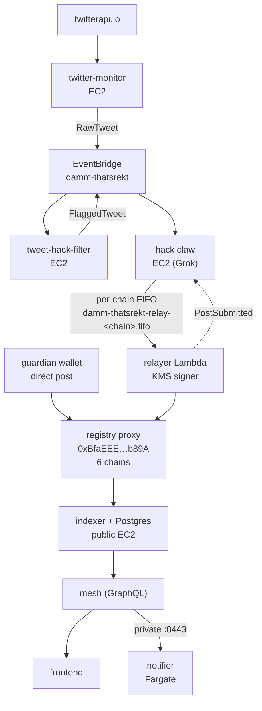
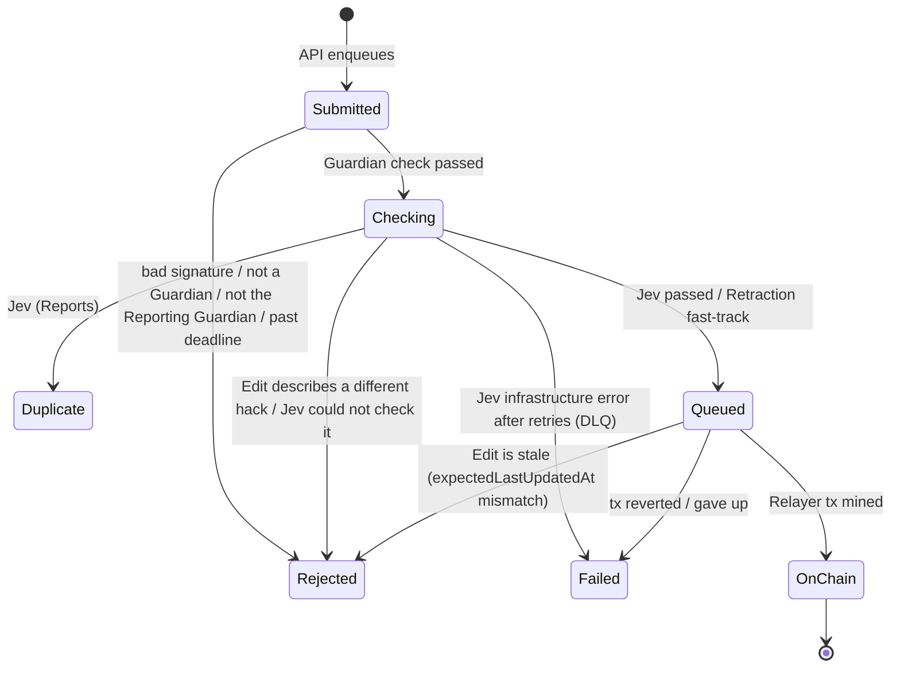

# thatsRekt — Guardian Report Intake Redesign

**Status:** Design in progress (D1–D48). Implementation not started.  
**Started:** 2026-09-30  
**Glossary:** [`../CONTEXT.md`](../CONTEXT.md) — terms in **bold** are defined there.  
**Builds on:** [`REWRITE-NOTES-2026-09-30.md`](./REWRITE-NOTES-2026-09-30.md). Where this file disagrees, this file wins (see §6).

---

## 1. Ground rules for the rewrite

| Rule | Decision |
|---|---|
| Rewrite scope | Heavy rewrite/refactor is acceptable across the whole stack: contracts, cloud, API, frontend. |
| Contract | Upgrading the registry contract is on the table. |
| Downtime | Avoid if possible; not a hard constraint. |
| Transport | Built on AWS SQS, like today's relay path. |
| API | Dumb: serves data, accepts **Requests**, enqueues them. Only a structural shape check and edge rate limiting (D29); no signature, membership, or content validation. |
| In scope | Centralizing two things: relaying to the chain and **Duplicate** checks (no hack verification stage, D46). The API is the only entry point. Decoupling the Twitter detector from the thatsRekt stack (D40). |
| Out of scope | The Twitter detector itself (twitter-monitor, tweet-hack-filter, its claw path): Bauti runs it on DAMM's behalf and refactors it in a separate planning session (D11). |

---

## 2. Current production (baseline)



Also running, not on this path: donations indexer (6 scheduled Fargate tasks), guardian-apply bot (hourly), notifier state in S3. Registry data still lives in the EC2 Postgres; RDS `thatsrekt-db` exists but the cutover (#317/#318) is not on `thatsrekt-cloud` main.

Today's contract identity model (`contracts/src/ThatsRekt.sol`): `post()` is `onlyWhitelisted` and stores `poster = msg.sender`; `amend*`, `addAttackers`, `addVictims`, `retract` require `poster == msg.sender`; `confirm`/`unconfirm` are `onlyWhitelisted`; `confirm` rejects `poster == msg.sender` (`PosterCannotConfirm`).

---

## 3. Target intake flow

```mermaid
flowchart TD
  G["Guardian<br/>EIP-712-signs a Request (one chain)"] -->|"Report / Edit / Retraction"| API["API (dumb)<br/>rate limit + shape check"]
  API --> QI[("intake<br/>SQS standard")]
  QI --> GC["Guardian check<br/>signature, Guardian on that chain,<br/>Reporting Guardian (Edit/Retraction), deadline"]
  GC -->|"Report / Edit"| QJ[("jev<br/>SQS standard")]
  GC -->|"Retraction (fast track)"| QR
  QJ --> JEV["Jev<br/>Reports: Duplicate vs same chain, Incident vs all chains<br/>Edits: still the same hack (D47)"]
  JEV --> QR[("thatsrekt-relay-&lt;chain&gt;.fifo<br/>new, per chain (D43)")]
  QR --> RS["Relayer service<br/>KMS key, Relayer role"]
  RS -->|"post / amend / add / retract<br/>keyed by requestId"| C["Registry on that chain"]
  GOV["Governance (purgeAdmin)"] -->|"purgePost"| C
  GW["Guardian wallet"] -->|"Upvote / Downvote"| C
  API & GC & JEV & RS -.->|"RequestStatus"| BUS["EventBridge<br/>thatsRekt-only bus (D42)"]
  BUS -.-> QS[("status SQS")] -.-> SW["status writer<br/>request_status (RDS)"]
  SW -.-> API
```

| Request | Signed contents (D33) | Path |
|---|---|---|
| New **Report** | chain, title, note, attackers, victims, `attackedAt`, `txHashes` (optional), `deadline` | `intake` (Guardian check) → `jev` (**Duplicate** + **Incident**) → `relay-<chain>` |
| **Edit** | chain, **Post** id, changed fields, `expectedLastUpdatedAt`, `deadline`, `txHashes` (optional) | `intake` → `jev` (still the same hack, D47; no **Duplicate** check) → `relay-<chain>` (stale check before sending) |
| **Retraction** | chain, **Post** id, `deadline` | `intake` → `relay-<chain>` (fast track, no Jev) |
| **Purge** | — | Not part of intake. Governance (`purgeAdmin`) calls `purgePost` directly. |

- A terminal outcome enqueues nothing further.
- Jev never calls the **Relayer service** directly; it only enqueues.
- A hack on N chains = N **Reports**, each relayed to its own chain once it passes; they share an **Incident** id off-chain.
- **Request** id = EIP-712 digest; it is the idempotency key on every queue and the on-chain `requestId` (D32, D35).

### Request status

Status is tracked per **Request** (Report, Edit, or Retraction), not per **Post**.



| Outcome | Meaning for the **Guardian** |
|---|---|
| **Rejected** | Fix your key or signature, you may not make this **Request**, it expired, or (for an **Edit**) the **Post** changed since you signed — re-sign against the current **Post** — or the **Edit** would make the **Post** describe a different hack — submit a new **Report** — or Jev could not check it — re-sign and resubmit (D48). |
| **Duplicate** | Already reported on this chain. |
| **On-chain** | Done; chain, **Post** id, tx hash. |
| **Failed** | A DAMM-side error (Jev infrastructure, or the **Relayer** could not get it on-chain) — DAMM's problem, not the **Guardian**'s. |

---

## 4. Decision log

| # | Question | Decision | Why / rejected alternatives |
|---|---|---|---|
| D1 | Who writes **Posts** on-chain? | A new on-chain **Relayer** role, held by the DAMM **Relayer service** via a KMS key. The contract allows more than one **Relayer**. **Guardians** no longer write **Posts**. | Matches REWRITE-NOTES goal 4 (Guardians without on-chain txs). |
| D2 | What can a **Relayer** do? | Only a **Relayer** can create, **Edit**, or **Retract** a **Post**. Its sole job is acting on behalf of **Guardians**. | Replaces today's `onlyWhitelisted` + `poster == msg.sender` gates. |
| D3 | Is the **Guardian** recorded on the **Post**? | Yes — every **Post** names the **Guardian** who submitted it (**Reporting Guardian**). | Keeps attribution now that `msg.sender` is always a **Relayer**. |
| D4 | Does the **Request signature** go on-chain? | No. It is an off-chain check only. The contract trusts the **Relayer** about who the **Reporting Guardian** is. | Rejected: contract re-verifying an EIP-712 signature. Accepted risk: whoever controls a **Relayer** key (or a pipeline bug) can create, **Edit**, or **Retract** **Posts** under any **Guardian**'s name. |
| D5 | Where is a bad signature / non-Guardian rejected? | In the first SQS consumer (Guardian check), not in the API. The API returns "accepted"; the rejection shows up as a status shortly after. | Rejected: synchronous verifier call from the API (would give an instant HTTP error). Accepted risk: unauthenticated traffic reaches the queue and status store; only edge rate limiting guards it. |
| D6 | How do **Guardians** Upvote/Downvote? | Directly from their own wallet, as today. The **Relayer** is not involved in **Votes**. | Rejected: votes through the **Relayer**; removing votes. Consequence: the **Guardian** set stays on-chain, and the Guardian check reads membership from the contract. |
| D7 | Self-vote rule | A **Guardian** cannot vote on a **Post** they are the **Reporting Guardian** of. `PosterCannotConfirm` moves from `poster` to `reportingGuardian`. | Carried over from today's rule; `poster` would always be the **Relayer**, making the old check meaningless. |
| D8 | Can one address be both? | No. The contract enforces that an address is either a **Guardian** or a **Relayer**, never both at once. | Keeps the roles separate: the role that writes cannot also vote or be credited. |
| D9 | Multi-chain hacks | The **Guardian** submits one **Report** per chain. Each is validated independently and relayed to its own chain. | Rejected: one **Report** fanned out to chosen chains; posting every **Report** to all 6 chains. |
| D10 | Scope of the Jev duplicate check | Only against historical **Reports** on the same chain as the new **Report**. A mainnet **Report** is compared only with mainnet history. | Follows from D9: sibling **Reports** on other chains must not be flagged as **Duplicates**. |
| D11 | Twitter-detected hacks | Out of scope. The Twitter detector is not part of the thatsRekt stack; Bauti runs it on DAMM's behalf, and it gets its own full refactor in a separate planning session. | This design only centralizes relay and **Duplicate** checks (D46). Known coupling, left to that session: today's detector writes straight to `relay-<chain>.fifo` and relies on the old relayer's `post(…, expectedPostId)`, so that path stops working when the upgrade lands. |
| D12 | Who decides a **Report** is accepted? | The off-chain pipeline alone (Guardian check → Jev **Duplicate** check, D46). Once accepted, the **Relayer service** just posts. The **Registry** does not re-check that `reportingGuardian` is a **Guardian**. | Rejected: an extra `isGuardian[reportingGuardian]` check in `post()`. Accepted: a **Guardian** removed between the Guardian check and the relayed tx still gets the **Post**. |
| D13 | Which **Guardian** set does the Guardian check use? | The **Guardian** set of the **Report**'s own chain. **Guardians** stay per chain, exactly as today. | Rejected: one canonical chain's roster for all chains. |
| D14 | Cross-chain awareness | Each chain's **Registry** is fully isolated and knows nothing of the others. No cross-chain state or ids on-chain. | Any cross-chain grouping must be off-chain. |
| D15 | Edit path | An **Edit** names the chain and **Post** id it changes. It goes Guardian check (signer is the **Post**'s **Reporting Guardian** and still a **Guardian**) → Jev same-hack check (D47) → **Relayer service** posts the amend. **No** **Duplicate** check (reconfirmed). | Rejected: a **Duplicate** check on **Edits** — the **Post** is already live and identified by id. Originally the claw validated **Edits** (D34); superseded by D46/D47. |
| D16 | **Retraction** path | A **Retraction** names the chain and **Post** id. Once the Guardian check passes, it is fast-tracked onto the queue for the **Relayer service**, which calls `retract`. No claw, no Jev. | Taking back a claim only removes data; nothing to verify. |
| D17 | Guardian delete vs governance moderation | A **Guardian**'s delete is a **Retraction** (`retract`, via the **Relayer**). **Purge** (`purgePost`) stays with governance (`purgeAdmin`); a **Relayer** can never purge. "Delete" is retired as a term. | Rejected: giving the **Relayer** `purgePost`; merging both into one `delete`. Keeps "reporter took it back" separate from "governance removed abuse", which indexers/frontends already read as two flags, and stops a compromised **Relayer** key from hiding any **Post** entirely. |
| D18 | Who may **Edit**/**Retract** a **Post**? | Only its **Reporting Guardian**, submitting a signed request to the API, and only while still a **Guardian** on that chain. The **Relayer service** relays it on-chain. | Rejected: letting **Retractions** survive Guardian removal (today's `retract` has no whitelist check); letting any **Guardian** change any **Post**. Removing a **Guardian** freezes their **Posts**; only a governance **Purge** can take one down. Closes the stolen-key → mass-retract scenario. |
| D19 | **Request** status model | Status is per **Request**. In-flight: `Submitted`, `Checking`, `Queued`. Terminal outcomes: **Rejected**, **Duplicate**, **On-chain**, **Failed** (see §3, Request status). **Not verified** was retired by D46. | `Checking` stays coarse — the **Guardian** gains nothing from knowing which consumer holds it. **Failed** is separate from **Rejected** so a **Relayer** outage never reads as the **Guardian**'s fault. |
| D20 | Channels | Not part of this redesign. The concept is dropped. | REWRITE-NOTES goal 1 had no concrete definition; this design stays scoped to relay and **Duplicate** checks. |
| D21 | Who governs the **Relayer** set? | Governance, exactly as for **Guardians**: added by `whitelistAdmin` (3-day TimelockController, multisig proposer), removed instantly by `whitelistRemover` (multisig kill switch). No separate relayer admin plane. | Rejected: a dedicated `relayerAdmin`/`relayerRemover` plane; owner-only (no instant kill switch). The D8 exclusivity check applies on every add. |
| D22 | Claw content sanity | **Superseded by D46.** Whenever the claw verifies a new **Report** or an **Edit**, it checks that the title and note make sense and are not gibberish. Random titles end as **Not verified**. | The **Registry** only enforces title length (1–200 bytes); content quality has to be judged off-chain. |
| D23 | How the new model ships | In-place UUPS upgrade of the existing proxies on each chain (same addresses). The existing `poster` storage slot is reused to mean **Reporting Guardian**: `post()` writes the passed-in **Guardian** there. A new `PostRelayed` event records which **Relayer** sent the tx. | Rejected: a new `reportingGuardian` struct field (dual attribution + legacy fallback); fresh Registries (address change for integrators, aggregates reset). Legacy **Posts** are already correct: today's `poster` is whoever reported it (mainnet: 47 by `0xFe6B…FFdb`, 12 by `0xE039…4374`, checked via `getPost` 1–59). Storage layout: existing slots unchanged; one mapping appended (D35) — verify with a `forge inspect` storage-layout diff. |
| D24 | Today's relayer key `0xFe6B…FFdb` | Stays a **Guardian** and keeps its legacy **Posts**. A brand-new KMS key becomes the **Relayer**, installed by the upgrade itself (D39). Anything that reports with `0xFe6B` afterwards goes through the API like any other **Guardian** (how the separate DAMM detector uses it is outside this design, D11). | Rejected: turning `0xFe6B` into the **Relayer** (it would have to leave the **Guardian** set per D8, freezing its legacy **Posts** under D18). `0xFe6B` is already whitelisted on all 6 chains (checked `isWhitelisted` on 1, 8453, 42161, 10, 56, 137), so no **Guardian** change is needed. |
| D25 | Queue topology | One queue per stage: API → `intake` (standard; Guardian check) → `jev` (standard; Jev: **Duplicate** + **Incident** for **Reports**, same hack for **Edits**) → new per-chain `thatsrekt-relay-<chain>.fifo` (**Relayer service**, D43). **Retractions** skip `jev`. Each stage has its own DLQ and retry policy. The **Request** id is the idempotency key on every stage and becomes the relay queue's `MessageDeduplicationId` (replacing `action_id`). | Rejected: one shared queue with a `stage` field (one retry policy for fast and slow stages; backlogs hide each other); per-chain FIFO for every stage (a slow Jev run stalls the whole chain). Only the relay stage needs ordering (per-chain nonces). |
| D26 | Status store | The API and every stage emit `RequestStatus{request_id, state, …}` events to a thatsRekt-only EventBridge bus (D42). One rule routes them to a `status` SQS queue; a single status writer upserts a `request_status` table in thatsRekt RDS. The API only reads that table. States only move forward; a terminal outcome is never overwritten (handles out-of-order and redelivered events). | Rejected: each stage writing RDS directly (five writers, forward-only rule duplicated); DynamoDB (a second datastore beside RDS). Same pattern as the relayer's lifecycle events (`lifecycle_v21.go`) and `PostSubmitted` → SQS → bookkeeping, on a bus the detector does not use. The RDS exists: `aws_db_instance.thatsrekt` (`thatsrekt-db`, `thatsrekt-cloud/terraform/rds.tf`), landed by thatsrekt-cloud#12/#13 (damm-cloud issues #317/#318, merged 2026-07-20). |
| D27 | **Duplicate** pool and disposition | Jev compares a **Report** against its chain's live **Posts** (not retracted or purged) **and** older **Reports** past the Guardian check that have no outcome yet. Oldest wins: a **Report** can only be a **Duplicate** of something older. A **Duplicate** ends with a pointer to the original **Post** id (or **Request** id if still in flight); the **Guardian** is told to **Upvote** it instead. "Same hack" is Jev's judgment, guided by the claw's proven signals: same attacker, same victim, or same protocol + day; code accepts it only with an objective overlap (D48). | Rejected: comparing on-chain **Posts** only (concurrent **Reports** both pass — the 2026-05-11 INK Finance 5-alert incident, where verified/in-flight siblings were invisible to `dedup_lookup`); auto-merging into the original (would be an **Edit** by someone other than its **Reporting Guardian**, breaking D18). Deferred: suggesting a **Duplicate**'s extra attackers/victims to the original's **Reporting Guardian**. |
| D28 | How a **Guardian** learns the outcome | Pull only. The frontend polls status by **Request** id after submitting, and a "My Requests" view lists every **Request** signed by the connected **Guardian** address with its outcome and pointer: **Duplicate** → original, **On-chain** → **Post** + tx, **Rejected** → which check failed (including "describes a different hack" for **Edits**). | Rejected: Telegram or email push (needs a **Guardian** ↔ contact mapping; push can later be added as another bus subscriber without changing this design). **Rejected** must name the failed check so the **Guardian** can act on it. |
| D29 | Spam on the unauthenticated intake | nginx `limit_req` per IP on the submit endpoint, a body-size cap, and strict structural schema validation in the API (shape only — no signature or membership check, D5 stands). `Rejected` status rows whose signer is not a **Guardian** expire after N days; rows from real **Guardians** are kept. | Rejected: API-side signer recovery + cached **Guardian** sets (reverses D5; kept as a contained fallback if spam becomes real); SIWE sessions (auth state in the API, double signing). Today there is no WAF/API Gateway/CloudFront in `thatsrekt-cloud/terraform` and no `limit_req` in `local-stack/nginx.conf`. |
| D30 | What the **Request signature** covers | An EIP-712 typed-data signature over the **full** **Request** payload: every field of a **Report** (chain, title, note, attackers, victims, `attackedAt`, …), every changed field of an **Edit** plus its chain and **Post** id, and the chain + **Post** id of a **Retraction**. The domain carries the target chain id. Any field the **Relayer** writes on-chain must come from the signed payload. | Guarantees the **Guardian** authored and approves the exact contents; no stage (Jev, **Relayer service**) may add or alter a signed field. Chain id in the domain matters because the proxy address is identical on all 6 chains, so `verifyingContract` alone cannot stop cross-chain replay. |
| D31 | Who can read a **Guardian**'s **Requests** | Public by address. Anyone can list any address's **Requests** and their contents and outcomes; no read signature. | Rejected: signed reads; capability-only access by **Request** id. Accepted risk: **Duplicate** and **Rejected** **Requests** naming attacker/victim addresses are publicly readable through the API even though they never reach the **Registry**. |
| D32 | Replay protection | **Request** id = the EIP-712 digest, so resubmitting the same signature is the same **Request** (SQS dedup + forward-only status make it a no-op). Every payload carries a `deadline` (order of 24 h), checked once by the Guardian check at intake — never at relay, so a slow Jev run or relay backlog cannot expire a valid **Request**. Every **Edit** carries `expectedLastUpdatedAt` (the **Post**'s `lastUpdatedAt` when signed); the **Relayer service** compares it with `getPost` just before sending, and a mismatch ends as **Rejected** (stale). | Rejected: per-**Guardian** nonces (one stuck **Request** blocks every later one; needs a nonce store); deadline only (replays inside the window still roll **Edits** back). Needed because D31 makes every signed payload public. No contract change: `lastUpdatedAt` is already returned by `getPost`; the per-chain relay FIFO (D25) serializes the check. |
| D33 | What a **Guardian** signs | **Report** type: `chainId, title, note, attackers[], victims[], attackedAt, txHashes[], deadline`. **Edit** type: chain, **Post** id, changed fields, `expectedLastUpdatedAt`, `deadline`, `txHashes[]`. `txHashes` is optional and may be empty on every **Request**: signed, stored off-chain with the **Request**, public via the API (D31) and shown to voters, never written on-chain. No stage may depend on it: Jev may use it as an extra signal for **Duplicate**/**Incident**/same-hack judgments when present, and must reach the same kind of decision without it. Exception to D30: the **Relayer service** supplies only the **Request** id (= the EIP-712 digest, D35) and the **Reporting Guardian** (= the recovered signer). | Rejected: requiring ≥1 tx hash (with no Verifier after D46 nothing checks it, and Guardians cannot be assumed to have one when reporting); dropping the field (loses optional evidence for voters and Jev); evidence on-chain (new field/event; keeps the upgrade minimal); a `sources[]` URL list. |
| D34 | What the claw checks on an **Edit** | **Superseded by D46/D47** (no claw; Jev keeps check (3)). The edited **Post** as a whole against the current one: (1) D22 sanity on the new title and note; (2) new attackers/victims are backed by the **Edit**'s `txHashes`; (3) the edited **Post** still describes the same hack. | Rejected: checking the change in isolation (**Votes** cast for one hack would silently count toward another). |
| D35 | Replace `expectedPostId` | Every **Relayer** write is keyed by its **Request** id: `post(requestId, reportingGuardian, title, attackers, victims, note, attackedAt)`, and `requestId` is likewise the first argument of every **Edit** call and `retract`. An appended `postIdOfRequest[bytes32 → uint256]` makes each **Request** id usable once; reuse reverts `RequestAlreadyRelayed(postId)`, which the **Relayer service** treats as **On-chain**. `expectedPostId`, `peekNextPostId`, and `PostIdMismatch` are removed. Attribution: the **Post** stores the **Reporting Guardian** (D23), `PostCreated` carries it as `poster`, and the **Edit** events' `amender` is the **Post**'s **Reporting Guardian** — never the **Relayer**. `PostRelayed(postId, relayer, requestId)` records which **Relayer** sent each write. | Rejected: just deleting it (exactly-once would rest on the relayer's 24 h `PostCreated(poster = signer)` log scan in `internal/idempotency`, which D23 breaks); keeping it (peek-then-post race, `PostIdMismatch` retries in `classifier.go`). Its original purpose — committing to a stable URL before mining — has no user once **Guardians** get a **Request** id and D28 status. Cost: one extra SSTORE per write. |
| D36 | Cross-chain grouping | Pipeline-assigned **Incident** id. In the `jev` stage, Jev also compares a **Report** against other chains' live **Posts** and in-flight **Reports** — for grouping only; the **Duplicate** check stays per chain (D10). A match inherits that `incidentId`; otherwise a new one is minted. Stored off-chain with the **Request**/**Post** and exposed by the API; the frontend groups by it. | Rejected: keeping the June-spec heuristic `poster + normalizeTitle + attackedAt window` (misses siblings filed by different **Guardians**); no grouping. Fills the `incidentId` seam the June spec left open. A wrong grouping only affects display, never on-chain state. |
| D37 | **Relayer** key compromise | No standby key. Governance removes the compromised **Relayer** instantly (`whitelistRemover`, D21); relay is paused (event-source mapping disabled so messages wait in the FIFO instead of hitting the DLQ); a new KMS key is added through the 3-day path; relay resumes. | Rejected: a pre-registered standby **Relayer** key; two active keys (one compromise exposes both). Accepted risk: up to a 3-day posting blackout on affected chains. No **Request** is lost: `deadline` is checked only at intake (D32) and the relay FIFO retains messages 14 days. |
| D38 | **Incident** ids for legacy **Posts** | One-off, idempotent backfill before the frontend switches to `incidentId`: run D36's grouping over every existing **Post** on all 6 chains, oldest first, each inheriting an earlier match's id or getting a new one. The June-spec heuristic is then deleted from the frontend. | Rejected: leaving legacy **Posts** ungrouped; keeping the heuristic as a fallback (two grouping systems forever). Scale: 93 **Posts** (`postCount()`: 1→59, 8453→5, 42161→7, 10→4, 56→16, 137→2). |
| D39 | Installing the first **Relayer** | The upgrade is `upgradeToAndCall(newImpl, initializeV2(initialRelayer))`; `initializeV2` is a `reinitializer(2)` that adds the KMS **Relayer** with the D8 exclusivity check. Every later **Relayer** add follows D21. | Rejected: upgrading, then adding through the 3-day `whitelistAdmin` path (`post()` is **Relayer**-only from the upgrade, so nobody could post on any chain for 3 days); hardcoding the **Relayer** in the implementation (contradicts D21, awkward rotation). The add is still governed — more strictly: the proxy `owner()` is the TimelockController `0xf6F8…2aB6` with `getMinDelay()` = 604800 (7 days) on all 6 chains, and the **Relayer** address is visible in the queued calldata. |
| D40 | Twitter detector boundary | The thatsRekt stack shares nothing with the Twitter detector: no EventBridge bus, queues, IAM grants, service instances, or DB tables. The detector's only possible interface is the public API, as an ordinary **Guardian** client. Cutting today's couplings is part of this redesign. | Today they share the `damm-thatsrekt` bus: `RawTweet` (twitter-monitor) → tweet-hack-filter → `FlaggedTweet` → hack-monitor-claw → `VerifiedHack`/`PostUpdate` → relayer, and the relayer's `PostSubmitted` → claw bookkeeping queue (`damm-thatsrekt-v2-notifier.tf`, `hack-monitor-claw.tf:637–648`, `tweet-hack-filter.tf:462–471`). Without decoupling, D26's `RequestStatus` events and the new **Relayer service** would land on a bus the detector also drives. |
| D41 | Cutover and the governance timelock | Keep the in-place upgrade and its 7-day owner timelock; schedule early so the delay overlaps off-chain build and testing. Sequence in §8. Accepted: a planned downtime window of a couple of hours. | Rejected: fresh deployment to skip the timelock (reverses D23: new address for integrators reading `attackerScore`/`isVictim`, 93 **Posts**, all **Votes** and **Guardian** sets to migrate or lose). No fast path exists: `_authorizeUpgrade` is `onlyOwner`; owner is TimelockController `0xf6F8…2aB6`, `getMinDelay()` = 7 days on all 6 chains, and changing the delay is itself a 7-day operation. A ready operation does not expire, and `EXECUTOR_ROLE` is open (`address(0)`), so the execution moment is ours to choose. Risk: an implementation bug found after scheduling means cancel and reschedule (+7 days) — audit before scheduling. |
| D42 | Shared infrastructure with the detector | thatsRekt builds its own: a new thatsRekt-only EventBridge bus carries D26's `RequestStatus` events. The detector keeps hack-monitor-claw, the `damm-thatsrekt` bus, and tweet-hack-filter untouched until its own refactor. (The planned thatsRekt **Verifier** service with from-scratch prompts is superseded by D46.) | Rejected: thatsRekt taking over hack-monitor-claw and the bus (forces the detector refactor before cutover); a shared claw library (couples both release cycles). The claw's tweet input and `prod_agent_chain_post_bookkeeping` are detector concerns. |
| D43 | Relay queues | New per-chain `thatsrekt-relay-<chain>.fifo` queues, each with its own DLQ and thatsRekt-only IAM; only `intake` (**Retractions**) and the `jev` stage may send. The old `damm-thatsrekt-relay-<chain>.fifo` queues, their `damm-thatsrekt` bus rule, and the old relayer Lambda are deleted after cutover. | Rejected: reusing and purging the old queues (a missed purge or leftover grant lets an unsigned, old-format detector message reach the **Relayer service**). Enforces D40 in infrastructure rather than in a cutover checklist. |
| D44 | Verifier tooling | **Superseded by D46.** The Verifier would have had every read tool: X/Twitter search, Foundry (`cast`, local `anvil` forks), chain RPC, Alchemy, web search/fetch. | — |
| D45 | How much the Verifier confirms | **Light check superseded by D46**; the principle stands: truth is signalled after posting by **Guardians**' **Upvotes**/**Downvotes**, and DAMM's detector, as a **Guardian**, is one of those voters. No outside confirmation is sought before relaying. | Rejected: requiring external confirmation (post-mortems, security-firm alerts) before relaying — slower in the first minutes after a hack, and duplicates the job **Votes** already do. |
| D46 | Remove the Verifier | No hack-verification stage. A **Report** is accepted once the Guardian check passes and Jev finds no **Duplicate**, and is relayed within seconds. Truth is decided after posting by **Votes** (D45), with **Purge** and **Guardian** removal (D18) against abuse. No evidence checks at intake. **Not verified** is retired. | Rejected: the D42/D44/D45 Verifier — minutes of latency per hack alert, LLM cost, and the largest prompt-injection surface (broad tool access); code-only `txHashes` checks (the field is optional, D33, so they could not gate acceptance). Accepted risk: a careless or compromised **Guardian**'s **Report** goes on-chain unchecked; `isVictim` and `attackerAppearances` move as soon as the **Post** exists, while `attackerScore` moves only with **Votes** (`ThatsRekt.sol` :798–807, :1069–1079). |
| D47 | Keeping **Edits** on the same hack | Jev checks every **Edit**: it compares the edited **Post** with the current one and decides whether it still describes the same hack. A different hack ends **Rejected** ("describes a different hack — submit a new **Report**"). Still no **Duplicate** check on **Edits** (D15). | Keeps the protection D34 (3) gave D15: without it, a **Post** that already has **Votes** could be edited into a different hack and those **Votes** would count toward the new attackers. Rejected: restricting what an **Edit** may change (e.g. fixed title); accepting the risk. Jev has no tools, so this adds little injection surface. |
| D48 | Prompt injection in Jev | Code bounds every Jev verdict. (1) Typed output validated in code: a fixed verdict set plus a pointer that must be one of the supplied candidate ids, else the output is malformed. (2) A **Duplicate** verdict is accepted only if code confirms an objective overlap with the candidate: a shared attacker/victim address, a shared `txHash` (when present, D33), or `attackedAt` within ±24 h. (3) An uncertain verdict, or output still malformed after retries, ends the **Report** or **Edit** as **Rejected** ("could not be checked — re-sign and resubmit"; a new `deadline` gives a new **Request** id, D32). Model API or infrastructure errors (timeouts, 5xx, throttling) are retried by SQS, then DLQ → **Failed**. (4) Untrusted text (titles and notes of the **Request** and of every candidate) reaches Jev only as quoted JSON data fields, never as instructions. (5) Jev has no tools, no keys, and no egress beyond the model API. (6) A CI injection suite covers planted-**Post** suppression and **Edit** pivots. | Rejected: a screening model (B — a second injectable model, more latency, blocks nothing the code bounds miss); a quarantined dual model (C — double cost for the same bound); posting when unsure (Bauti chose invalid); a separate "Unchecked" outcome (same **Guardian** action as **Rejected**); mapping uncertain verdicts to **Failed** (hides that re-signing helps). Accepted risk: a **Post** or in-flight **Report** whose text reliably derails Jev makes later **Reports** on that chain **Rejected** while it stays in the candidate pool, until it is **Purged** or retracted. |

---

## 5. Contract changes

| Area | Today | Target |
|---|---|---|
| Roles | `isWhitelisted` (guardians), plus admin slots | Per-**Registry** **Guardian** set (as today) and **Relayer** set; adding an address to one reverts if it is in the other (D8). |
| `post` | `onlyWhitelisted`; `expectedPostId` must equal `postCount + 1`; `poster = msg.sender` | Relayer-only; `post(requestId, reportingGuardian, …)`, writes the **Reporting Guardian** into the existing `poster` slot unchecked; `requestId` usable once (D2, D3, D12, D23, D35). |
| `amendTitle`, `amendNote`, `addAttackers`, `addVictims` | `onlyWhitelisted` + `poster == msg.sender`; events' `amender` = `msg.sender` | Relayer-only, keyed by `requestId` (D2, D35); events' `amender` = the **Post**'s **Reporting Guardian**. |
| `retract` | `poster == msg.sender` | Relayer-only, keyed by `requestId`, on behalf of the **Reporting Guardian** (D2, D16, D35). |
| `purgePost` | `onlyPurgeAdmin` | Unchanged; the **Relayer** role gets no purge rights (D17). |
| `confirm` / `unconfirm` | `onlyWhitelisted`; blocks `poster` | Guardian-only from the wallet; blocks `reportingGuardian` (D6, D7). |
| `PostCreated` event | carries `poster` (`msg.sender`) | Same shape; its `poster` argument now carries the **Reporting Guardian** (D23). |
| `PostRelayed` event | — | New: `(postId, relayer, requestId)` for every **Relayer** write — links each on-chain change to its signed **Request** (D23, D35). |
| `peekNextPostId`, `PostIdMismatch` | exist | Removed (D35). |
| `postIdOfRequest` | — | New appended mapping `bytes32 → uint256`; reuse reverts `RequestAlreadyRelayed(postId)` (D35). |
| Upgrade | UUPS proxy `0xBfaEEE…b89A` on 6 chains | New implementation per chain, same proxy; existing slots unchanged, one mapping appended (D23, D35). |
| `initializeV2` | — | New `reinitializer(2)`, called by the upgrade; installs the first **Relayer** (D39). |

### Post fields stored by `post()` today

| Field | Required | Stored | Rule |
|---|---|---|---|
| `title` | yes | storage (`postTitle`) | 1–200 bytes (`TitleEmpty`, `TitleTooLong`) |
| `attackedAt` | yes | storage | `> 0` and `≤ block.timestamp` (`InvalidAttackedAt`) |
| `expectedPostId` | yes | becomes the id | must equal `postCount + 1` (`PostIdMismatch`) — removed by D35 |
| `attackers` | no | storage | combined with victims ≤ 100 (`PostTooLarge`) |
| `victims` | no | storage | combined with attackers ≤ 100 |
| `note` | no | `PostCreated` event only | empty allowed |

Contract-set: `poster`, `confirmations`/`disconfirmations` = 0, `removed`/`purged` = false, `lastUpdatedAt`. Not on-chain: tx hash, attack block, chain id (the chain is where the tx lands). `post()` does not reject zero/duplicate addresses; `addAttackers`/`addVictims` do.

---

## 6. Changes vs REWRITE-NOTES-2026-09-30

- REWRITE-NOTES has the **API** validating signature + whitelist. Superseded by D5: the API is dumb; the first queue consumer validates.
- REWRITE-NOTES says "sole relayer". Refined by D1: a **Relayer** role that allows several addresses, with DAMM's **Relayer service** as the one in use.
- REWRITE-NOTES goal 1 (channels) is dropped by D20.

---

## 7. Open questions

None.

---

## 8. Implementation steps

1. ADRs (written, accepted):
   - [`docs/adr/0001-reporting-guardian-trusted-from-relayer.md`](./adr/0001-reporting-guardian-trusted-from-relayer.md) — D4, D12 (the **Registry** trusts the **Relayer** about the **Reporting Guardian**; no on-chain signature check).
   - [`docs/adr/0002-in-place-upgrade-request-keyed-writes.md`](./adr/0002-in-place-upgrade-request-keyed-writes.md) — D23, D35 (in-place UUPS upgrade reusing the `poster` slot; **Request**-id-keyed writes replace `expectedPostId`).
2. Twitter detector refactor — separate planning session (D11). This redesign only cuts its couplings to the thatsRekt stack (D40); its current relay path stops working at the upgrade.
3. Cutover (D39, D41):
   1. Create the KMS **Relayer** key.
   2. Deploy and audit the new implementation on all 6 chains; verify the storage-layout diff (D23, D35).
   3. The Safe schedules `upgradeToAndCall(newImpl, initializeV2(relayer))` on each chain's TimelockController.
   4. During the 7 days: ship the off-chain stack dark — API, `intake`/`jev`, status writer, new **Relayer service** — with every relay event-source mapping disabled; rehearse the full flow on a fork against the new implementation.
   5. Downtime window: switch the frontend to signed **Requests**, execute the 6 upgrades, enable the 6 relay mappings, smoke-test one **Request** per chain.
   6. After cutover: delete the old `damm-thatsrekt-relay-<chain>.fifo` queues, their bus rule, and the old relayer Lambda (D43).
