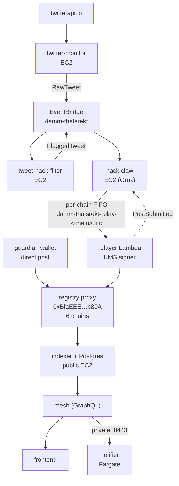
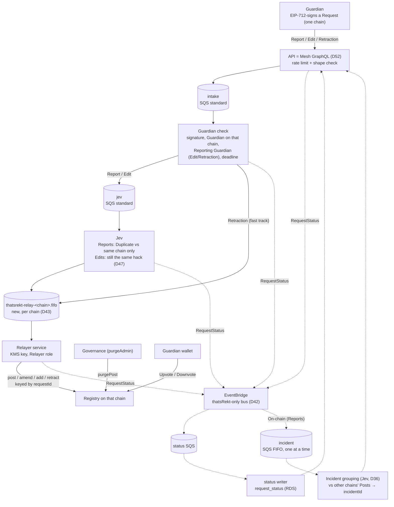
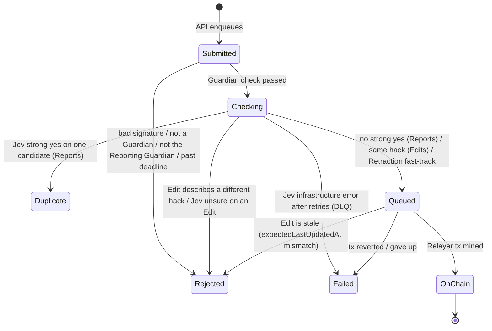

# thatsRekt — Guardian Report Intake Redesign

**Status:** Design in progress (D1–D56). Implementation not started.  
**Started:** 2026-09-30  
**Glossary:** [`../CONTEXT.md`](../CONTEXT.md) — terms in **bold** are defined there.  
**Builds on:** [`REWRITE-NOTES-2026-09-30.md`](./REWRITE-NOTES-2026-09-30.md). Where this file disagrees, this file wins (see §6).

---

## 1. Ground rules for the rewrite

| Rule | Decision |
|---|---|
| Rewrite scope | Heavy rewrite/refactor is acceptable across the whole stack: contracts, cloud, API, frontend. |
| Contract | Upgrading the registry contract is on the table. |
| Downtime | Avoid if possible; not a hard constraint. |
| Transport | Built on AWS SQS, like today's relay path. |
| API | The Mesh GraphQL gateway (D52). Dumb: serves data, accepts **Requests**, enqueues them. Only a structural shape check and edge rate limiting (D29); no signature, membership, or content validation. |
| In scope | Centralizing two things: relaying to the chain and **Duplicate** checks (no hack verification stage, D46). The API is the only entry point. Decoupling the Twitter detector from the thatsRekt stack (D40). |
| Out of scope | The Twitter detector itself (twitter-monitor, tweet-hack-filter, its claw path): Bauti runs it on DAMM's behalf and refactors it in a separate planning session (D11). |

---

## 2. Current production (baseline)

Also running, not on this path: donations indexer (6 scheduled Fargate tasks), guardian-apply bot (hourly), notifier state in S3. Registry data still lives in the EC2 Postgres; RDS `thatsrekt-db` exists but the cutover (#317/#318) is not on `thatsrekt-cloud` main.

Today's contract identity model (`contracts/src/ThatsRekt.sol`): `post()` is `onlyWhitelisted` and stores `poster = msg.sender`; `amend*`, `addAttackers`, `addVictims`, `retract` require `poster == msg.sender`; `confirm`/`unconfirm` are `onlyWhitelisted`; `confirm` rejects `poster == msg.sender` (`PosterCannotConfirm`).

---

## 3. Target intake flow

| Request | Signed contents (D33) | Path |
|---|---|---|
| New **Report** | chain, title, note, attackers, victims, `attackedAt`, `deadline` | `intake` (Guardian check) → `jev` (**Duplicate**, same chain only) → `relay-<chain>`; once **On-chain**, `incident` (grouping, off the relay path) |
| **Edit** | chain, **Post** id, changed fields, `expectedLastUpdatedAt`, `deadline` | `intake` → `jev` (still the same hack, D47; no **Duplicate** check) → `relay-<chain>` (stale check before sending) |
| **Retraction** | chain, **Post** id, `deadline` | `intake` → `relay-<chain>` (fast track, no Jev) |
| **Purge** | — | Not part of intake. Governance (`purgeAdmin`) calls `purgePost` directly. |

- A terminal outcome enqueues nothing further.
- Jev never calls the **Relayer service** directly; it only enqueues.
- A hack on N chains = N **Reports**, each relayed to its own chain once it is not a **Duplicate** there; the `incident` stage then gives them a shared **Incident** id off-chain. The **Registry** has no multi-chain concept.
- **Request** id = EIP-712 digest; it is the idempotency key on every queue and the on-chain `requestId` (D32, D35).

### Request status

Status is tracked per **Request** (Report, Edit, or Retraction), not per **Post**.

| Outcome | Meaning for the **Guardian** |
|---|---|
| **Rejected** | Fix your key or signature, you may not make this **Request**, it expired, or (for an **Edit**) the **Post** changed since you signed — re-sign against the current **Post** — or the **Edit** would make the **Post** describe a different hack, or Jev could not confirm it is the same hack — submit a new **Report** or re-sign a narrower **Edit** (D48). |
| **Duplicate** | Already reported on this chain. |
| **On-chain** | Done; chain, **Post** id, tx hash. |
| **Failed** | A DAMM-side error (Jev infrastructure, or the **Relayer** could not get it on-chain) — DAMM's problem, not the **Guardian**'s. |

---

## 4. Decision log

| # | Question | Decision | Why / rejected alternatives |
|---|---|---|---|
| D1 | Who writes **Posts** on-chain? | A new on-chain **Relayer** role, held by the DAMM **Relayer service** via a KMS key. The contract allows more than one **Relayer**. **Guardians** no longer write **Posts**. | Matches REWRITE-NOTES goal 4 (Guardians without on-chain txs). |
| D2 | What can a **Relayer** do? | Only a **Relayer** can create, **Edit**, or **Retract** a **Post**. Its sole job is acting on behalf of **Guardians**. | Replaces today's `onlyWhitelisted` + `poster == msg.sender` gates. |
| D3 | Is the **Guardian** recorded on the **Post**? | Yes — every **Post** names the **Guardian** who submitted it (**Reporting Guardian**). | Keeps attribution now that `msg.sender` is always a **Relayer**. |
| D4 | Does the **Request signature** go on-chain? | Yes. The **Registry** verifies the **Guardian**'s EIP-712 signature on every **Relayer** write (D55). The **Relayer** cannot write anything a **Guardian** did not sign. | Reversed by Bauti (2026-10-05); the first answer (off-chain check only, the contract trusting the **Relayer** about the **Reporting Guardian** — ADR 0001) let a **Relayer** key or pipeline bug create, **Edit**, or **Retract** **Posts** under any **Guardian**'s name. ADR 0001 is superseded by ADR 0003. |
| D5 | Where is a bad signature / non-Guardian rejected? | In the first SQS consumer (Guardian check), not in the API. The API returns "accepted"; the rejection shows up as a status shortly after. | Rejected: synchronous verifier call from the API (would give an instant HTTP error). Accepted risk: unauthenticated traffic reaches the queue and status store; only edge rate limiting guards it. |
| D6 | How do **Guardians** Upvote/Downvote? | Directly from their own wallet, as today. The **Relayer** is not involved in **Votes**. | Rejected: votes through the **Relayer**; removing votes. Consequence: the **Guardian** set stays on-chain, and the Guardian check reads membership from the contract. |
| D7 | Self-vote rule | A **Guardian** cannot vote on a **Post** they are the **Reporting Guardian** of. `PosterCannotConfirm` moves from `poster` to `reportingGuardian`. | Carried over from today's rule; `poster` would always be the **Relayer**, making the old check meaningless. |
| D8 | Can one address be both? | No. The contract enforces that an address is either a **Guardian** or a **Relayer**, never both at once. | Keeps the roles separate: the role that writes cannot also vote or be credited. |
| D9 | Multi-chain hacks | The **Guardian** submits one **Report** per chain. Each is validated independently and relayed to its own chain. | Rejected: one **Report** fanned out to chosen chains; posting every **Report** to all 6 chains. |
| D10 | Scope of the Jev duplicate check | Only against historical **Reports** on the same chain as the new **Report**. A mainnet **Report** is compared only with mainnet history. | Follows from D9: sibling **Reports** on other chains must not be flagged as **Duplicates**. |
| D11 | Twitter-detected hacks | Out of scope. The Twitter detector is not part of the thatsRekt stack; Bauti runs it on DAMM's behalf, and it gets its own full refactor in a separate planning session. | This design only centralizes relay and **Duplicate** checks (D46). Known coupling, left to that session: today's detector writes straight to `relay-<chain>.fifo` and relies on the old relayer's `post(…, expectedPostId)`, so that path stops working when the upgrade lands. |
| D12 | Who decides a **Report** is accepted? | Two layers. The off-chain pipeline decides what gets relayed (Guardian check → Jev **Duplicate** check, D46). The **Registry** independently enforces authorship: a valid signature from the named **Guardian**, who must still be a **Guardian** on that chain when the tx executes (D55). | Reversed with D4. A **Guardian** removed between the Guardian check and the mined tx now reverts (`NotWhitelisted`); the **Relayer service** maps that to **Rejected** (not a **Guardian**). Still off-chain only: the **Duplicate** check and the **Edit** same-hack check (D47) — a **Relayer** could relay a **Guardian**-signed **Request** the pipeline ruled out, but only that **Guardian**'s own signed content. |
| D13 | Which **Guardian** set does the Guardian check use? | The **Guardian** set of the **Report**'s own chain. **Guardians** stay per chain, exactly as today. | Rejected: one canonical chain's roster for all chains. |
| D14 | Cross-chain awareness | Each chain's **Registry** is fully isolated and knows nothing of the others. No cross-chain state or ids on-chain. | Any cross-chain grouping must be off-chain. |
| D15 | Edit path | An **Edit** names the chain and **Post** id it changes. It goes Guardian check (signer is the **Post**'s **Reporting Guardian** and still a **Guardian**) → Jev same-hack check (D47) → **Relayer service** posts the amend. **No** **Duplicate** check (reconfirmed). | Rejected: a **Duplicate** check on **Edits** — the **Post** is already live and identified by id. Originally the claw validated **Edits** (D34); superseded by D46/D47. |
| D16 | **Retraction** path | A **Retraction** names the chain and **Post** id. Once the Guardian check passes, it is fast-tracked onto the queue for the **Relayer service**, which calls `retract`. No claw, no Jev. | Taking back a claim only removes data; nothing to verify. |
| D17 | Guardian delete vs governance moderation | A **Guardian**'s delete is a **Retraction** (`retract`, via the **Relayer**). **Purge** (`purgePost`) stays with governance (`purgeAdmin`); a **Relayer** can never purge. "Delete" is retired as a term. | Rejected: giving the **Relayer** `purgePost`; merging both into one `delete`. Keeps "reporter took it back" separate from "governance removed abuse", which indexers/frontends already read as two flags, and stops a compromised **Relayer** key from hiding any **Post** entirely. |
| D18 | Who may **Edit**/**Retract** a **Post**? | Only its **Reporting Guardian**, submitting a signed request to the API, and only while still a **Guardian** on that chain. The **Relayer service** relays it on-chain. | Rejected: letting **Retractions** survive Guardian removal (today's `retract` has no whitelist check); letting any **Guardian** change any **Post**. Removing a **Guardian** freezes their **Posts**; only a governance **Purge** can take one down. Closes the stolen-key → mass-retract scenario. |
| D19 | **Request** status model | Status is per **Request**. In-flight: `Submitted`, `Checking`, `Queued`. Terminal outcomes: **Rejected**, **Duplicate**, **On-chain**, **Failed** (see §3, Request status). **Not verified** was retired by D46. | `Checking` stays coarse — the **Guardian** gains nothing from knowing which consumer holds it. **Failed** is separate from **Rejected** so a **Relayer** outage never reads as the **Guardian**'s fault. |
| D20 | Channels | Not part of this redesign. The concept is dropped. | REWRITE-NOTES goal 1 had no concrete definition; this design stays scoped to relay and **Duplicate** checks. |
| D21 | Who governs the **Relayer** set? | Governance, exactly as for **Guardians**: added by `whitelistAdmin` (3-day TimelockController, multisig proposer), removed instantly by `whitelistRemover` (multisig kill switch). No separate relayer admin plane. | Rejected: a dedicated `relayerAdmin`/`relayerRemover` plane; owner-only (no instant kill switch). The D8 exclusivity check applies on every add. |
| D22 | Claw content sanity | **Superseded by D46.** Whenever the claw verifies a new **Report** or an **Edit**, it checks that the title and note make sense and are not gibberish. Random titles end as **Not verified**. | The **Registry** only enforces title length (1–200 bytes); content quality has to be judged off-chain. |
| D23 | How the new model ships | In-place UUPS upgrade of the existing proxies on each chain (same addresses). The existing `poster` storage slot is reused to mean **Reporting Guardian**: `post()` writes the passed-in **Guardian** there. A new `PostRelayed` event records which **Relayer** sent the tx. | Rejected: a new `reportingGuardian` struct field (dual attribution + legacy fallback); fresh Registries (address change for integrators, aggregates reset). Legacy **Posts** are already correct: today's `poster` is whoever reported it (mainnet: 47 by `0xFe6B…FFdb`, 12 by `0xE039…4374`, checked via `getPost` 1–59). Storage layout: existing slots unchanged; one mapping appended (D35) — verify with a `forge inspect` storage-layout diff. |
| D24 | Today's relayer key `0xFe6B…FFdb` | Stays a **Guardian** and keeps its legacy **Posts**. A brand-new KMS key becomes the **Relayer**, installed by the upgrade itself (D39). Anything that reports with `0xFe6B` afterwards goes through the API like any other **Guardian** (how the separate DAMM detector uses it is outside this design, D11). | Rejected: turning `0xFe6B` into the **Relayer** (it would have to leave the **Guardian** set per D8, freezing its legacy **Posts** under D18). `0xFe6B` is already whitelisted on all 6 chains (checked `isWhitelisted` on 1, 8453, 42161, 10, 56, 137), so no **Guardian** change is needed. |
| D25 | Queue topology | One queue per stage: API → `intake` (standard; Guardian check) → `jev` (standard; Jev: **Duplicate** for **Reports**, same hack for **Edits**) → new per-chain `thatsrekt-relay-<chain>.fifo` (**Relayer service**, D43). **Retractions** skip `jev`. Off the relay path, an `incident` FIFO queue (one message group, so one **Post** at a time) receives every **Report**'s **On-chain** event for grouping (D36). Each stage has its own DLQ and retry policy. The **Request** id is the idempotency key on every stage and becomes the relay queue's `MessageDeduplicationId` (replacing `action_id`). | Rejected: one shared queue with a `stage` field (one retry policy for fast and slow stages; backlogs hide each other); per-chain FIFO for every stage (a slow Jev run stalls the whole chain). Only the relay stage needs per-chain ordering (nonces); the `incident` stage needs global serial order (D36). |
| D26 | Status store | The API and every stage emit `RequestStatus{request_id, state, …}` events to a thatsRekt-only EventBridge bus (D42). One rule routes them to a `status` SQS queue; a single status writer upserts a `request_status` table in thatsRekt RDS. The API only reads that table. States only move forward; a terminal outcome is never overwritten (handles out-of-order and redelivered events). | Rejected: each stage writing RDS directly (five writers, forward-only rule duplicated); DynamoDB (a second datastore beside RDS). Same pattern as the relayer's lifecycle events (`lifecycle_v21.go`) and `PostSubmitted` → SQS → bookkeeping, on a bus the detector does not use. The RDS exists: `aws_db_instance.thatsrekt` (`thatsrekt-db`, `thatsrekt-cloud/terraform/rds.tf`), landed by thatsrekt-cloud#12/#13 (damm-cloud issues #317/#318, merged 2026-07-20). |
| D27 | **Duplicate** pool and disposition | Jev compares a **Report** against its chain's live **Posts** (not retracted or purged) **and** older **Reports** past the Guardian check that have no outcome yet. Oldest wins: a **Report** can only be a **Duplicate** of something older. A **Duplicate** ends with a pointer to the original **Post** id (or **Request** id if still in flight); the **Guardian** is told to **Upvote** it instead. "Same hack" is Jev's judgment, guided by the claw's proven signals: same attacker, same victim, or same protocol + day; code accepts it only with an objective overlap (D48). | Rejected: comparing on-chain **Posts** only (concurrent **Reports** both pass — the 2026-05-11 INK Finance 5-alert incident, where verified/in-flight siblings were invisible to `dedup_lookup`); auto-merging into the original (would be an **Edit** by someone other than its **Reporting Guardian**, breaking D18). Deferred: suggesting a **Duplicate**'s extra attackers/victims to the original's **Reporting Guardian**. |
| D28 | How a **Guardian** learns the outcome | Pull only. The frontend polls status by **Request** id after submitting, and a "My Requests" view lists every **Request** signed by the connected **Guardian** address with its outcome and pointer: **Duplicate** → original, **On-chain** → **Post** + tx, **Rejected** → which check failed (including "describes a different hack" for **Edits**). | Rejected: Telegram or email push (needs a **Guardian** ↔ contact mapping; push can later be added as another bus subscriber without changing this design). **Rejected** must name the failed check so the **Guardian** can act on it. |
| D29 | Spam on the unauthenticated intake | nginx `limit_req` per IP on the submit endpoint, a body-size cap, and strict structural schema validation in the API (shape only — no signature or membership check, D5 stands). `Rejected` status rows whose signer is not a **Guardian** are deleted 1 day after their outcome; rows from real **Guardians** are kept. | Decided by Bauti (2026-10-05): 1 day, enough to inspect an abuse burst, small enough that junk never accumulates. Rejected: 7 or 30 days of retention for non-**Guardian** rows; API-side signer recovery + cached **Guardian** sets (reverses D5; kept as a contained fallback if spam becomes real); SIWE sessions (auth state in the API, double signing). Today there is no WAF/API Gateway/CloudFront in `thatsrekt-cloud/terraform` and no `limit_req` in `local-stack/nginx.conf`. |
| D30 | What the **Request signature** covers | An EIP-712 typed-data signature over the **full** **Request** payload (D33 types). The domain carries the target chain id and the proxy address. The **Registry** recomputes the digest from the calldata and verifies it (D55), so every field the **Relayer** writes on-chain provably comes from the signed payload. | Guarantees the **Guardian** authored and approves the exact contents; no stage (Jev, **Relayer service**) can add or alter a signed field without the write reverting. Chain id in the domain matters because the proxy address is identical on all 6 chains, so `verifyingContract` alone cannot stop cross-chain replay. |
| D31 | Who can read a **Guardian**'s **Requests** | Public by address. Anyone can list any address's **Requests** and their contents and outcomes; no read signature. | Rejected: signed reads; capability-only access by **Request** id. Accepted risk: **Duplicate** and **Rejected** **Requests** naming attacker/victim addresses are publicly readable through the API even though they never reach the **Registry**. |
| D32 | Replay protection | **Request** id = the EIP-712 digest, so resubmitting the same signature is the same **Request** (SQS dedup + forward-only status make it a no-op). Every payload carries a signed `deadline`, defaulting to 7 days after signing. It is checked twice: by the Guardian check at intake (early **Rejected**) and by the **Registry** on every **Relayer** write, which reverts `RequestExpired(deadline)` once `block.timestamp > deadline` (D55); the **Relayer service** maps that revert to **Rejected** (expired). Every **Edit** carries `expectedLastUpdatedAt` (the **Post**'s `lastUpdatedAt` when signed); the contract refuses it if the **Post** has changed since (D50), and the **Relayer service** pre-checks with `getPost` to skip a doomed tx; either way the outcome is **Rejected** (stale). | Decided by Bauti (2026-10-05): on-chain, so a **Relayer** cannot hold a signed **Request** and land it much later. Rejected: intake-only checking (the first answer — nothing could ever expire in a backlog, but a **Relayer** could land a signed **Request** at any time); the earlier ~24 h default (a slow Jev run or the D37 3-day **Relayer** rotation would expire valid **Requests**); per-**Guardian** nonces (one stuck **Request** blocks every later one; needs a nonce store); deadline only (replays inside the window still roll **Edits** back). Needed because D31 makes every signed payload public. `lastUpdatedAt` is already stored and returned by `getPost`; the per-chain relay FIFO (D25) serializes **Edits**. |
| D33 | What a **Guardian** signs | Three fixed EIP-712 types (the chain comes from the domain, D30): **Report** `guardian, title, note, attackers[], victims[], attackedAt, deadline`; **Edit** `guardian, postId, expectedLastUpdatedAt, newTitle, newNote, addAttackers[], addVictims[], deadline` (empty value = unchanged, matching `editPost`, D51); **Retraction** `guardian, postId, deadline`. `guardian` is the signer's own address (needed for ERC-1271, D55). No separate evidence field: a **Guardian** who has exploit tx hashes puts them in the note, which is emitted on-chain in `PostCreated`/`PostNoteAmended`. Evidence is optional; no stage may depend on it. Code may extract `0x` + 64-hex strings from notes as an extra signal (D48). The **Relayer service** adds nothing but the signature itself; the **Request** id is computed by the contract (D35). | Rejected: a "changed fields only" **Edit** type (the contract needs one fixed struct to hash); a required `txHashes[]` field (with no Verifier after D46 nothing checks it, and **Guardians** cannot be assumed to have one when reporting); an optional `txHashes[]` field (an extra signed field stored only off-chain, while the note already reaches the chain); evidence in a new on-chain field/event (keeps the upgrade minimal); a `sources[]` URL list. |
| D34 | What the claw checks on an **Edit** | **Superseded by D46/D47** (no claw; Jev keeps check (3)). The edited **Post** as a whole against the current one: (1) D22 sanity on the new title and note; (2) new attackers/victims are backed by the **Edit**'s `txHashes`; (3) the edited **Post** still describes the same hack. | Rejected: checking the change in isolation (**Votes** cast for one hack would silently count toward another). |
| D35 | Replace `expectedPostId` | Every **Relayer** write is keyed by its **Request** id, which the contract computes as the EIP-712 digest of the signed struct (D55) — never a caller argument: `post(Report, signature)`, `editPost(Edit, signature)` (D51), `retract(Retraction, signature)`. An appended `postIdOfRequest[bytes32 → uint256]` makes each **Request** id usable once; reuse reverts `RequestAlreadyRelayed(postId)`, which the **Relayer service** treats as **On-chain**. `expectedPostId`, `peekNextPostId`, and `PostIdMismatch` are removed. Attribution: the **Post** stores the **Reporting Guardian** (D23), `PostCreated` carries it as `poster`, and the **Edit** events' `amender` is the **Post**'s **Reporting Guardian** — never the **Relayer**. `PostRelayed(postId, relayer, requestId)` records which **Relayer** sent each write. | Rejected: just deleting it (exactly-once would rest on the relayer's 24 h `PostCreated(poster = signer)` log scan in `internal/idempotency`, which D23 breaks); keeping it (peek-then-post race, `PostIdMismatch` retries in `classifier.go`). Keying by the digest, not the signature bytes, means a malleated signature is still the same **Request**. Its original purpose — committing to a stable URL before mining — has no user once **Guardians** get a **Request** id and D28 status. Cost: one extra SSTORE per write. |
| D36 | Cross-chain grouping | Pipeline-assigned **Incident** id, assigned after relay and never gating it: a **Report** is relayed as soon as it passes the Guardian check and is not a **Duplicate** on its own chain (D10). Its **On-chain** status event feeds the `incident` stage (D25), which compares the new **Post** with live **Posts** on the other chains, one Jev call per candidate, oldest first (D49). The first strong `same` that also passes the D48 overlap check makes it inherit that **Post**'s `incidentId`; otherwise a new one is minted. The stage processes one **Post** at a time, so two siblings landing together cannot each mint an id. **Edits** do not regroup (D47 keeps them on the same hack). The stage stores `(chain, postId) → incidentId` in thatsRekt RDS; Mesh exposes it on `UnifiedPost` (D52) and the frontend groups by it. Nothing multi-chain exists on-chain. | Decided by Bauti (2026-10-05): grouping is for API consumers only and must not delay relay. Rejected: grouping inside the `jev` stage before relay (one Jev call per candidate across all 6 chains added to every **Report**'s latency, for a result that never changes the outcome); comparing in-flight **Reports** (only needed when grouping ran before relay); keeping the June-spec heuristic `poster + normalizeTitle + attackedAt window` (misses siblings filed by different **Guardians**); no grouping. Fills the `incidentId` seam the June spec left open. A wrong grouping only affects display, never on-chain state. |
| D37 | **Relayer** key compromise | No standby key. Governance removes the compromised **Relayer** instantly (`whitelistRemover`, D21); relay is paused (event-source mapping disabled so messages wait in the FIFO instead of hitting the DLQ); a new KMS key is added through the 3-day path; relay resumes. | Rejected: a pre-registered standby **Relayer** key; two active keys (one compromise exposes both). With D55 a leaked key cannot forge **Posts**, **Edits**, or **Retractions**; it can only withhold, delay, or reorder **Guardian**-signed **Requests** within their deadline, or relay ones the pipeline ruled out. Accepted risk: up to a 3-day posting blackout on affected chains. **Requests** signed with the default 7-day `deadline` (D32) outlive the 3-day rotation and the relay FIFO retains messages 14 days; a **Request** whose deadline passes during the blackout ends **Rejected** (expired) and is re-signed. |
| D38 | **Incident** ids for legacy **Posts** | One-off, idempotent backfill before the frontend switches to `incidentId`: feed every existing **Post** on all 6 chains, oldest first, through the `incident` stage (D36), each inheriting an earlier match's id or getting a new one. The June-spec heuristic is then deleted from the frontend. | Rejected: leaving legacy **Posts** ungrouped; keeping the heuristic as a fallback (two grouping systems forever); a separate backfill grouping script (two implementations of D36). Scale: 93 **Posts** (`postCount()`: 1→59, 8453→5, 42161→7, 10→4, 56→16, 137→2). |
| D39 | Installing the first **Relayer** | The upgrade is `upgradeToAndCall(newImpl, initializeV2(initialRelayer))`; `initializeV2` is a `reinitializer(2)` that adds the KMS **Relayer** with the D8 exclusivity check. Every later **Relayer** add follows D21. | Rejected: upgrading, then adding through the 3-day `whitelistAdmin` path (`post()` is **Relayer**-only from the upgrade, so nobody could post on any chain for 3 days); hardcoding the **Relayer** in the implementation (contradicts D21, awkward rotation). The add is still governed — more strictly: the proxy `owner()` is the TimelockController `0xf6F8…2aB6` with `getMinDelay()` = 604800 (7 days) on all 6 chains, and the **Relayer** address is visible in the queued calldata. |
| D40 | Twitter detector boundary | The thatsRekt stack shares nothing with the Twitter detector: no EventBridge bus, queues, IAM grants, service instances, or DB tables. The detector's only possible interface is the public API, as an ordinary **Guardian** client. Cutting today's couplings is part of this redesign. | Today they share the `damm-thatsrekt` bus: `RawTweet` (twitter-monitor) → tweet-hack-filter → `FlaggedTweet` → hack-monitor-claw → `VerifiedHack`/`PostUpdate` → relayer, and the relayer's `PostSubmitted` → claw bookkeeping queue (`damm-thatsrekt-v2-notifier.tf`, `hack-monitor-claw.tf:637–648`, `tweet-hack-filter.tf:462–471`). Without decoupling, D26's `RequestStatus` events and the new **Relayer service** would land on a bus the detector also drives. |
| D41 | Cutover and the governance timelock | Keep the in-place upgrade and its 7-day owner timelock. Schedule the 6 upgrades only once the whole off-chain stack is built, shipped dark, and rehearsed on a fork against the deployed implementation — the operations become executable by anyone 7 days later, and that ready moment is the start of the downtime window (§8). Accepted: a planned downtime window of a couple of hours, and the 7-day wait after the build finishes. | Decided by Bauti (2026-10-05). The ready moment is not ours to choose: `EXECUTOR_ROLE` is held by `address(0)` on all 6 TimelockControllers (`hasRole(EXECUTOR_ROLE, 0x0)` = `true` on 1, 8453, 42161, 10, 56, 137, checked 2026-10-05), so anyone can execute a ready operation, and it never expires. Executed before the off-chain stack is live, the upgrade makes `post` **Relayer**-only with nothing relaying — no **Posts** on any chain. Rejected: scheduling right after audit so the delay overlaps the build (anyone could execute before the stack is ready); scheduling right after audit with a longer delay aimed at the planned window (a slipping build forces cancel-and-reschedule before the ready moment, each costing at least 7 more days, and a missed cancel is an outage); an implementation that stays inert until a "relay enabled" switch (a second governed on-chain step with its own delay); fresh deployment to skip the timelock (reverses D23: new address for integrators reading `attackerScore`/`isVictim`, 93 **Posts**, all **Votes** and **Guardian** sets to migrate or lose). No fast path exists: `_authorizeUpgrade` is `onlyOwner`; owner is TimelockController `0xf6F8…2aB6`, `getMinDelay()` = 7 days on all 6 chains, and changing the delay is itself a 7-day operation. Risk: a bug found after scheduling means the Safe cancels before the ready moment and reschedules (+7 days) — audit and rehearse before scheduling. |
| D42 | Shared infrastructure with the detector | thatsRekt builds its own: a new thatsRekt-only EventBridge bus carries D26's `RequestStatus` events. The detector keeps hack-monitor-claw, the `damm-thatsrekt` bus, and tweet-hack-filter untouched until its own refactor. (The planned thatsRekt **Verifier** service with from-scratch prompts is superseded by D46.) | Rejected: thatsRekt taking over hack-monitor-claw and the bus (forces the detector refactor before cutover); a shared claw library (couples both release cycles). The claw's tweet input and `prod_agent_chain_post_bookkeeping` are detector concerns. |
| D43 | Relay queues | New per-chain `thatsrekt-relay-<chain>.fifo` queues, each with its own DLQ and thatsRekt-only IAM; only `intake` (**Retractions**) and the `jev` stage may send. The old `damm-thatsrekt-relay-<chain>.fifo` queues, their `damm-thatsrekt` bus rule, and the old relayer Lambda are deleted after cutover. | Rejected: reusing and purging the old queues (a missed purge or leftover grant lets an unsigned, old-format detector message reach the **Relayer service**). Enforces D40 in infrastructure rather than in a cutover checklist. |
| D44 | Verifier tooling | **Superseded by D46.** The Verifier would have had every read tool: X/Twitter search, Foundry (`cast`, local `anvil` forks), chain RPC, Alchemy, web search/fetch. | — |
| D45 | How much the Verifier confirms | **Light check superseded by D46**; the principle stands: truth is signalled after posting by **Guardians**' **Upvotes**/**Downvotes**, and DAMM's detector, as a **Guardian**, is one of those voters. No outside confirmation is sought before relaying. | Rejected: requiring external confirmation (post-mortems, security-firm alerts) before relaying — slower in the first minutes after a hack, and duplicates the job **Votes** already do. |
| D46 | Remove the Verifier | No hack-verification stage. A **Report** is accepted once the Guardian check passes and Jev finds no **Duplicate**, and is relayed within seconds. Truth is decided after posting by **Votes** (D45), with **Purge** and **Guardian** removal (D18) against abuse. No evidence checks at intake. **Not verified** is retired. | Rejected: the D42/D44/D45 Verifier — minutes of latency per hack alert, LLM cost, and the largest prompt-injection surface (broad tool access); code-only tx-hash checks (evidence is optional, D33, so they could not gate acceptance). Accepted risk: a careless or compromised **Guardian**'s **Report** goes on-chain unchecked; `isVictim` and `attackerAppearances` move as soon as the **Post** exists, while `attackerScore` moves only with **Votes** (`ThatsRekt.sol` :798–807, :1069–1079). |
| D47 | Keeping **Edits** on the same hack | Jev checks every **Edit**: it compares the edited **Post** with the current one and decides whether it still describes the same hack. A different hack ends **Rejected** ("describes a different hack — submit a new **Report**"). Still no **Duplicate** check on **Edits** (D15). | Keeps the protection D34 (3) gave D15: without it, a **Post** that already has **Votes** could be edited into a different hack and those **Votes** would count toward the new attackers. Rejected: restricting what an **Edit** may change (e.g. fixed title); accepting the risk. Jev has no tools, so this adds little injection surface. |
| D48 | Prompt injection in Jev | Code bounds every Jev verdict. (1) Typed output validated in code: a fixed verdict set (`same` / `different` / `unsure`) plus a pointer that must be the supplied candidate id; anything else is malformed. (2) A **Duplicate** verdict is accepted only if code confirms an objective overlap with the candidate: a shared attacker/victim address, a shared tx hash extracted from both notes (when present, D33), or `attackedAt` within ±24 h. (3) **Reports**: only a strong `same` on one candidate (passing (2)) makes a **Duplicate**; `unsure`, `different`, or output still malformed after retries all count as "not this candidate", so a **Report** with no strong `same` is posted. **Edits**: anything but `same` ends **Rejected** — an **Edit** is never applied without a positive same-hack verdict (D47). **Incident** (D36): only a strong `same` passing (2) groups; anything else mints a new id. Model API or infrastructure errors (timeouts, 5xx, throttling) are retried by SQS, then DLQ → **Failed**. (4) Untrusted text (titles and notes of the **Request** and of every candidate) reaches Jev only as quoted JSON data fields, never as instructions. (5) Jev has no tools, no keys, and no egress beyond the model API. (6) A CI injection suite covers planted-**Post** suppression and **Edit** pivots. | Rejected: a screening model (B — a second injectable model, more latency, blocks nothing the code bounds miss); a quarantined dual model (C — double cost for the same bound); rejecting a **Report** on any `unsure` (with one call per candidate, D49, rejections would grow with every **Post**); a separate "Unchecked" outcome. Effect: a **Post** whose text derails Jev can only cause extra **Posts**, never hide a real alert; the worst case for a **Report** is a redundant **Post** that **Votes** and the frontend's **Incident** view absorb. |
| D49 | Jev call shape | One candidate per Jev call. For a **Report**'s **Duplicate** check (`jev` stage), code builds the D27 pool (same chain) and asks Jev about each candidate in its own call, oldest first; the first strong `same` that passes the D48 overlap check ends the **Report** as **Duplicate** of that candidate, and if no candidate gets one the **Report** is posted (D48 (3)). **Incident** grouping (`incident` stage, after relay) uses the same shape over the D36 pool (other chains' live **Posts**). An **Edit** is already one comparison (current vs edited **Post**). Every call is a fresh context holding exactly two records. Jev's prompts are a written spec — inputs, the meaning of "same hack", the output schema, and worked same/different/unsure examples — reviewed before implementation and versioned with its fixtures. | Rejected for now: all candidates in one context (the pool grows with every **Post** — mainnet already has 59 — and will not fit a 32k context). Accepted cost: N model calls per **Report** for the **Duplicate** check, plus N for grouping off the relay path. Deferred optimizations: code pre-filtering candidates, batching several candidates per call. |
| D50 | Where stale **Edits** are refused | On-chain. `editPost` (D51) takes the signed `expectedLastUpdatedAt` and reverts `StalePost(postId, lastUpdatedAt)` unless it equals the **Post**'s stored `lastUpdatedAt`. The **Relayer service** maps that revert to **Rejected** (stale); its pre-send `getPost` comparison (D32) stays only to skip a doomed tx. | Rejected: an off-chain-only check (D32 as first written — a pipeline bug or compromised **Relayer** could apply an **Edit** on top of a newer version, rolling the **Post** back). `lastUpdatedAt` already exists and is bumped only by `post` and today's four **Edit** functions (`ThatsRekt.sol` :708, :1003, :1026, :1083, :1123); **Votes** and `retract` do not touch it, so a **Vote** never makes an **Edit** stale. Limitation: second granularity — two changes in the same block share a timestamp; the per-chain relay FIFO (D25) makes that unreachable for **Relayer** writes. |
| D51 | How an **Edit** reaches the chain | One function, one tx: `editPost(Edit edit, bytes signature)`, where `Edit` is the signed D33 struct (`guardian, postId, expectedLastUpdatedAt, newTitle, newNote, addAttackers, addVictims, deadline`). Empty values mean "unchanged"; an **Edit** with nothing to change reverts. It runs the D55 signature checks and the D50 stale check once, consumes the **Request** id once (D35), applies every change with today's per-field rules (title 1–200 bytes, attackers + victims ≤ 100, zero/duplicate addresses rejected, new attackers inherit the **Post**'s net **Votes**), bumps `lastUpdatedAt` once, and emits the existing per-field events (`PostTitleAmended`, `PostNoteAmended`, `AttackersAdded`, `VictimsAdded`) plus `PostRelayed`. `amendTitle`, `amendNote`, `addAttackers`, `addVictims` are removed as entry points. | Rejected: keeping four calls per **Edit** (the second call of a multi-field **Edit** hits both `StalePost` and `RequestAlreadyRelayed`); one change per signed **Edit** (up to four signatures, each waiting for the previous to land); multicall (needs the stale check and **Request** id special-cased inside a batch). Indexers keep consuming the same events. |
| D52 | What the API is | The existing Mesh GraphQL gateway (`mesh/`) — no new service. A `requests` module beside `comments`/`guardian`/`donations`: `submitRequest(kind, payload, signature)` mutation (shape check, enqueue to `intake`, return the **Request** id — no signature check, D5); `request(id)` and `requests(signer, limit)` queries over `request_status` (public by address, D31); `incidentId` on `UnifiedPost` (D36). nginx `limit_req` sits on the Mesh route (D29). Integrators keep one GraphQL endpoint for **Posts**, **Requests**, and outcomes. | Rejected: a separate REST intake service with Mesh stitching only reads (two public surfaces; submissions bypass GraphQL). Mesh already runs signed-payload mutations and off-chain tables (`submitComment`, `guardian_applications` via `metaPool`, `server.ts` :758–777), so this is its existing pattern. Accepted: intake and read traffic share one process. |
| D53 | TypeScript framework | Effect-TS (v4) only where code is already TypeScript, plus new TypeScript services. Rewritten in Effect: Mesh (D52) and the `indexer`. New, written in Effect: the `intake`, `jev`, and `incident` consumers and the status writer. Go services stay Go — no language rewrites: the **Relayer service** is the existing Go relayer (`damm-thatsrekt-relayer`), extended in Go for the new relay queues (D43), the signed-struct calldata (D55), the revert → outcome mapping (D32, D35, D50), and `RequestStatus` events (D26), and deployed as a new Lambda on the new queues; the `notifier` stays Go (D56). `guardian-apply-bot` (TypeScript; hourly Fargate task that forwards `guardian_applications` rows to a private Telegram channel) is kept unchanged through cutover; its Effect rewrite is a follow-up after cutover (§8). Domain types (**Request** payloads, `RequestStatus`, Jev verdicts) are `effect/Schema`, shared across the TypeScript services; errors are tagged; dependencies (SQS, RDS, RPC, model API, Alchemy) are Layers with test Layers. The Go **Relayer service** consumes the same JSON shapes; a shared fixture set (one example per D33 type and per `RequestStatus` state) is decoded by both the Schemas and the Go structs in CI so the two cannot drift. GraphQL transport stays `graphql-yoga` + `@graphql-tools/stitch`: Effect v4 ships no GraphQL server (no GraphQL module in `Effect-TS/effect-smol` packages at `3a1128c`, `effect` 4.0.0-beta.98; its HTTP stack is `unstable/httpapi`, REST/OpenAPI). Resolvers are Effect programs run on a `ManagedRuntime` of the app Layer. Written with the `effect-ts` skill. | Decided by Bauti (2026-10-05): Effect rewrites only for services already in TypeScript. Rejected: rewriting the Go relayer in TS + Effect (D53 as first written — a language rewrite of the KMS-signing path on the cutover's critical path); rewriting the Go `notifier` (D56); keeping today's plain-TS style in the TypeScript services; rewriting `guardian-apply-bot` before cutover (off the new path — adds risk, moves nothing forward). Accepted: the **Request**/status boundary is declared twice (Schema + Go struct), held together by the shared CI fixtures; Effect v4 is still beta — pin the exact version (DAMM fixed-versions rule). |
| D54 | Donations | The donations indexer is replaced by live reads from Alchemy's Transfers API (`alchemy_getAssetTransfers`, incoming transfers to the donation recipient, native + the existing ERC20 allowlist) on all 6 chains, called server-side from Mesh's `donations` resolver. The Alchemy key stays server-side (Secrets Manager; Bauti supplies it). The frontend `/donate` timeline keeps working on the same `donations` query. Removed: `donations-indexer/` (six scheduled Fargate tasks, `thatsrekt-donations-indexer.tf`, its ECR repo, `build-donations-indexer.yml`, its Portal alarms and secrets) and Mesh's `donationsDb.ts`. The `thatsrekt_donations` database and its `donation` table are left in place, marked deprecated — never dropped. Stopping the live scheduled tasks is a production change made only with explicit approval. | Decided by Bauti (2026-10-05): cheaper than six indexers plus a database. Rejected: rewriting the indexer in Effect (D53). Alchemy lists the Transfers API for BNB Smart Chain as well as Ethereum, Base, Arbitrum, Optimism, Polygon (alchemy.com/docs/bnb-smart-chain/bnb-smart-chain-api-overview); confirm per chain with the key. Accepted: donation data depends on Alchemy availability; the ERC20 allowlist (anti-spam) moves into the resolver. The **Donations Indexer** and **Indexer Family** terms leave `CONTEXT.md` in the same change that removes the indexer. |
| D55 | On-chain signature verification | Every **Relayer** write carries the **Guardian**'s signed struct (D33) and signature. The **Registry** (OZ `EIP712Upgradeable`, domain name `thatsRekt`, version `2`, chain id, proxy address) hashes the struct; that digest is the **Request** id (D32, D35). It then requires: (1) `SignatureChecker.isValidSignatureNow(guardian, digest, signature)` — ECDSA for EOAs, ERC-1271 for contract wallets — else `InvalidSignature`; (2) `guardian` is a **Guardian** on this chain at execution, else `NotWhitelisted`; (3) for an **Edit**/**Retraction**, `guardian` is the **Post**'s **Reporting Guardian**, else `NotPoster` (D18); (4) `block.timestamp ≤ deadline`, else `RequestExpired(deadline)` (D32). Only then does it apply the write, storing `guardian` as the **Reporting Guardian**. The off-chain Guardian check (D5) stays as an early filter that gives fast **Rejected** statuses and skips doomed txs; the contract is the authority. | Decided by Bauti (2026-10-05): the **Relayer** must not be able to speak for a **Guardian** — off-chain verification alone would let it. Supersedes ADR 0001 (ADR 0003). Rejected: off-chain-only verification (D4 as first written); ECDSA-only (`isWhitelisted` admits any address, including Safes). `guardian` is inside the signed struct so an ERC-1271 signature valid for one wallet cannot be credited to another with the same owners. Accepted: extra gas per write (hashing title, note, arrays, plus one signature check); the typed-data schema becomes part of the contract ABI, so changing it is a 7-day upgrade. Storage: `EIP712Upgradeable` (OZ 5.6) keeps its state in an ERC-7201 namespace, so `__gap` and existing slots are untouched. |
| D56 | Forwarding new **Posts** to Telegram | The existing Go `notifier` (`notifier/`, Fargate singleton, `thatsrekt-notifier.tf`) stays the public channel forwarder, in Go, with no Effect rewrite. It keeps today's behaviour: poll Mesh's `posts` feed over the private route every 10 s; publish a new **Post**; edit the message in place when `actionCount`/`lastUpdatedAt` change (**Edits**); strike it through when per-chain `postById` shows a **Retraction**; state in S3. One message per **Post** (a hack on N chains is N messages, as today). Its only input is Mesh, so the redesign needs no notifier change as long as the indexer keeps the `posts`/`postById` fields it reads (`poster` now carries the **Reporting Guardian**, D23). Verify during the build: if the indexer bumps `actionCount` once per event, one `editPost` (D51, several events) raises "rev N" by more than one — fix in the indexer if so, not in the notifier. Covered by the cutover smoke test (§8). | Decided by Bauti (2026-10-05): keep it, keep it Go. Rejected: an Effect rewrite (D53 covers TypeScript services only; a rewrite adds cutover risk and changes nothing a channel reader sees); an event-driven rebuild off the thatsRekt bus; one message per **Incident** (grouping is asynchronous, D36, so it would delay or rewrite alerts). It shares no bus, queue, or IAM with the detector (D40); `damm-thatsrekt-v2-notifier.tf` is the claw's bookkeeping queue, not this bot. |

---

## 5. Contract changes

| Area | Today | Target |
|---|---|---|
| Roles | `isWhitelisted` (guardians), plus admin slots | Per-**Registry** **Guardian** set (as today) and **Relayer** set; adding an address to one reverts if it is in the other (D8). |
| `post` | `onlyWhitelisted`; `expectedPostId` must equal `postCount + 1`; `poster = msg.sender` | Relayer-only `post(Report, signature)`: verifies the signature and that the signer is a **Guardian** (D55), writes the signer into the existing `poster` slot as **Reporting Guardian**; **Request** id (= digest) usable once (D2, D3, D23, D35). |
| `amendTitle`, `amendNote`, `addAttackers`, `addVictims` | `onlyWhitelisted` + `poster == msg.sender`; events' `amender` = `msg.sender` | Removed as entry points; replaced by Relayer-only `editPost(Edit, signature)` — D55 signature + Guardian + **Reporting Guardian** checks, one stale check (`StalePost`, D50), **Request** id used once (D35), same per-field events with `amender` = the **Post**'s **Reporting Guardian** (D2, D51). |
| `retract` | `poster == msg.sender` | Relayer-only `retract(Retraction, signature)` — D55 checks; signer must be the **Post**'s **Reporting Guardian** and still a **Guardian** (D2, D16, D18, D35). |
| Signature verification | — | New: `EIP712Upgradeable` domain (`thatsRekt`, `2`, chain id, proxy) + OZ `SignatureChecker` (ECDSA + ERC-1271); signed `deadline` enforced on every write; new errors `InvalidSignature`, `RequestExpired(deadline)` (D32, D55). |
| `purgePost` | `onlyPurgeAdmin` | Unchanged; the **Relayer** role gets no purge rights (D17). |
| `confirm` / `unconfirm` | `onlyWhitelisted`; blocks `poster` | Guardian-only from the wallet; blocks `reportingGuardian` (D6, D7). |
| `PostCreated` event | carries `poster` (`msg.sender`) | Same shape; its `poster` argument now carries the **Reporting Guardian** (D23). |
| `PostRelayed` event | — | New: `(postId, relayer, requestId)` for every **Relayer** write — links each on-chain change to its signed **Request** (D23, D35). |
| `peekNextPostId`, `PostIdMismatch` | exist | Removed (D35). |
| `postIdOfRequest` | — | New appended mapping `bytes32 → uint256`; reuse reverts `RequestAlreadyRelayed(postId)` (D35). |
| Upgrade | UUPS proxy `0xBfaEEE…b89A` on 6 chains | New implementation per chain, same proxy; existing slots unchanged, one mapping appended (D23, D35). |
| `initializeV2` | — | New `reinitializer(2)`, called by the upgrade; installs the first **Relayer** (D39). |

### Post fields stored by `post()` today

| Field | Required | Stored | Rule |
|---|---|---|---|
| `title` | yes | storage (`postTitle`) | 1–200 bytes (`TitleEmpty`, `TitleTooLong`) |
| `attackedAt` | yes | storage | `> 0` and `≤ block.timestamp` (`InvalidAttackedAt`) |
| `expectedPostId` | yes | becomes the id | must equal `postCount + 1` (`PostIdMismatch`) — removed by D35 |
| `attackers` | no | storage | combined with victims ≤ 100 (`PostTooLarge`) |
| `victims` | no | storage | combined with attackers ≤ 100 |
| `note` | no | `PostCreated` event only | empty allowed |

Contract-set: `poster`, `confirmations`/`disconfirmations` = 0, `removed`/`purged` = false, `lastUpdatedAt`. Not on-chain: tx hash, attack block, chain id (the chain is where the tx lands). `post()` does not reject zero/duplicate addresses; `addAttackers`/`addVictims` do.

---

## 6. Changes vs REWRITE-NOTES-2026-09-30

- REWRITE-NOTES has the **API** validating signature + whitelist. Superseded by D5: the API is dumb; the first queue consumer validates.
- REWRITE-NOTES says "sole relayer". Refined by D1: a **Relayer** role that allows several addresses, with DAMM's **Relayer service** as the one in use.
- REWRITE-NOTES goal 1 (channels) is dropped by D20.

---

## 7. Open questions

None.

---

## 8. Implementation steps

1. ADRs (written, accepted):
   - [`docs/adr/0001-reporting-guardian-trusted-from-relayer.md`](./adr/0001-reporting-guardian-trusted-from-relayer.md) — **superseded by ADR 0003**.
   - [`docs/adr/0002-in-place-upgrade-request-keyed-writes.md`](./adr/0002-in-place-upgrade-request-keyed-writes.md) — D23, D35 (in-place UUPS upgrade reusing the `poster` slot; **Request**-id-keyed writes replace `expectedPostId`).
   - [`docs/adr/0003-registry-verifies-request-signatures.md`](./adr/0003-registry-verifies-request-signatures.md) — D4, D12, D55 (the **Registry** verifies every **Request signature** on-chain; the **Relayer** cannot speak for a **Guardian**).
2. Jev prompt spec (D47, D48, D49): pairwise **Duplicate**/same-hack prompt, **Incident** prompt, **Edit** same-hack prompt, output schema, worked examples, injection fixtures — reviewed before any Jev code.
3. Twitter detector refactor — separate planning session (D11). This redesign only cuts its couplings to the thatsRekt stack (D40); its current relay path stops working at the upgrade.
4. Cutover (D39, D41). Anyone can execute a ready timelock operation, so the upgrades are scheduled only when everything else is ready to go live, and the ready moment opens the downtime window.
   1. Contract: implement the §5 changes (Relayer role, EIP-712 signature verification, `post`/`editPost`/`retract` taking the signed struct + signature, `StalePost`, `postIdOfRequest`, `PostRelayed`, `initializeV2`), Foundry tests, audit, `forge inspect` storage-layout diff (D23, D35, D50, D51, D55).
   2. In parallel with step 1, from the start: build the off-chain stack — Mesh `requests` module, `intake`/`jev`/`incident`, status writer, the Go **Relayer service** extended for signed **Requests** (D53).
   3. Create the KMS **Relayer** key (its address is an `initializeV2` argument).
   4. Deploy the audited implementation on all 6 chains and verify it on each explorer.
   5. Ship the off-chain stack dark (every relay event-source mapping disabled) and rehearse the full flow on a fork against the deployed implementation.
   6. Only then, the Safe schedules `upgradeToAndCall(newImpl, initializeV2(relayer))` on all 6 TimelockControllers in one batch with the 7-day minimum delay. All 6 become ready at the same timestamp; that timestamp is the start of the downtime window, announced in advance. If a blocker appears during the wait, the Safe cancels before the ready moment (D41).
   7. Downtime window, at the ready moment: DAMM executes the 6 upgrades itself, switches the frontend to signed **Requests**, enables the 6 relay mappings, smoke-tests one **Request** per chain, and confirms the `notifier` publishes the new **Post**, edits it for an **Edit**, and strikes it through for a **Retraction** (D56).
   8. After cutover: delete the old `damm-thatsrekt-relay-<chain>.fifo` queues, their bus rule, and the old relayer Lambda (D43).
5. Follow-ups after cutover:
   - Rewrite `guardian-apply-bot` in Effect (D53).
